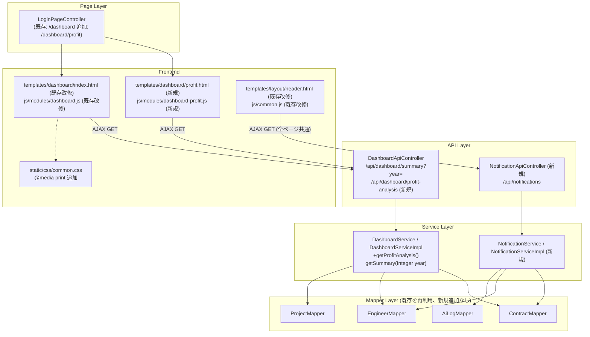

# Design Document

## Overview

本設計は、`dashboard-improvements`の6つの要件（4つの課題）に対する実装方針を定義する。

| # | 課題 | 対応要件 |
|---|------|----------|
| 1 | `/dashboard/profit`の500エラー解消（利益分析ページ新規実装） | Requirement 1 |
| 2 | 年度別売上・粗利データのリアルタイム集計 | Requirement 2, 3 |
| 3 | 「レポート出力」ボタンの印刷機能実装 | Requirement 4 |
| 4 | ヘッダー通知ドロップダウンの動的データ化 | Requirement 5, 6 |

いずれも新規テーブルを追加せず、既存の`t_contract`・`t_engineer`・`t_project`・`t_ai_log`をアプリケーション層（Java Stream）でリアルタイム集計・抽出する。既存の`DashboardServiceImpl.getSummary()`が採用している「Mapperで全件/条件付き取得 → Streamでループ集計」パターンを継承し、DB側の集計SQL（GROUP BY等）は使用しない。

技術方針として、以下3点はユーザー承認済みとする。

1. 印刷レイアウトは「白背景+黒文字に切替（`@media print`）」方式。サイドバー/ヘッダー/レポート出力ボタンは印刷時に非表示にする。
2. 年度別集計は既存`/api/dashboard/summary`に`year`パラメータを追加する形で統合する（新規エンドポイントは作らない）。
3. 通知APIは新規`NotificationApiController`（`/api/notifications`）として独立させる（ダッシュボード専用コントローラーに寄せない。ヘッダーは全ページ共通コンポーネントであるため）。

## Architecture

### コンポーネント構成（全体）



### 変更ファイル一覧（新規／改修）

| ファイル | 種別 | 概要 |
|---|---|---|
| `controller/page/LoginPageController.java` | 改修 | `/dashboard/profit`のGETマッピング追加 |
| `templates/dashboard/profit.html` | 新規 | 利益分析ページテンプレート |
| `static/js/modules/dashboard-profit.js` | 新規 | 利益分析ページ用JS |
| `controller/api/DashboardApiController.java` | 改修 | `/summary`に`year`パラメータ追加、`/profit-analysis`新規追加 |
| `service/DashboardService.java` | 改修 | `getSummary(Integer year)`、`getProfitAnalysis()`追加 |
| `service/impl/DashboardServiceImpl.java` | 改修 | 年度別集計ロジック、利益分析ロジック追加 |
| `dto/dashboard/ContractProfitDto.java` | 新規 | 利益分析用DTO |
| `controller/api/NotificationApiController.java` | 新規 | `/api/notifications` |
| `service/NotificationService.java` | 新規 | 通知取得インターフェース |
| `service/impl/NotificationServiceImpl.java` | 新規 | 通知抽出ロジック |
| `dto/notification/NotificationDto.java` | 新規 | 通知DTO |
| `templates/dashboard/index.html` | 改修 | 年度セレクトへのid付与、レポート出力ボタンへのid付与、`no-print`クラス付与 |
| `static/js/modules/dashboard.js` | 改修 | 年度切替イベント、Chart再描画、印刷ボタンハンドラ |
| `templates/layout/header.html` | 改修 | 通知ドロップダウンの静的項目を動的レンダリング用コンテナに置換 |
| `static/js/common.js` | 改修 | 通知取得・描画処理の追加（全ページ共通初期化に統合） |
| `static/css/common.css` | 改修 | `@media print`ブロック追加 |

---

## Requirement 1: 利益分析ページ

### 1.1 ルーティング

既存の`/dashboard`ルートは`LoginPageController`（「ログイン画面、ダッシュボードなどのページ遷移を管理する」コントローラー）に定義されている。新規に`DashboardPageController`を作るとルーティングの責務が2つのコントローラーに分散し混乱を招くため、**同じ`LoginPageController`に`/dashboard/profit`のGETマッピングを追加する**。

```java
/**
 * 利益分析ページを表示する
 *
 * @return 利益分析テンプレート名
 */
@GetMapping("/dashboard/profit")
public String profitAnalysis() {
    return "dashboard/profit";
}
```

### 1.2 API設計: `GET /api/dashboard/profit-analysis`

`DashboardApiController`に追加する。

```java
@GetMapping("/profit-analysis")
public ApiResult<List<ContractProfitDto>> getProfitAnalysis() {
    return ApiResult.success(dashboardService.getProfitAnalysis());
}
```

レスポンス例:

```json
{
  "code": 200,
  "message": "処理が成功しました",
  "data": [
    {
      "contractNo": "C-2026-0012",
      "engineerName": "田中 太郎",
      "projectName": "大手金融基盤刷新プロジェクト",
      "sellingPrice": 800000,
      "costPrice": 600000,
      "grossProfitAmount": 200000,
      "grossProfitRate": "25.0%"
    }
  ]
}
```

### 1.3 DTO設計: `dto/dashboard/ContractProfitDto.java`

既存の`DashboardSummaryDto`と同じ`@Data @Builder @NoArgsConstructor @AllArgsConstructor`パターンに従うフラットなDTO（1契約=1レコードのため、ネストなし）。

```java
package com.ses.dto.dashboard;

import lombok.AllArgsConstructor;
import lombok.Builder;
import lombok.Data;
import lombok.NoArgsConstructor;

import java.math.BigDecimal;

@Data
@Builder
@NoArgsConstructor
@AllArgsConstructor
public class ContractProfitDto {
    private String contractNo;
    private String engineerName;
    private String projectName;
    private BigDecimal sellingPrice;
    private BigDecimal costPrice;
    private BigDecimal grossProfitAmount;
    /** "25.0%" または売上単価が0の場合は "N/A" */
    private String grossProfitRate;
}
```

- `grossProfitAmount` = `sellingPrice - costPrice`
- `grossProfitRate`（AC 1.3, 1.4）:
  - `sellingPrice == 0` → `"N/A"`
  - それ以外 → `grossProfitAmount / sellingPrice * 100` を小数点1桁に丸めて `"xx.x%"` 形式の文字列化（既存`DashboardServiceImpl`の`Math.round(x * 10.0) / 10.0`パターンを流用）

### 1.4 Service実装方針

`DashboardService`に`getProfitAnalysis()`を追加。

```java
public interface DashboardService {
    DashboardSummaryDto getSummary(Integer year);
    List<ContractProfitDto> getProfitAnalysis();
}
```

`DashboardServiceImpl.getProfitAnalysis()`の実装は、既存の`getSummary()`内で行っている「Contractを取得 → `engineerMapper.selectById`/`projectMapper.selectById`でループ結合」というN+1パターンをそのまま踏襲する（新規JOIN用SQLやMapperメソッドは追加しない）。

```java
@Override
public List<ContractProfitDto> getProfitAnalysis() {
    List<Contract> contracts = contractMapper.selectList(
        new QueryWrapper<Contract>().orderByDesc("start_date"));

    List<ContractProfitDto> result = new ArrayList<>();
    for (Contract c : contracts) {
        Engineer e = c.getEngineerId() != null ? engineerMapper.selectById(c.getEngineerId()) : null;
        Project p = c.getProjectId() != null ? projectMapper.selectById(c.getProjectId()) : null;

        BigDecimal selling = c.getSellingPrice() != null ? c.getSellingPrice() : BigDecimal.ZERO;
        BigDecimal cost = c.getCostPrice() != null ? c.getCostPrice() : BigDecimal.ZERO;
        BigDecimal profit = selling.subtract(cost);

        String rate;
        if (selling.compareTo(BigDecimal.ZERO) == 0) {
            rate = "N/A";
        } else {
            double pct = profit.doubleValue() / selling.doubleValue() * 100;
            rate = (Math.round(pct * 10.0) / 10.0) + "%";
        }

        result.add(ContractProfitDto.builder()
                .contractNo(c.getContractNo())
                .engineerName(e != null ? e.getFullName() : "不明")
                .projectName(p != null ? p.getProjectName() : "不明")
                .sellingPrice(selling)
                .costPrice(cost)
                .grossProfitAmount(profit)
                .grossProfitRate(rate)
                .build());
    }
    return result;
}
```

- `orderByDesc("start_date")`によりAC 1.5（契約開始日の降順）を満たす。
- Contractが0件の場合、`result`は空リストのまま返却される（AC 1.6はフロントエンド側で「対象データがありません」を表示することで対応、後述）。

### 1.5 テンプレート: `templates/dashboard/profit.html`

既存`dashboard/index.html`と同じ`layout:decorate="~{layout/base}"`パターンに従う。

```html
<!DOCTYPE html>
<html lang="ja" xmlns:th="http://www.thymeleaf.org"
      xmlns:layout="http://www.ultraq.net.nz/thymeleaf/layout"
      layout:decorate="~{layout/base}">
<head><title>利益分析</title></head>
<body>
<div layout:fragment="content">
    <div class="d-flex justify-content-between align-items-center mb-4">
        <h4 class="text-white fw-bold mb-1">
            <i class="bi bi-graph-up-arrow me-2 text-accent-yellow"></i>利益分析
        </h4>
    </div>

    <div class="card bg-card border-dark shadow-sm">
        <div class="card-body p-0">
            <div class="table-responsive">
                <table class="table table-dark table-hover table-striped mb-0 align-middle">
                    <thead class="table-secondary border-dark">
                        <tr>
                            <th class="px-4 py-3">契約番号</th>
                            <th class="py-3">要員名</th>
                            <th class="py-3">案件名</th>
                            <th class="py-3 text-end">売上単価</th>
                            <th class="py-3 text-end">原価</th>
                            <th class="py-3 text-end">粗利額</th>
                            <th class="px-4 py-3 text-end">粗利率</th>
                        </tr>
                    </thead>
                    <tbody id="profit-table-body">
                        <!-- JSにより動的生成。0件時は「契約データがありません」を表示 -->
                    </tbody>
                </table>
            </div>
        </div>
    </div>
</div>

<th:block layout:fragment="page-js">
    <script th:src="@{/js/modules/dashboard-profit.js}"></script>
</th:block>
</body>
</html>
```

`dashboard-profit.js`は既存`dashboard.js`と同じ`$.ajax`パターンで`/api/dashboard/profit-analysis`を呼び出し、`#profit-table-body`に行を生成する。空配列の場合は`<tr><td colspan="7" class="text-center text-muted py-4">契約データがありません</td></tr>`を表示（AC 1.6）。通信エラー時は`Toast.error(...)`で通知する（既存`dashboard.js`のエラーハンドリングと同一パターン）。

---

## Requirement 2 & 3: 年度別集計APIとフロントエンド連携

### 2.1 API変更: `GET /api/dashboard/summary?year=`

```java
@GetMapping("/summary")
public ApiResult<DashboardSummaryDto> getSummary(
        @RequestParam(required = false) Integer year) {
    return ApiResult.success(dashboardService.getSummary(year));
}
```

- `year`省略時（AC 2.2）: 既存の「直近6ヶ月トレーリング」ロジックをそのまま実行（後方互換を維持）。
- `year`指定時（AC 2.1）: 指定された会計年度（4月～翌年3月、AC 2.6）の12ヶ月分を返す。

**影響範囲の明確化**: `year`パラメータが変更するのは`DashboardSummaryDto.charts.revenue`（`labels`/`sales`/`profit`）のみ。KPI（`kpi`）、ステータス分布（`charts.status`）、退場予定リスト（`retiring`）は要件上「稼動中の全契約」を対象とする既存ロジックのままとし、年度に依存させない。

### 2.2 DashboardServiceImplの分岐ロジック

```java
@Override
public DashboardSummaryDto getSummary(Integer year) {
    // ... KPI計算・ステータス分布・退場予定リストは既存のまま ...

    List<YearMonth> targetMonths = (year != null)
            ? buildFiscalYearMonths(year)      // 4月(year)～3月(year+1)
            : buildTrailingMonths(6);          // 既存: 直近6ヶ月

    List<String> monthLabels = new ArrayList<>();
    List<Long> salesData = new ArrayList<>();
    List<Long> profitData = new ArrayList<>();

    for (YearMonth ym : targetMonths) {
        LocalDate monthStart = ym.atDay(1);
        LocalDate monthEnd = ym.atEndOfMonth();
        monthLabels.add(ym.getMonthValue() + "月");

        long monthSales = 0;
        long monthProfit = 0;
        for (Contract c : allContracts) {
            if (c.getStartDate() != null && !c.getStartDate().isAfter(monthEnd)
                    && (c.getEndDate() == null || !c.getEndDate().isBefore(monthStart))) {
                long sell = c.getSellingPrice() != null ? c.getSellingPrice().longValue() : 0;
                long cost = c.getCostPrice() != null ? c.getCostPrice().longValue() : 0;
                monthSales += sell;
                monthProfit += (sell - cost);
            }
        }
        salesData.add(monthSales);
        profitData.add(monthProfit);
    }
    // ... RevenueChartDto組み立て（既存と同様）
}

/** 会計年度(4月始まり)の12ヶ月を返す。例: buildFiscalYearMonths(2026) → 2026-04 ... 2027-03 */
private List<YearMonth> buildFiscalYearMonths(int fiscalYear) {
    List<YearMonth> months = new ArrayList<>();
    YearMonth start = YearMonth.of(fiscalYear, 4);
    for (int i = 0; i < 12; i++) {
        months.add(start.plusMonths(i));
    }
    return months;
}

/** 既存の直近6ヶ月トレーリングロジック（現行コードをそのまま関数化） */
private List<YearMonth> buildTrailingMonths(int count) {
    List<YearMonth> months = new ArrayList<>();
    YearMonth current = YearMonth.from(LocalDate.now());
    for (int i = count - 1; i >= 0; i--) {
        months.add(current.minusMonths(i));
    }
    return months;
}
```

- 契約が存在しない月は自然に`monthSales=0, monthProfit=0`となる（AC 2.7）。
- 契約が存在する月はループ計算結果をそのまま返す。計算結果が偶然0になった場合でも、それは「アクティブな契約が存在しない場合」と区別されず同じ0が返るが、これはAC 2.7/2.8が要求する外部から見た振る舞い（ゼロ値を返す）として同一であり、実装上の特別分岐は不要（両ケースとも「計算結果として0を返す」という単純なループ集計で満たされる）。

### 2.3 フロントエンド連携（`dashboard.js` / `dashboard/index.html`）

**テンプレート変更**（`dashboard/index.html`):
- 年度セレクトに`id="fiscal-year-selector"`を付与。
- レポート出力ボタンに`id="btn-print-report"`と印刷時非表示用の`no-print`クラスを付与。
- サイドバー（`aside.sidebar`）・ヘッダー（`header.top-header`）にも`no-print`クラスを付与（`layout/base.html`側で対応、詳細はRequirement 4参照）。

**`dashboard.js`変更方針**:

```javascript
let revenueChartInstance = null; // Chart.jsインスタンスを保持し再描画時にdestroy()する

$(document).ready(function() {
    Chart.defaults.color = '#adb5bd';
    Chart.defaults.borderColor = 'rgba(255, 255, 255, 0.1)';

    const currentFiscalYear = getCurrentFiscalYear(); // 現在月が4月以降なら今年、1-3月なら前年
    populateFiscalYearSelector(currentFiscalYear);     // 現在年度を含む直近5年度分の<option>を生成
    $('#fiscal-year-selector').val(currentFiscalYear);

    loadDashboardData(currentFiscalYear);

    $('#fiscal-year-selector').on('change', function() {
        loadDashboardData($(this).val());
    });

    $('#btn-print-report').on('click', function() {
        window.print();
    });
});

function getCurrentFiscalYear() {
    const now = new Date();
    const month = now.getMonth() + 1; // 1-12
    return month >= 4 ? now.getFullYear() : now.getFullYear() - 1;
}

function loadDashboardData(year) {
    $.ajax({
        url: '/api/dashboard/summary',
        method: 'GET',
        data: { year: year },
        success: function(res) {
            if (res.code === 200 && res.data) {
                renderKPIs(res.data.kpi);
                renderCharts(res.data.charts);       // 内部でrevenueChartInstanceをdestroy()して再生成
                renderRetiringList(res.data.retiring);
            } else {
                Toast.error(res.message || 'ダッシュボードデータの取得に失敗しました');
            }
        },
        error: function(err) {
            console.error(err);
            Toast.error('通信エラーが発生しました'); // AC3.4: 既存のグラフ表示は変更しない（再描画関数を呼ばないため自然に維持される）
        }
    });
}
```

- `renderCharts()`内で、既存の`new Chart(...)`呼び出しの前に`if (revenueChartInstance) revenueChartInstance.destroy();`を追加し、生成した`Chart`インスタンスを`revenueChartInstance`に代入する（AC 3.2: フルリロードなしで再描画）。
- 初回ロード時は`year=currentFiscalYear`を明示的に渡すため、AC 3.3（デフォルトは現在の会計年度）を満たす。API自体は`year`省略時に直近6ヶ月を返す後方互換動作を維持するが、フロントエンドは常に`year`を渡す運用とする。
- AJAX失敗時（AC 3.4）は`renderCharts`/`renderKPIs`等を呼ばないため、既存のDOM内容（前回描画されたグラフ）がそのまま保持される。加えて`Toast.error`でエラー通知を表示する。

---

## Requirement 4: レポート出力（印刷）機能

### 4.1 JSハンドラ

`dashboard.js`の`$('#btn-print-report').on('click', function() { window.print(); });`（上記2.3で提示済み）。ブラウザ標準の印刷プレビュー機能を呼び出すのみで、PDF生成等のサーバー処理は行わない（AC 4.1）。

### 4.2 `common.css`への`@media print`追加

白背景・黒文字に切り替え、サイドバー・ヘッダー・レポート出力ボタンを非表示にする。

```css
/* ================== PRINT STYLES ================== */
@media print {
    body {
        background-color: #ffffff !important;
        color: #000000 !important;
    }

    /* サイドバー・ヘッダー・印刷ボタン等を非表示 (AC 4.2) */
    .sidebar,
    .top-header,
    .footer,
    .no-print {
        display: none !important;
    }

    .main-wrapper {
        margin-left: 0 !important;
    }

    /* カード・テーブルを白背景+黒文字に強制変更 */
    .card,
    .card-header,
    .card-footer,
    .table-dark,
    .table-secondary {
        background-color: #ffffff !important;
        color: #000000 !important;
        border-color: #cccccc !important;
        backdrop-filter: none !important;
        box-shadow: none !important;
    }

    .text-white,
    .text-muted,
    h1, h2, h3, h4, h5, h6 {
        color: #000000 !important;
    }

    /* 印刷対象を明示 (AC 4.3): KPIカード・グラフ・ステータス分布・退場予定表は
       通常フローのまま表示されるため display 変更は不要。改ページ制御のみ追加 */
    .card {
        page-break-inside: avoid;
    }
}
```

- `.no-print`クラスを`btn-print-report`ボタン、`aside.sidebar`、`header.top-header`（`layout/sidebar.html`/`layout/header.html`側の要素）に付与することで、既存の`.sidebar`/`.top-header`セレクタと合わせて確実に非表示にする（クラス名セレクタと構造セレクタの二重指定で堅牢性を確保）。
- KPIカード（`#kpi-*`を含むカード群）、`#revenueChart`/`#statusChart`を含むカード、`#retiring-table-body`を含むカードは`layout:fragment="content"`内の通常のブロック要素であり、`display:none`を明示的に付与しない限り印刷対象に含まれる（AC 4.3）。

---

## Requirement 5 & 6: 通知データの動的生成API + フロントエンド連携

### 5.1 API設計: `GET /api/notifications`

新規`NotificationApiController`を追加する。ヘッダーは全ページ共通コンポーネントであるため、ダッシュボード専用の`DashboardApiController`には含めない。

```java
package com.ses.controller.api;

import com.ses.common.result.ApiResult;
import com.ses.dto.notification.NotificationDto;
import com.ses.service.NotificationService;
import lombok.RequiredArgsConstructor;
import org.springframework.web.bind.annotation.GetMapping;
import org.springframework.web.bind.annotation.RequestMapping;
import org.springframework.web.bind.annotation.RestController;

import java.util.List;

@RestController
@RequestMapping("/api/notifications")
@RequiredArgsConstructor
public class NotificationApiController {

    private final NotificationService notificationService;

    @GetMapping
    public ApiResult<List<NotificationDto>> list() {
        return ApiResult.success(notificationService.getNotifications());
    }
}
```

### 5.2 Service設計

```java
package com.ses.service;

import com.ses.dto.notification.NotificationDto;
import java.util.List;

public interface NotificationService {
    List<NotificationDto> getNotifications();
}
```

`NotificationServiceImpl`は`IService`を継承しない（単一エンティティに対応するCRUDサービスではなく、複数テーブルを横断して集計するサービスのため、既存の`DashboardService`と同じ「素のインターフェース実装」パターンに従う）。

```java
@Service
@RequiredArgsConstructor
public class NotificationServiceImpl implements NotificationService {

    private static final int MAX_NOTIFICATIONS = 10;

    private final ContractMapper contractMapper;
    private final EngineerMapper engineerMapper;
    private final AiLogMapper aiLogMapper;

    @Override
    public List<NotificationDto> getNotifications() {
        List<NotificationDto> notifications = new ArrayList<>();
        notifications.addAll(buildRetiringEngineerNotifications());
        notifications.addAll(buildAiMatchingNotifications());

        return notifications.stream()
                .sorted(Comparator.comparing(NotificationDto::getSortDate).reversed())
                .limit(MAX_NOTIFICATIONS)
                .collect(Collectors.toList());
    }

    private List<NotificationDto> buildRetiringEngineerNotifications() {
        LocalDate now = LocalDate.now();
        LocalDate limit = now.plusDays(30);

        List<Contract> retiringContracts = contractMapper.selectList(new QueryWrapper<Contract>()
                .eq("status", "稼動中")
                .isNotNull("end_date")
                .le("end_date", limit)
                .ge("end_date", now));

        List<NotificationDto> list = new ArrayList<>();
        for (Contract c : retiringContracts) {
            Engineer e = engineerMapper.selectById(c.getEngineerId());
            if (e == null) continue;
            long daysLeft = ChronoUnit.DAYS.between(now, c.getEndDate());
            list.add(NotificationDto.builder()
                    .type("RETIRING_ENGINEER")
                    .icon("bi-exclamation-triangle")
                    .message(e.getFullName() + "氏の退場日が近づいています（残り" + daysLeft + "日）")
                    .date(c.getEndDate().format(DateTimeFormatter.ofPattern("yyyy/MM/dd")))
                    .sortDate(c.getEndDate().atStartOfDay())
                    .build());
        }
        return list;
    }

    private List<NotificationDto> buildAiMatchingNotifications() {
        LocalDateTime since = LocalDateTime.now().minusHours(24);

        List<AiLog> logs = aiLogMapper.selectList(new QueryWrapper<AiLog>()
                .eq("request_type", "マッチング")
                .ge("created_at", since));

        List<NotificationDto> list = new ArrayList<>();
        for (AiLog log : logs) {
            list.add(NotificationDto.builder()
                    .type("AI_MATCHING")
                    .icon("bi-robot")
                    .message("【AI】マッチング処理が完了しました")
                    .date(log.getCreatedAt().format(DateTimeFormatter.ofPattern("MM/dd HH:mm")))
                    .sortDate(log.getCreatedAt())
                    .build());
        }
        return list;
    }
}
```

- 退場予定エンジニア抽出: `status='稼動中'`かつ`end_date`がNULLでなく、現在日から30日以内（AC 5.2）。既存`DashboardServiceImpl`の退場予定リスト抽出条件と同一の考え方を再利用する。
- AIマッチング完了通知: `t_ai_log.request_type = 'マッチング'`かつ`created_at`が直近24時間以内（AC 5.3）。
- 双方0件の場合、`notifications`は空リストのまま返却される（AC 5.4）。
- `sortDate`降順ソート後に`limit(10)`で件数制限する（AC 5.5, 5.6）。

### 5.3 DTO設計: `dto/notification/NotificationDto.java`

```java
package com.ses.dto.notification;

import lombok.AllArgsConstructor;
import lombok.Builder;
import lombok.Data;
import lombok.NoArgsConstructor;

import java.time.LocalDateTime;

@Data
@Builder
@NoArgsConstructor
@AllArgsConstructor
public class NotificationDto {
    /** "RETIRING_ENGINEER" または "AI_MATCHING" */
    private String type;
    /** Bootstrap Iconsのクラス名 (アイコン部分、"bi-"プレフィックス) */
    private String icon;
    private String message;
    /** 表示用の日付文字列 */
    private String date;
    /** ソート専用。JSON化はされるが画面表示には使わない */
    private LocalDateTime sortDate;
}
```

- `type`に応じてフロントエンドで色/アイコンを分岐する（AC 6.4: 退場予定通知とAIマッチング通知で異なるアイコンを表示）。

### 5.4 フロントエンド連携

#### `templates/layout/header.html`の変更

ハードコードされた`<li>`2件を、JSでレンダリングするコンテナに置換する。

```html
<ul class="dropdown-menu dropdown-menu-end dropdown-menu-dark bg-secondary border-dark shadow-lg"
    aria-labelledby="notificationDropdown" style="width: 300px;">
    <li><h6 class="dropdown-header text-white border-bottom border-dark pb-2">通知</h6></li>
    <li id="notification-list">
        <!-- JSにより動的生成。ロード中/空/エラー時のメッセージもここに描画 -->
        <span class="dropdown-item-text text-muted small py-2">読み込み中...</span>
    </li>
    <li><hr class="dropdown-divider border-dark"></li>
    <li><a class="dropdown-item text-center small text-muted hover-text-white" href="#">すべての通知を見る</a></li>
</ul>
```

#### `common.js`の変更

`header.html`は全ページで`layout/base.html`から`th:replace`されるため、通知取得ロジックは**ページ共通の`common.js`の初期化処理に追加する**（ダッシュボード専用の`dashboard.js`には置かない）。

```javascript
// 既存の DOMContentLoaded 初期化ブロック内に追加
document.addEventListener('DOMContentLoaded', function() {
    // ...既存の初期化処理...
    SES.notification.load(); // 追加
});

// SESオブジェクトに追加するモジュール
SES.notification = {
    load: function() {
        const container = document.getElementById('notification-list');
        if (!container) return;

        $.ajax({
            url: '/api/notifications',
            method: 'GET',
            success: function(res) {
                if (res.code === 200) {
                    SES.notification.render(res.data || []);
                } else {
                    SES.notification.renderError();
                }
            },
            error: function() {
                SES.notification.renderError();
            }
        });
    },

    render: function(list) {
        const container = $('#notification-list');
        if (!list || list.length === 0) {
            container.html('<span class="dropdown-item-text text-muted small py-2">新しい通知はありません</span>');
            return;
        }
        const iconColorMap = {
            'RETIRING_ENGINEER': 'text-accent-yellow',
            'AI_MATCHING': 'text-accent-blue'
        };
        const html = list.map(function(n) {
            const colorClass = iconColorMap[n.type] || 'text-accent-blue';
            return `<a class="dropdown-item py-2" href="#">
                        <i class="bi ${n.icon} ${colorClass} me-2"></i>${n.message}
                    </a>`;
        }).join('');
        container.html(html);
    },

    renderError: function() {
        $('#notification-list').html(
            '<span class="dropdown-item-text text-danger small py-2">通知を読み込めませんでした</span>'
        );
    }
};
```

- 通知0件時もドロップダウンコンテナ自体は表示を維持し、コンテナ内に「新しい通知はありません」を表示する（AC 6.3）。
- `type`ごとに異なるアイコン色（`icon`フィールド自体もサーバー側でtype別に変えているため、アイコン形状自体もサーバー側の指定に従う。AC 6.4）。
- 通信失敗時はドロップダウン自体を表示したまま、コンテナ内に「通知を読み込めませんでした」を表示する（AC 6.5）。

---

## Error Handling

| API | 正常時 | 異常時 |
|---|---|---|
| `GET /api/dashboard/summary?year=` | `ApiResult.success(DashboardSummaryDto)` | `year`が不正な値でもJava側で`Integer`変換に失敗した場合はSpringの型変換エラーとなり、既存の`GlobalExceptionHandler.handleException`が捕捉し`ApiResult.error("システムエラーが発生しました")`（500）を返す。业務的なバリデーション例外は投げない（`year`は任意の整数として扱い、該当契約が0件でも空グラフとして正常応答する） |
| `GET /api/dashboard/profit-analysis` | `ApiResult.success(List<ContractProfitDto>)`（0件時は空配列） | Contractに紐づくEngineer/Projectが存在しない場合は例外を投げず、`"不明"`をデフォルト値として使用する（既存`getSummary()`の`retiring`リスト構築ロジックと同様の防御的実装） |
| `GET /api/notifications` | `ApiResult.success(List<NotificationDto>)`（0件時は空配列、AC 5.4） | Mapperアクセスで想定外の例外が発生した場合は`GlobalExceptionHandler.handleException`が捕捉し500エラーを返す。フロントエンドはこれを「読み込み失敗」として扱い、AC 6.5のメッセージを表示する |

いずれのAPIも既存の`ApiResult<T>`統一レスポンス形式を用い、個別の業務例外（`BusinessException`）は投げない方針とする（対象データが0件であることはエラーではなく正常な結果として扱う）。

---

## Testing Strategy

現時点でテストディレクトリ（`src/test`）は存在しないため、本機能実装時に`spring-boot-starter-test`（`pom.xml`に既存）を用いてJUnit 5 + Mockitoベースのテストを新規導入する。

### 単体テスト（Service層、Mockitoでモック化したMapperを使用）

- **`DashboardServiceImplTest`**
  - `getProfitAnalysis()`: 売上単価0円の契約で`grossProfitRate`が`"N/A"`になること（AC 1.4）／複数契約が`start_date`降順で返ること（AC 1.5）／契約0件時に空リストを返すこと（AC 1.6の前提データ）
  - `getSummary(Integer year)`: `year`指定時に4月～翌年3月の12ヶ月が返ること（AC 2.6）／`year`未指定時に既存の6ヶ月トレーリング挙動が維持されること（AC 2.2）／指定年度内で対象契約がない月は0を返すこと（AC 2.7）／契約がある月は計算結果を返すこと（AC 2.8）

- **`NotificationServiceImplTest`**
  - 終了日が30日以内の稼動中契約に対して`RETIRING_ENGINEER`通知が生成されること（AC 5.2）／30日を超える契約が対象外になること
  - `request_type='マッチング'`かつ直近24時間以内の`AiLog`に対して`AI_MATCHING`通知が生成されること（AC 5.3）／24時間を超えるログが対象外になること
  - 該当データが0件の場合に空リストが返ること（AC 5.4）
  - 通知が10件を超える場合に`sortDate`降順で最新10件のみ返ること（AC 5.5, 5.6）

### コントローラーテスト（`@WebMvcTest` + `MockMvc`、Serviceはモック化）

- `DashboardApiControllerTest`: `/api/dashboard/summary?year=2026`が`ApiResult`形式で200を返すこと、`year`省略時も同様に動作すること
- `NotificationApiControllerTest`: `/api/notifications`が`ApiResult`形式で200を返すこと

### フロントエンドの検証方針（手動確認、自動テストフレームワーク未導入のため）

本プロジェクトにはフロントエンド用の自動テストフレームワーク（Jest等）が存在しないため、以下は実装後の手動QAチェックリストとして扱う。

- 年度セレクトボックス切替時に画面リロードなしでグラフが再描画されること（AC 3.1, 3.2）、開発者ツールのNetworkタブでAPI通信が発生することを確認
- ページ初期表示時にセレクトボックスが現在の会計年度になっていること（AC 3.3）
- API通信を強制的に失敗させた場合（例: ネットワークタブでオフライン化）、既存グラフが消えずエラートーストが表示されること（AC 3.4）
- 「レポート出力」ボタン押下でブラウザの印刷プレビューが開くこと、印刷プレビュー上でサイドバー・ヘッダー・ボタンが非表示になり白背景+黒文字になっていること（AC 4.1, 4.2, 4.3）
- ヘッダー通知ドロップダウンが実データで表示されること、通知0件時のメッセージ表示、通信失敗時のエラーメッセージ表示（AC 6.2, 6.3, 6.5）、退場予定通知とAIマッチング通知でアイコンが異なること（AC 6.4）
