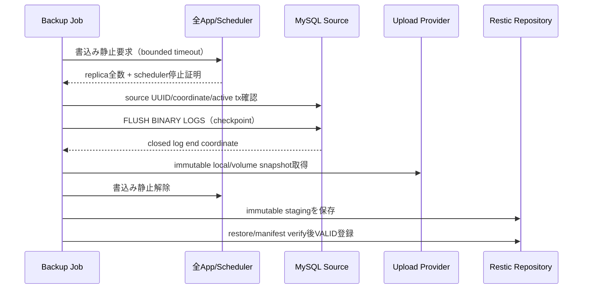

# 正式データバックアップ・PITR 設計

## 1. 設計方針

この機能は「成功時に復元できる」だけでは不十分である。最優先は、誤った DB を壊さないこと、復元不能な backup を成功表示しないこと、要求時刻より後の transaction/file を混入させないことである。

採用する原則:

1. **production source を原地復元しない。** 新しい recovery target へ restore し、旧環境は cutover 確定まで保持する。
2. **時刻ではなく coordinate を replay する。** UTC 要求時刻は checkpoint 選択に使い、apply は dump/checkpoint の file/position を使う。
3. **DB と uploads の復旧点をひとつにする。** 15 分ごとの整合 checkpoint を recovery unit とする。
4. **plan と apply を分ける。** plan は read-only、apply は target guard と二者承認を通過した不変 plan だけを受け付ける。
5. **証跡がない成功は成功ではない。** test、drill、RPO/RTO、SHA を ledger へ記録する。

## 2. 現状との差分

`baseline.md` の HFP-03-BL-* を正とする。特に現行 `restore.sh` は target 時刻を表示するだけで、最新 full を直接既存 DB へ import し、binlog/uploads を復元しない。そのため既存 script を「ほぼ完成」とみなして小修正してはいけない。安全境界を先に実装し、各 legacy path を failing test で封じる。

## 3. コンポーネント

予定構成。実装時に既存命名規約へ合わせるが、責務を統合しない。

```text
ops/backup/
├── Dockerfile                         # pinned Oracle MySQL 8 client + restic
├── docker-compose.yml                 # production job definitions
├── preflight.sh                       # read-only environment contract
├── backup-full.sh                     # quiesced full + manifest
├── archive-binlog.sh                  # continuous raw archive
├── create-checkpoint.sh               # rotate/closed-binlog/uploads watermark
├── snapshot-binlog.sh                 # closed binlog only
├── check-backup.sh                    # watermark-based health JSON
├── retention.sh                       # dependency-aware, separate role
├── plan-restore.sh                    # requested UTC -> immutable plan
├── restore.sh                         # staging DB/uploads restore only
├── validate-restore.sh                # DB/file/app read-only validation
├── cutover.sh                         # explicit stop/switch/read-only gate
├── rollback-cutover.sh                # pre-write rollback only
├── lib/                               # parsing/guard/manifest/lock helpers
├── providers/                         # versioned quiesce/uploads snapshot adapter
├── tests/                             # unit + Docker integration
└── runbooks/                          # incident/restore/key/gap/drill
```

`APP_STOP_COMMAND` のような環境値を `bash -c` で評価しない。provider は repository 内の固定 executable と明示引数で呼ぶ。

## 4. Backup データモデル

### 4.1 full metadata

`metadata.json` は schema version 付き canonical JSON とする。

```json
{
  "schema_version": 1,
  "kind": "full",
  "status": "VALID",
  "consistency_time_utc": "2026-08-12T17:00:00Z",
  "source_server_uuid": "uuid",
  "source_lineage": "sha256(uuid + db-fingerprint)",
  "database_fingerprint": "sha256(environment + logical-db-name)",
  "binlog_start": {"file": "binlog.000123", "position": 4567},
  "gtid_executed": "optional-set",
  "app_commit": "git-sha",
  "flyway_max_success": "102",
  "mysql_server_version": "8.0.x",
  "mysql_client_version": "8.0.x",
  "tool_image_digest": "sha256:...",
  "uploads_snapshot_id": "restic-id",
  "quiesce": {"provider": "...", "started_at": "...", "released_at": "..."},
  "critical_table_counts": {"sys_user": 10, "t_engineer": 300}
}
```

DB 名、生の host、user、password、S3 URL、顧客/要員名は格納しない。復元時の論理 DB 名は plan と recovery-target allowlist で解決する。

### 4.2 checkpoint metadata

checkpoint は次を一体で参照する。

- UTC consistency time。
- source UUID/lineage。
- closed binlog end file/position と GTID watermark。
- その整合点の uploads snapshot ID/inventory SHA。
- 主要 table counts と Flyway version。
- 利用する直前 full への参照は補助情報にとどめ、restore plan 時に再計算する。

### 4.3 manifest 作成順

現行は `manifest.sha256` 作成後に `metadata.txt` を追加するため、metadata が保護されない。順番を固定する。

1. dump/uploads/binlog/metadata を staging に生成。
2. 全 producer process を終了し、file descriptor が閉じたことを確認。
3. payload の path/type/size/SHA-256 から `manifest.json` を生成。
4. `manifest.json` の SHA-256 を `manifest.sha256` に書く。
5. staging を read-only にして restic backup。
6. restic snapshot ID を外部 job result と evidence に記録する。snapshot ID を自分自身の manifest へ後書きしない。
7. restore verification を 1 回実行できた snapshot だけを checkpoint index へ `VALID` 登録する。

## 5. 整合 checkpoint protocol

### 5.1 共通 protocol



静止中に deadline を超えた場合は解除を試み、snapshot を INVALID として隔離する。静止解除に失敗した場合は重大 alert とし、job の成功より service safety を優先する。静止区間は DB coordinate と immutable な local/volume snapshot の確定までとし、S3/restic への network upload は解除後に行ってよい。ただし upload/restore verify が完了するまで checkpoint を VALID にせず、RPO watermark も進めない。単なる可変 directory を immutable staging とみなして解除してはいけない。

### 5.2 full

- deployment/change lock を取得し、Flyway/DDL を禁止する。
- 全 table が InnoDB であることを preflight する。
- app write を静止後、`mysqldump --single-transaction --quick --source-data=2` を実行する。
- dump 内 coordinate と同時取得した status が矛盾しないことを検証する。
- uploads snapshot を同じ静止区間で取得する。
- full の dump が長く静止時間 SLO を超える環境では、replica/volume snapshot 等の provider を先に導入する。静止を黙って解除して DB/uploads の整合性を犠牲にしない。

### 5.3 15 分 checkpoint

- app write を静止する。
- log rotation し、rotation 前の log を closed end coordinate とする。
- live archiver が closed file の source size まで追従し、`mysqlbinlog --verify-binlog-checksum` が成功するまで待つ。
- uploads の immutable snapshot を取得する。
- immutable local/volume snapshot の確定後に書込みを再開し、repository への保存・verify 後だけ checkpoint を VALID 登録する。atomic snapshot がない local copy provider は copy 完了まで静止を維持する。
- 実効復旧点はこの closed coordinate と uploads snapshot の組。target 時刻が間にあっても DB だけ先へ replay しないため、DB→file missing reference を構造的に防ぐ。

## 6. Binlog archive

### 6.1 live archive

- startup 時に source UUID と `SHOW BINARY LOGS` を取得する。
- state file の last valid file/position か、最初の full coordinate から開始する。
- `mysqlbinlog --read-from-remote-server --raw --stop-never --connection-server-id=<unique> <initial-log>` を使う。initial log を省略しない。
- TLS は `VERIFY_IDENTITY`、CA が host naming と両立しない既存環境のみ期限付きで `VERIFY_CA` を許容し ledger に残す。`REQUIRED` だけは不可。
- source/server UUID が state と違う場合は自動継続しない。
- raw active file は work area に置き、rotation で閉じたことを source file size/end position と checksum で確認してから immutable area へ rename する。

### 6.2 continuity

restore plan は次を全件確認する。

1. start file が full coordinate を含む。
2. file suffix が連続し、同一 lineage である。
3. 各 file の checksum と manifest SHA が一致する。
4. 最初の file だけ `--start-position`、最後の file だけ `--stop-position` を適用する。
5. checkpoint end が last closed file の event boundary である。
6. GTID ON の場合は GTID set を補助検証し、file/position と矛盾すれば停止する。

transaction compression が ON の場合、同じ `end_log_pos` を持つ展開 event があり得る。そのため tool image は source と互換の MySQL 8 minor に固定し、position は transaction payload の外側の有効 event boundary だけを使用する。

### 6.3 timezone

MySQL 公式仕様では `--start-datetime` / `--stop-datetime` は mysqlbinlog 実行 host の local timezone で解釈される。したがって:

- external input は末尾 `Z` の UTC のみ。
- process は `TZ=UTC` とし metadata/evidence に記録。
- datetime option は調査 window の表示だけに使う。
- apply は position のみ。host timezone を変えても plan coordinate は不変。

## 7. Restore plan

### 7.1 選択 algorithm

```text
requested_target = strict RFC3339 UTC parse
checkpoints = VALID && lineage一致 && consistency_time <= requested_target
effective = max(checkpoints.consistency_time)
if requested_target - effective > 15分: RPO_MISSED
fulls = VALID && lineage一致 && consistency_time <= effective.time
base_full = max(fulls.consistency_time)
resolve binlogs from base_full.start_position through effective.end_position
verify dependency graph, SHA, checksums, continuity, uploads snapshot
bind target UUID/marker/new DB name and approval policy
write canonical plan.json + plan.sha256
```

restic snapshot time は network upload 完了時刻であり整合時刻ではないため、選択に使わない。

### 7.2 plan state

```text
DRAFT -> VERIFIED -> APPROVED -> APPLYING -> RESTORED
                                  |              |
                                  v              v
                               EXPIRED      FAILED_VALIDATION
                                                 |
                                                 v
                                           READY_FOR_CUTOVER
```

plan/payload/target が変われば SHA が変わり、既存 approval は無効になる。plan の再利用、apply の再実行は target DB が非空になるため拒否される。

### 7.3 二者承認

production approval は canonical claim と detached signature、または同等の組織 identity provider 検証を使う。各 claim は plan SHA、target UUID、DB 名、change ticket、actor、role、issued/expiry を bind する。2 名は異なる actor でなければならない。production verifier が未導入なら apply は `BLOCKED` であり、固定 env 文字列へ downgrade しない。

## 8. Recovery target guard

restore 書込み前に、同じ connection で次を検証する。

| 条件 | 判定 |
|---|---|
| target `@@server_uuid` = source UUID | 拒否 |
| target UUID が signed plan/allowlist と不一致 | 拒否 |
| recovery control schema の marker/plan ID 不一致 | 拒否 |
| target DB が既に存在し table/object を含む | 拒否 |
| host/db/user が空または default fallback | 拒否 |
| TLS identity 不一致 | 拒否 |
| target credential が production source へ接続可能 | provisioning test 失敗 |
| approval が 2 名未満、同一 actor、期限切れ | 拒否 |

production source の credential/repository secret を restore container へ mount しない。production source の不変性は drill の誤接続 fixture で開始/終了 hash を比較する。

## 9. Staging restore と検証

### 9.1 DB

1. target guard。
2. plan snapshot を temp/staging へ `restic restore --verify`。
3. manifest と archive 安全性検証。
4. 新規 DB/schema を作成。
5. full dump import。
6. 必要な全 binlog file を順序固定し、ひとつの `mysqlbinlog` process からひとつの `mysql --binary-mode` connection へ pipe。
7. pipe の両 command exit code を `pipefail` で検証。途中失敗は DB を FAILED staging として公開しない。

file ごとに `mysqlbinlog ... | mysql ...` を繰り返してはいけない。temporary table や session state が file 境界をまたぐためである。

### 9.2 uploads

- archive entry を列挙して path traversal/special file/link を先に拒否。
- `UPLOAD_RELEASES_DIR/<plan-id>.staging` へ展開し、manifest/inventory SHA を検証。
- DB に保存された `storage_key`、`stored_name`、`pdf_path`、`signed_pdf_path`、`certificate_path`、`skill_sheet_path` 等の参照を inventory と照合する。
- missing referenced file/hash mismatch は fatal。未参照 extra file は隔離 report とし、自動削除しない。
- validation 完了後に `.ready` へ rename する。本番 `current` は cutover まで変更しない。

### 9.3 DB/application validation

- `flyway_schema_history` failed row 0、metadata の version と一致。
- `CHECK TABLE`、critical table count、必要 FK/invariant query。
- marker before=存在、after=不存在。
- DB→uploads missing 0、hash mismatch 0。
- 復元時点と同じ app build を recovery/read-only profile で起動し、Flyway migrate、scheduler、mail、外部 API、cleanup を無効化して login/主要 GET smoke。
- validation report の全項目が PASS の場合だけ `READY_FOR_CUTOVER`。

## 10. Cutover と rollback

restore と cutover は別 command/承認とする。

1. traffic を停止し、全 app replica の停止を確認。
2. 旧 DB/uploads fingerprint を final rollback evidence として保存。
3. DB secret/config と uploads `current` pointer を ready target へ切替。
4. app を **read-only** で起動し smoke。
5. smoke 失敗なら app を停止し、旧 DB secret/config と旧 uploads pointer へ戻す。
6. smoke 成功と最終承認後だけ read-write を解放する。
7. read-write 解放後は旧環境への単純 rollback を禁止する。新規 write を失うため、別 incident/forward recovery とする。

uploads pointer は同一 filesystem の versioned directory/symlink を atomic rename する。mount root を直接上書きしない。旧 version は retention 期限まで read-only で保持する。

## 11. 秘密・権限

- MySQL password は mode 0600 の tmpfs option file に書き、MySQL option の**先頭引数**として `--defaults-extra-file` を渡す。`MYSQL_PWD` は使用しない。
- restic password は `RESTIC_PASSWORD_FILE`、S3 は workload identity または secret file。値を export/log しない。
- role を分離する。
  - dump role: 対象 DB read、view/trigger/event/routine に必要な最小権限。
  - binlog role: replication client、必要な TLS、checkpoint rotation 用 privilege は別 account。
  - repository writer: backup に必要、delete/prune 不可。
  - retention role: 定期 maintenance 時だけ delete/prune 可。
  - restore target role: recovery target 新規 DB のみ。source 権限なし。
- repository は versioning/immutability を有効にし、鍵はオフライン escrow と二者管理。
- log/evidence は credential、接続 URL、raw SQL payload、個人データを redaction する。

## 12. Retention と repository lock

`flock` 等の共有 lock contract を全 restic command に適用する。

| 操作 | lock | 備考 |
|---|---|---|
| full/checkpoint/binlog snapshot | exclusive/write | 短い bounded timeout。 |
| repository check | shared または実装で検証した専用 | prune とは同時不可。 |
| forget/prune | exclusive/maintenance | backup 成功 path から分離。 |
| restore | read/shared | prune 中は開始しない。 |

retention は dependency graph を作り、PITR 30 日分の checkpoint をそれぞれ復元可能な状態で残す。weekly/monthly full-only は UI/report 上も `FULL_ONLY` とする。`restic forget --prune` を full backup の末尾で無条件実行しない。

## 13. Monitoring

`check-backup.sh --json` の minimum output:

```json
{
  "status": "OK|WARN|CRITICAL",
  "full_age_seconds": 0,
  "checkpoint_age_seconds": 0,
  "binlog_event_lag_seconds": 0,
  "last_closed_file": "binlog.000123",
  "source_current_file": "binlog.000124",
  "gap_count": 0,
  "repository_check_age_seconds": 0,
  "last_drill_age_days": 0,
  "rpo_available": true
}
```

古い file が存在することではなく、repository に到達した最新 closed event/checkpoint watermark と source current coordinate を見る。full 26h、checkpoint/event 20m warning/30m critical、gap は即 critical とする。

## 14. Test 設計

### 14.1 unit/static

- shellcheck、help/invalid option、strict UTC parser、snapshot selector、dependency graph、manifest、path guard、target guard、approval、lock、redaction。
- fake `mysql/restic/mysqlbinlog` で argv/connection 数を検査。
- `MYSQL_PWD` 不使用、secret が argv/env/log にないこと。

### 14.2 Docker integration

- exact digest の MySQL 8 source と別 target、隔離 network、test restic/MinIO、synthetic uploads。
- full→checkpoint-before→marker-after→log rotation→plan→restore。
- marker before present/after absent、複数 binlog を mysql connection 1 回で replay。
- timezone UTC/JST/America の同一 plan SHA。
- target より後の full が latest restic snapshot でも選ばれない。
- gap、truncation、checksum、manifest、uploads、nonempty target、same UUID、marker/approval failure。
- prune/snapshot lock race、archiver restart。
- source fixture の count/SHA が全 negative test 前後で不変。

### 14.3 drill

四半期 drill は `restore-drill.sh` が実際に `plan-restore.sh`、`restore.sh`、`validate-restore.sh` を呼ぶ。`mysqladmin ping` だけで成功にしない。HFP-03-PROD-007の匿名profile ID/SHA、容量/分布許容差、production同等以下のrestore resourceをpreflightし、RPO/RTO segment、tool/image digest、test count、skip、secret scanと共にevidenceへ残す。

## 15. 失敗と rollback decision table

| 段階 | 失敗 | 動作 | production 影響 |
|---|---|---|---|
| preflight/backup | 前提不一致、静止不可 | snapshot 未発行、alert、静止解除 | なし。解除失敗は重大 incident。 |
| archive | gap/truncation/checksum | RPO unavailable、full 再取得判断 | source は変更しない。 |
| plan | full/checkpoint/依存不足 | apply 不可、`RPO_MISSED`/`BLOCKED` | なし。 |
| restore pre-write | guard/approval/SHA 不正 | import 前停止 | なし。 |
| staging import | dump/binlog error | target を FAILED 隔離、再実行は新規 target | source 不変。 |
| validation | DB/file/app 不一致 | cutover 不可 | source 不変。 |
| read-only cutover | smoke failure | app 停止、旧 DB/uploads pointer へ戻す | write 再開前なので loss なし。 |
| read-write 再開後 | regression/data issue | 単純 rollback 禁止、incident commander 判断 | forward recovery/PITR。 |
