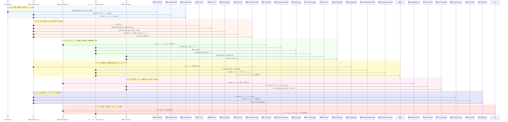

# SES Manager Pro 300人規模 7大業務E2Eシナリオ仕様書

本ドキュメントは、**300人規模の実データ (`V100__seed_r3_scale_300.sql`)** を基盤とし、全 15 モジュールを横断する **7 大 End-to-End (E2E) 業務ライフサイクルシナリオ** の詳細画面操作手順、入力データ、および DB 反映先仕様書です。

---

## 1. 300人規模 E2E シナリオ全景

---

## 2. 7 大 E2E シナリオ画面操作・データ落盤詳細仕様

### 2.1 シナリオ 1 [300人データ]: 採用〜要員化〜25名営業分配〜歩合コミッション画面フロー
1. **ステップ 1 (画面 `/candidate/list`)**: HR `s300.hr01` でログイン。「候補者登録」Modal で氏名 `山本 太郎`、スキル `Java, Spring` 入力保存。
   - **DB落盤**: `t_candidate` (name='山本 太郎', status='応募')
2. **ステップ 2 (画面 `/candidate/list`)**: カードを「内定承諾」へドラッグし、「エンジニアへ正式変換」を押下。
   - **DB落盤**: `t_candidate.status` = '要員化済', `t_engineer` (name='山本 太郎', status='待機中')
3. **ステップ 3 (画面 `/engineer/detail/{id}`)**: 営業 `s300.sales01` を選択し「主担当設定」。その後 `s300.sales02` へ変更。
   - **DB落盤**: `t_engineer_sales` (旧: `primary_flag`=0, `released_at`=NOW(), 新: `primary_flag`=1, `assigned_at`=NOW())
4. **ステップ 4 (画面 `/sales-performance`)**: 「歩合計算実行」ボタンを押下。
   - **DB落盤**: `t_sales_commission_snapshot` (sales_user_id, total_sales, gross_profit, commission_amount)
   - **画面表示**: 25 営業の売上・利益・歩合額が画面テーブルに描画。

### 2.2 シナリオ 2 [300人データ]: CRM商談〜案件〜AIマッチング〜提案Kanban〜契約自動生成〜CloudSign署名フロー
1. **ステップ 1 (画面 `/crm/list`)**: 営業 `s300.sales01` でログイン、新規商談作成（想定売上85万円）。
   - **DB落盤**: `t_lead`, `t_opportunity` (amount=850000)
2. **ステップ 2 (画面 `/project/list`)**: SES案件作成（単価80〜90万円、精算幅140-180h、必須Java）。
   - **DB落盤**: `t_project` (price_min=800000, settlement_hours_min=140, settlement_hours_max=180)
3. **ステップ 3 (画面 `/project/detail/{id}`)**: 「AI適合度マッチング試算」押下。適合率 88% の要員を抽出。
   - **DB落盤**: `t_ai_match_score`
4. **ステップ 4 (画面 `/proposal/kanban`)**: 要員を案件に提案、Kanban で「成約」列へドラッグ＆ドロップ。
   - **DB落盤**: `t_proposal.status` = '成約', `t_contract` にドラフト自動 INSERT
5. **ステップ 5 (画面 `/contract/list`)**: 自動生成された契約を開き、「S10 コンプライアンスチェック」実行。
   - **DB落盤**: `t_dispatch_compliance` (limit_date)
6. **ステップ 6 (画面 `/contract-document/list`)**: 「CloudSign 署名依頼送信」を押下。
   - **DB落盤**: `t_contract_document` (status='SENT' → 'SIGNED')

### 2.3 シナリオ 3 [S11勤怠]: 255名要員タイムシート〜36協定過重労働〜勤怠承認〜月次締め拒否〜自動請求・消込フロー
1. **ステップ 1 (画面 `/my/timesheet`)**: 要員 `s300.eng001`〜`eng255` で当月タイムシート（出退勤・残業）を入力し「提出」。
   - **DB落盤**: `t_work_record` (status='SUBMITTED', work_hours, overtime_hours)
2. **ステップ 2 (画面 `/attendance/overtime-alert`)**: マネージャー `s300.mgr01` で過重労働・36協定アラートを照会。
   - **DB落盤**: `t_attendance_discrepancy`
3. **ステップ 3 (画面 `/attendance/list`)**: 「一括承認」を押下。
   - **DB落盤**: `t_work_record.status` = 'APPROVED'
4. **ステップ 4 (画面 `/monthly-closing/list`)**: 「月次締め確定」を押下。
   - **DB落盤**: `t_monthly_closing` (work_month, status='CLOSED')
   - **検証**: 要員画面での同一月勤怠変更が `MonthlyClosingServiceImpl.assertOpenForUpdate` で Swal エラー拒否。
5. **ステップ 5 (画面 `/invoice/list`)**: 「当月一括請求書作成」を押下。
   - **DB落盤**: `t_invoice` (total_amount), `t_invoice_item` (控除/残業按分切捨て計算)
6. **ステップ 6 (画面 `/reconciliation/list`)**: 「入金消込実行」を押下。
   - **DB落盤**: `t_invoice_payment`, `t_invoice.status` = 'PAID'

### 2.4 シナリオ 4 [S10/S12]: BP調達〜S10派遣台帳〜S12キャパシティ〜KPIフロー
1. **ステップ 1 (画面 `/bp-availability/list`)**: BP 企業 15 社から要員空きデータを取り込み。
   - **DB落盤**: `t_bp_company`, `t_bp_availability`
2. **ステップ 2 (画面 `/compliance/dispatch-ledger`)**: **S10** 派遣請負台帳を作成、抵触日（個人 3 年ルール）を検証。
   - **DB落盤**: `t_dispatch_compliance`
3. **ステップ 3 (画面 `/staffing/capacity-planning`)**: **S12** 今後 6 ヶ月の要員稼働予測シミュレーションを実行。
   - **DB落盤**: `t_staffing_capacity`
4. **ステップ 4 (画面 `/`)**: ダッシュボードの稼働率・粗利益率・ベンチ数がリアルタイム更新されることを確認。

### 2.5 シナリオ 5 [S13〜S16]: 外部ポータル〜S14要員ポータル〜S16 JP PINT〜S15会計フロー
1. **ステップ 1 (画面 `/portal/engineer-self`)**: **S14** 要員自身が最新スキルを更新、経費申請。
   - **DB落盤**: `t_engineer_self_profile`, `t_engineer_expense`
2. **ステップ 2 (画面 `/invoice/jp-pint`)**: **S16** 請求書から JP PINT デジタルインボイス XML を出力。
   - **DB落盤**: `t_jp_pint_export_log`
3. **ステップ 3 (画面 `/accounting/export`)**: **S15** 会計仕訳 CSV および全銀 FB データを出力。
   - **DB落盤**: `t_accounting_journal`, `t_fb_transfer_log`

### 2.6 シナリオ 6 [S17/セキュリティ]: S17 AI学習〜データスコープ〜監査ログフロー
1. **ステップ 1 (画面 `/ai/feedback-learning`)**: **S17** 提案成約/失注データをフィードバックし AI 再学習。
   - **DB落盤**: `t_ai_feedback_log`, `t_ai_model_config`
2. **ステップ 2 (画面 `/customer/list`)**: 25 名の各営業でログインし、自担当以外の顧客・契約が非表示（データスコープ隔離）であることを検証。
3. **ステップ 3 (画面 `/audit-log/list`)**: 一連の全操作が `t_audit_log` に記録されていることを確認。

### 2.7 シナリオ 7 [排他・同時実行]: 排他制御・トランザクション完全ロールバックフロー
1. **ステップ 1 (画面 `/my/timesheet`)**: 300 人のユーザーによる同時ログイン・タイムシート一括送信を実行。
   - **検証**: MyBatis-Plus 楽観排他・ShedLock バッチロックによりデッドロック発生ゼロ。
2. **ステップ 2 (DB異常系)**: 複合処理の途中でデータベース例外を発生させ、`@Transactional` ロールバックを検証。
   - **検証**: DB 状態が完全にロールバックされ、データ不整合が 0 件。

---
