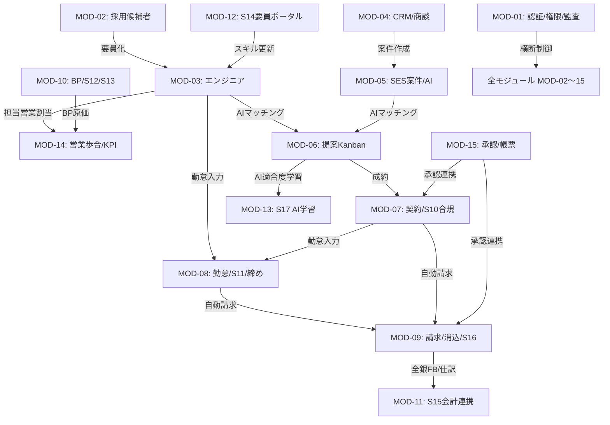

# SES Manager Pro モジュール間結合テスト（ITb）クロス連携マトリクス

本ドキュメントは、**モジュール間（Module X ↔ Module Y）のクロス機能連携・画面間データ遷移・DB共通状態整合性** を検証する全連携結合テスト仕様書です。

---

## 1. モジュール間クロス連携テストマトリクス概要

---

## 2. モジュール間クロス連携詳細検証仕様

### 2.1 【MOD-02 ↔ MOD-03】採用候補者 → エンジニア正式変換・マスタ連携
- **連携操作**: 採用画面 `/candidate/list` で「内定承諾」候補者の「要員化」ボタン押下。
- **データ連動**:
  - `t_candidate.status` = '要員化済'
  - `t_engineer` に新規 INSERT (id, name, email, status='待機中', deleted_flag=0)
  - `t_engineer_skill` に候補者スキルを自動コピー
- **UI表示連動**: エンジニア一覧画面 `/engineer/list` に即座に新要員が「待機中」バッジで登場。

### 2.2 【MOD-03 ↔ MOD-14】エンジニア ↔ 担当営業アサイン・歩合算定連携
- **連携操作**: エンジニア詳細 `/engineer/detail/{id}` で担当営業 `sales01` から `sales02` へ変更。
- **データ連動**:
  - `t_engineer_sales` (旧営業: `primary_flag`=0, `released_at`=NOW(), 新営業: `primary_flag`=1, `assigned_at`=NOW())
  - `/sales-performance` 画面の歩合計算ロジックが `t_engineer_sales` の履歴史を参照。
- **UI表示連動**: `/sales-performance` 画面で当月分の売上・インセンティブが新営業 `sales02` へ正しく配分表示。

### 2.3 【MOD-04 ↔ MOD-05 ↔ MOD-06】CRM商談 → 案件要件 → 提案Kanban連携
- **連携操作**: `/crm/list` で商談を「成約見込み」とし、`/project/list` で案件を作成。`/proposal/kanban` で要員をマッチング提案。
- **データ連動**:
  - `t_opportunity.id` → `t_project.opportunity_id`
  - `t_project.id` + `t_engineer.id` → `t_proposal` (status='候補')
  - `t_ai_match_score` の適合率（例: 88%）が提案カード上に自動埋め込み。
- **UI表示連動**: 提案Kanban画面上に案件名・要員名・AI適合度スコア・想定単価が一体カードとして描画。

### 2.4 【MOD-06 ↔ MOD-07】提案Kanban成約 → 契約ドラフト自動生成・S10合規連携
- **連携操作**: `/proposal/kanban` でカードを「成約」列へドラッグ＆ドロップ。
- **データ連動**:
  - `t_proposal.status` = '成約'
  - `t_contract` にドラフト自動 INSERT (`engineer_id`, `project_id`, `unit_price`, `sales_user_id` = エンジニア現主担当)
  - `t_dispatch_compliance` に S10 派遣・請負コンプライアンスチェック記録自動作成。
- **UI表示連動**: 契約一覧画面 `/contract/list` に「ドラフト（承認待ち）」として自動登場、コンプライアンス合格バナー表示。

### 2.5 【MOD-07 ↔ MOD-08】契約 ↔ 勤怠タイムシート・S11過重労働・月次締め連携
- **連携操作**: 稼働中契約に基づき要員が `/my/timesheet` で工数入力、マネージャーが `/attendance/list` で承認し `/monthly-closing/list` で締め確定。
- **データ連動**:
  - `t_contract.id` → `t_work_record.contract_id`
  - `t_work_record.status` = 'APPROVED'
  - `t_monthly_closing.status` = 'CLOSED' (該当月の `t_work_record` に対する UPDATE / DELETE を DB/Service ガードで遮断)
- **UI表示連動**: 月次締め確定後、要員画面のタイムシート編集ボタンが非活性（ロック状態）になり、変更試行時は Swal エラー表示。

### 2.6 【MOD-08 ↔ MOD-09】確定勤怠 ↔ 自動請求書発行・精算計算・消込・S16 JP PINT連携
| ITb-04 | 勤怠・月次締め → 請求・AR | 勤怠ステータス `SUBMITTED` のデータを選択し月次締め実行。 その後、対象月の請求書一括生成バッチを実行。 | 勤怠時間が正確に請求書の「精算幅基準稼働時間」および「残業/控除」項目に反映されていること。 |
| ITb-05 (Edge) | 契約・単価改定 → 請求書 | 月半ばでの単価改定（`t_contract_price_history`）がある状態で請求書を生成。 | 稼働日割で日割計算された単価が適用され、請求額が正確に算出されていること。 |
| ITb-06 (S12) | 契約・アサイン → キャパシティ計画 | 新規案件にベンチ要員をアサイン（稼働開始日＝翌月1日）。 | `/staffing/capacity-planning` (S12) の翌月ベンチ数が 1 減少し、稼働率予測グラフが上昇すること。 |
| ITb-07 (S15) | 月次締め・BP支払 → 会計/全銀FB | BP支払確定後、`/accounting/export` (S15) から全銀データと仕訳CSVを出力。 | BP口座情報が正しくFBデータ(テキスト)にフォーマットされ、CSV借方貸方の合計が完全に一致すること。 |

> **Note**: `payroll-management` (Freee API連携) モジュールに関しては、現在改修中（半成品）のため、本結合テストフェーズからは一時除外（推後）とします。APIモック等での単体テストのみ実施済みの状態を維持してください。

- **データ連動**:
  - `t_work_record` の総稼働時間と `t_contract` の精算幅 (140-180h) を照合。
  - 下限割れ（控除）/ 上限超過（残業）を按分切捨て計算し `t_invoice` + `t_invoice_item` に保存。
  - `t_invoice_payment` に消込記録、`t_invoice.status` = 'PAID'
  - `t_jp_pint_export_log` に PEPPOL XML 出力ログ保存。
- **UI表示連동**: 請求書 PDF プレビューに明細行が正確描画、売掛金残高が 0 円になり、ブラウザで `.xml` ファイルが自動ダウンロード。

### 2.7 【MOD-09 ↔ MOD-11】請求・消込 ↔ S15 会計仕訳・全銀FBデータ・BP支払連携
- **連携操作**: 請求確定・消込後、`/accounting/export` で会計仕訳 CSV / 全銀 FB データを出力。
- **数据連動**:
  - `t_invoice` + `t_bp_payment` → `t_accounting_journal` (売上高 / 売掛金 / 買掛金 / 外注費の借方貸方仕訳)
  - `t_fb_transfer_log` (全銀協ヘッダー・データ・トレーラーレコード生成)
- **UI表示連動**: 画面上で仕訳合計貸借一致チェック結果が表示され、全銀 FB テキストファイルがダウンロード。

### 2.8 【MOD-10 ↔ MOD-14】BP空き要員・S12キャパシティ ↔ 管理会計・ダッシュボードKPI連携
- **連携操作**: `/bp-availability/list` で BP 要員を調達、`/staffing/capacity-planning` でキャパシティシミュレーション実行。
- **データ連動**:
  - `t_bp_availability` + `t_engineer` → ダッシュボード集計ロジック (`DashboardServiceImpl`)
  - 売上（顧客単価） - 原価（BP支払単価/自社人件費） ＝ 限界利益・粗利益率をリアルタイム算出。
- **UI表示連動**: ダッシュボード (`/`) および管理会計画面 (`/management-accounting`) の KPI パネル・グラフが即座に再描画。

### 2.9 【MOD-12 ↔ MOD-03】S14 要員セルフサービス ↔ エンジニアマスタスキル連動
- **連携操作**: 要員が `/portal/engineer-self` で自身のスキルタグ・資格を更新。
- **データ連動**: `t_engineer_self_profile` → `t_engineer_skill`
- **UI表示連動**: 営業が閲覧するエンジニア詳細 `/engineer/detail/{id}` のスキル一覧およびスキルシート PDF に最新情報が自動反映。

### 2.10 【MOD-06 ↔ MOD-13】提案Kanban成約/失注 ↔ S17 AIフィードバック学習連携
- **連携操作**: `/proposal/kanban` で提案が「成約」または「失注」にステータス変更。
- **データ連動**: `t_proposal.status` → `t_ai_feedback_log` (提案条件、要員スキル、結果) → `t_ai_model_config` (重みパラメータ更新)
- **UI表示連動**: `/ai/feedback-learning` 画面の適合度精度スコアグラフが向上更新。

### 2.11 【MOD-15 ↔ MOD-07 ↔ MOD-09】多段階承認 ↔ 契約・見積・請求連携
- **連携操作**: `/approval/list` でマネージャーが契約・見積の多段階承認を実行。
- **データ連動**: `t_approval_request.status` = 'APPROVED' → `t_contract.status` = 'ACTIVE' / `t_quotation.status` = 'APPROVED'
- **UI表示連動**: 契約画面・見積画面で「承認済」バッジに変化し、請求書発行・PDFダウンロードが可能化。

### 2.12 【MOD-01 ↔ ALL】認証・ロール権限・データスコープ・監査ログの全モジュール横断統制
- **連携操作**: 全画面操作において `MenuPermissionFilter`, `DataScopeService`, `ApiAuditFilter` が常時作動。
- **データ連動**: 全 API/画面リクエストに対して `t_audit_log` に操作ログが記録され、営業担当者以外のデータアクセスが 403 / 404 で遮断。
- **UI表示連動**: 非許可権限ユーザーの画面でボタン非活性・メニュー非表示・アクセス拒否エラー画面が徹底表示。

---
