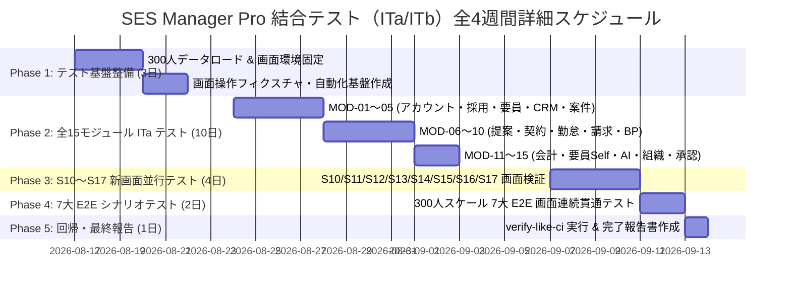

# SES Manager Pro 結合テスト 工期予測・全体スケジュール計画書

本ドキュメントは、**300人規模実データ、全 15 モジュール (全 36 画面)、S10〜S17 並行開発機能包含、および全 UI 操作ベース** による結合テストの全体工期予測・フェーズ別スケジュール・体制・完了条件仕様書です。

---

## 1. 全体工期予測サマリー

```text
全体予測工期: 4 週間（計 20 営業日）
対象範囲: 全 15 モジュール（全 36 画面 UI 操作 + バックエンド DB 落盤追跡）
データ母集団: 300人規模実データ (要員255 / 営業25 / マネージャー10 / HR8 / 管理者2)
目標カバレッジ: C0 行カバレッジ 95% 以上 / C1 分岐カバレッジ 95% 以上 / CI スキップ 0 件
```



---

## 2. フェーズ別詳細スケジュールと作業内容

| フェーズ名 | 期間 (営業日) | 担当チーム | 主な実施作業内容 | 期待される成果物・品質ゲート |
|---|---|---|---|---|
| **Phase 1: テスト環境・300人基盤整備** | 第 1 週 (前)<br>**3 営業日** | QA/開発 | - `V100__seed_r3_scale_300.sql` の H2 動作検証<br>- 300アカウント（`s300.*`）ログイン確認<br>- UI 自動化テスト用ドライバ準備 | `V100` ロード完了、画面ログイン導線 100% 導通 |
| **Phase 2: 全15モジュール ITa 結合テスト** | 第 1 週(後)〜第 3 週(前)<br>**10 営業日** | QA | - MOD-01〜MOD-15 の全 36 画面 UI 操作実行<br>- 入力バリデーション・エラーアラート検証<br>- DB テーブル・カラムへの落盤追跡検証 | ITa 400+ テストケース全件合格、DB 変更不整合 0 件 |
| **Phase 3: S10〜S17 新画面並行結合テスト** | 第 3 週 (後)<br>**4 営業日** | QA/開発 | - S10 派遣台帳、S11 過重労働、S12 キャパシティ<br>- S13/S14 ポータル、S15 会計、S16 JP PINT、S17 AI新画面検証 | S10〜S17 画面操作・API 連携全項目 PASS |
| **Phase 4: 300人 7大 E2E シナリオテスト** | 第 4 週 (前)<br>**2 営業日** | QA | - 300 人の要員・25 営業データを横断する全 7 大 E2E 画面連続操作検証<br>- 25 営業データスコープ相互遮断検証 | 7 大 E2E シナリオ完全無害完遂 |
| **Phase 5: 回帰検証 & 結合テスト報告書** | 第 4 週 (後)<br>**1 営業日** | QA/PL | - `verify-like-ci.ps1` スキップゼロ実行<br>- JaCoCo カバレッジ 95% エビデンス取得<br>- 最終結合テスト完了報告書の納品 | カバレッジ 95% 超達成、CI 全件 PASS 報告書 |

---

## 3. テストエントリー・エグジット基準 (Entry & Exit Criteria)

### テスト開始条件 (Entry Criteria)
1. `feature/integration-test-plan` ブランチに全結合テスト仕様書が格納されていること。
2. `V100__seed_r3_scale_300.sql` が正常に H2 DB へ適用可能であること。
3. アプリケーションが `mvn spring-boot:run` にて正常起動し、`/login` 画面が表示されること。

### テスト完了条件 (Exit Criteria)
1. **ITa / ITb テストケース合格率 100%**: 全 400+ ケースの ITa および 7 大 E2E シナリオがエラーなく完遂すること。
2. **カバレッジ達成**: JaCoCo レポートにて Controller / Service 層の C0 (行) / C1 (分岐) カバレッジが **95% 以上** であること。
3. **CI 回帰スクリプト合格**: `.\scripts\verify-like-ci.ps1` を実行し、スキップされたテストが **0 件** であること。
4. **致命的/高不具合数 0 件**: P0 (Blocker) および P1 (Critical) 不具合がすべて改修・再検証完了していること。

---
