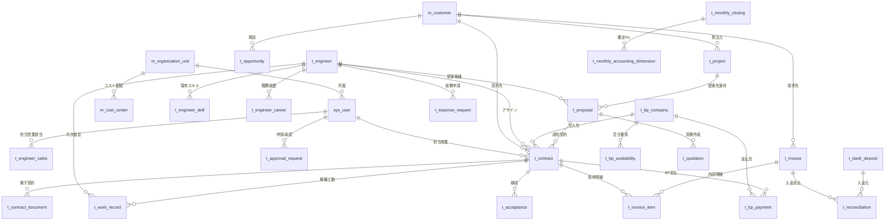
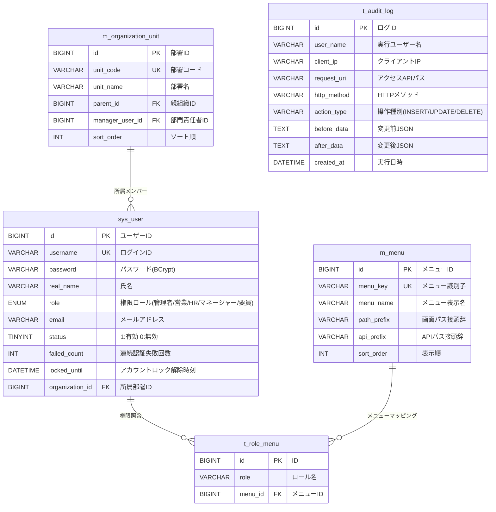
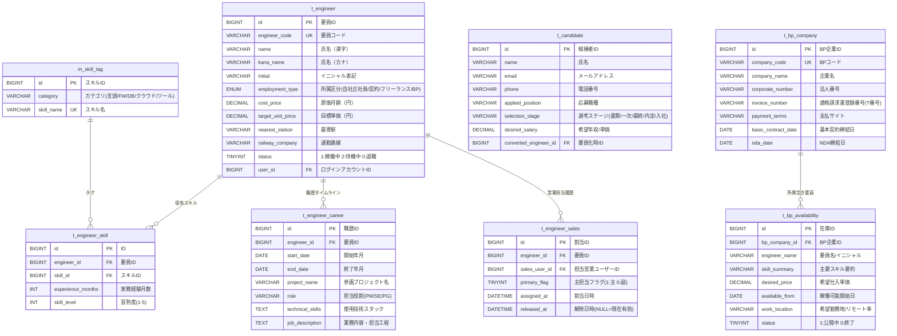
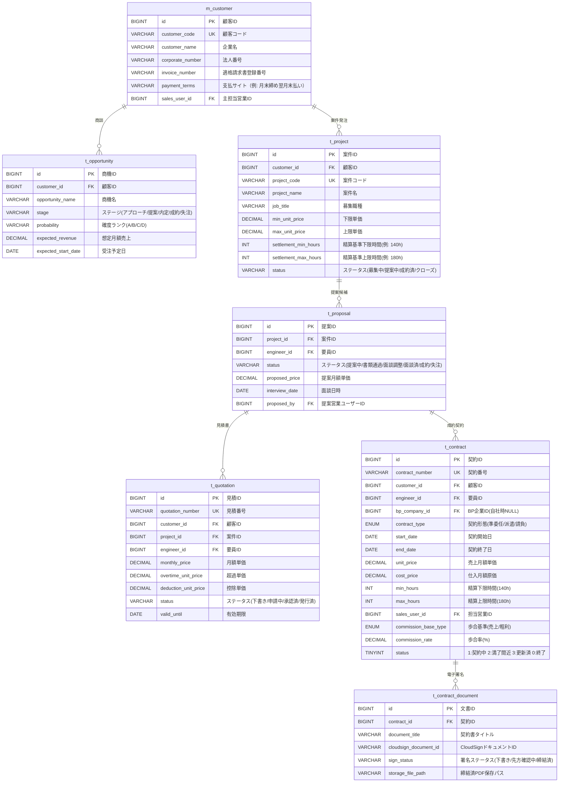
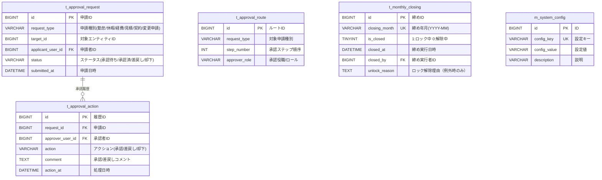

# SES Manager Pro データベース設計書 & ER図（Entity Relationship Architecture）

本ドキュメントは、システムエンジニアリングサービス（SES）統合管理プラットフォーム「**SES Manager Pro**」のデータベース構造、エンティティ間リレーションシップ（ER図）、各ドメインのテーブル定義、およびデータ整合性制約を定義した公式データベース仕様書です。

---

## 1. データベースアーキテクチャ概要

* **RDBMS**: MySQL 8.0+ / InnoDB ストレージエンジン
* **文字コード / 照合順序**: `utf8mb4` / `utf8mb4_unicode_ci`
* **論理削除 (Soft Delete)**: `deleted_flag TINYINT DEFAULT 0` （MyBatis-Plus Global Logic Delete）
* **共通監査カラム**:
  * `created_at DATETIME DEFAULT CURRENT_TIMESTAMP` (作成日時)
  * `updated_at DATETIME DEFAULT CURRENT_TIMESTAMP ON UPDATE CURRENT_TIMESTAMP` (更新日時)
  * `created_by VARCHAR(50)` / `updated_by VARCHAR(50)` (作成者/更新者)

---

## 2. 全社エンティティ相関図 (High-Level ER Matrix)

---

## 3. ドメイン別詳細ER図

### 3.1 認証・権限・組織・監査ドメイン (Auth, RBAC, Org & Audit)

---

### 3.2 要員・スキル・採用・BPドメイン (Engineer, Skill, Candidate & BP)

---

### 3.3 顧客・商機・案件・提案・契約ドメイン (CRM, Project, Proposal & Contract)

---

### 3.4 勤怠・検収・請求・入金消込・経費ドメイン (Billing, AR & Expenses)

```mermaid
erDiagram
    t_work_record {
        BIGINT id PK "勤怠ID"
        BIGINT contract_id FK "契約ID"
        BIGINT engineer_id FK "要員ID"
        VARCHAR work_month "稼働年月(YYYY-MM)"
        DECIMAL actual_hours "実稼働工数(h)"
        DECIMAL over_hours "超過時間(h)"
        DECIMAL deduction_hours "控除不足時間(h)"
        DECIMAL billing_amount "請求確定金額（円）"
        DECIMAL payment_amount "BP支払金額（円）"
        TINYINT status "0:未提出 1:提出済 2:承認済"
        VARCHAR evidence_file_path "客先勤務表エビデンスパス"
    }

    t_acceptance {
        BIGINT id PK "検収ID"
        BIGINT contract_id FK "契約ID"
        VARCHAR work_month "検収年月"
        DECIMAL accepted_hours "客先確定検収時間(h)"
        DECIMAL variance_hours "申告工数との差異(h)"
        VARCHAR acceptance_status "検収ステータス(未確定/確定済)"
        DATE confirmed_at "確定日時"
    }

    t_invoice {
        BIGINT id PK "請求書ID"
        VARCHAR invoice_number UK "請求書番号"
        BIGINT customer_id FK "顧客ID"
        VARCHAR billing_month "請求対象月"
        DATE issue_date "発行日"
        DATE due_date "支払期日"
        DECIMAL subtotal_amount "税抜合計額"
        DECIMAL tax_amount "消費税額(10%)"
        DECIMAL total_amount "税込合計額"
        VARCHAR status "ステータス(未発行/発行済/送付済/入金完了)"
        VARCHAR pdf_file_path "請求書PDF保存パス"
    }

    t_invoice_item {
        BIGINT id PK "明細ID"
        BIGINT invoice_id FK "請求書ID"
        BIGINT contract_id FK "契約ID"
        VARCHAR item_name "品名（要員稼働費）"
        DECIMAL unit_price "基本単価"
        DECIMAL adjustment_amount "過不足精算額"
        DECIMAL amount "明細合計金額"
    }

    t_bank_deposit {
        BIGINT id PK "入金ID"
        DATE deposit_date "入金日"
        VARCHAR payer_name "振込人名義（カナ）"
        DECIMAL amount "入金金額"
        VARCHAR bank_account "入金口座番号"
        TINYINT reconciled_flag "消込済フラグ(1:消込済 0:未消込)"
    }

    t_reconciliation {
        BIGINT id PK "消込ID"
        BIGINT invoice_id FK "請求書ID"
        BIGINT deposit_id FK "入金ID"
        DECIMAL reconciled_amount "消込金額"
        DECIMAL fee_amount "振込手数料額"
        DATETIME reconciled_at "消込完了日時"
    }

    t_bp_payment {
        BIGINT id PK "支払ID"
        BIGINT bp_company_id FK "BP企業ID"
        BIGINT contract_id FK "契約ID"
        VARCHAR work_month "対象年月"
        DECIMAL payment_amount "仕入支払金額"
        DECIMAL tax_amount "消費税額"
        DATE payment_due_date "支払期日"
        VARCHAR status "ステータス(未確定/確定済/振込完了)"
    }

    t_expense_request {
        BIGINT id PK "経費申請ID"
        BIGINT user_id FK "申請ユーザーID"
        DATE expense_date "利用日"
        VARCHAR account_title "勘定科目（旅費交通費等）"
        DECIMAL amount "税込金額"
        VARCHAR payee "支払先"
        VARCHAR invoice_number "インボイス事業者番号"
        VARCHAR receipt_file_path "領収書画像パス"
        VARCHAR status "ステータス(申請中/一次承認/経理承認/精算済/差戻し)"
    }

    t_work_record ||--o{ t_invoice_item : "精算反映"
    t_invoice ||--o{ t_invoice_item : "請求明細"
    t_invoice ||--o{ t_reconciliation : "消込先"
    t_bank_deposit ||--o{ t_reconciliation : "消込元"
```

---

### 3.5 ワークフロー・決算・システム設定ドメイン (Workflow, Closing & System)

---

## 4. データベース整合性・制約ポリシー

1. **外部キー制約 (FK) & カスケード保護**:
   * マスタデータ（顧客、要員、契約）は、誤削除によるトランザクション孤立を防ぐため `RESTRICT` を基本とし、MyBatis-Plus の論理削除（`deleted_flag = 1`）によって運用します。
2. **ユニーク制約 (UK) & 重複防止**:
   * `sys_user.username`、`m_customer.customer_code`、`t_engineer.engineer_code`、`t_contract.contract_number`、`t_invoice.invoice_number`、`t_monthly_closing.closing_month` など業務キーに対して一意性制約を定義。
3. **トランザクション整合性 & 月次締めガード**:
   * 月次締めが完了した月度（`t_monthly_closing.is_closed = 1`）に対する `t_work_record`、`t_acceptance`、`t_invoice`、`t_bp_payment` への更新操作は、サービス層の `MonthlyClosingService.assertOpenForUpdate()` により確実に例外遮断されます。
