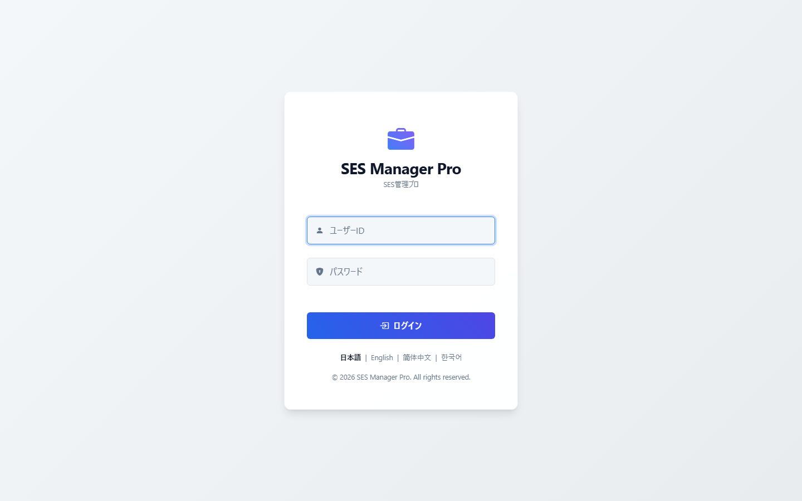
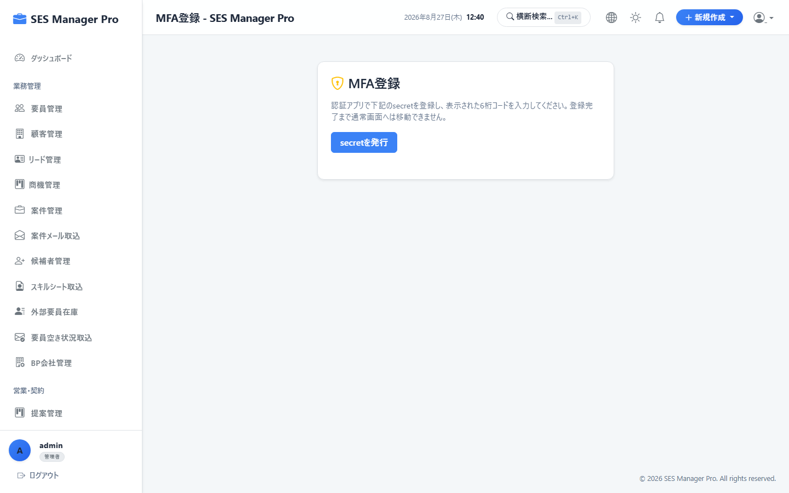
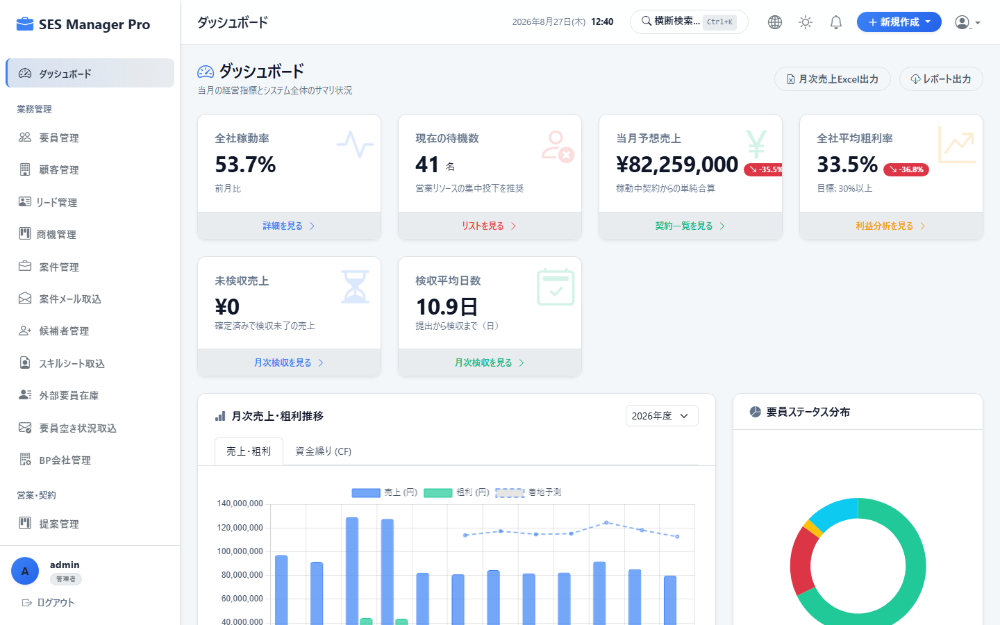
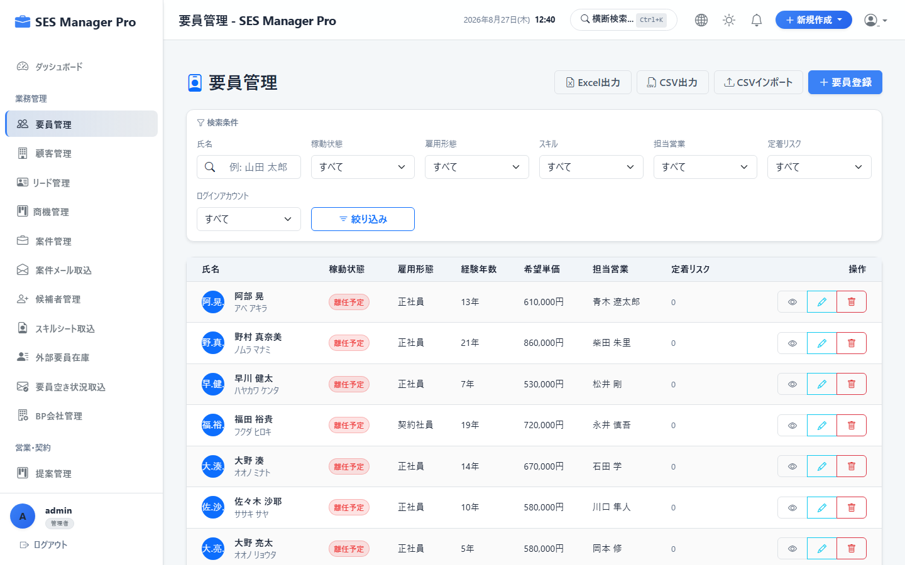

# 第1章 共通基本操作・初期設定マニュアル

本書では、**SES Manager Pro** にアクセスし、日常の業務を開始するためのログイン、二要素認証（MFA）、共通画面構成、データ検索、およびログアウトの操作手順を説明します。

---

## 1-1. ログイン

### 概要・目的
システムを利用するために、ユーザー認証を行います。

* **対象ロール**：全ロール（管理者 / 営業 / HR / マネージャー / 要員）
* **アクセスURL**：`http://localhost:8080/login`
* **キャプチャID**：`CAP-COM-001`




```
+-------------------------------------------------------------+
|                      SES Manager Pro                        |
|                                                             |
|       +---------------------------------------------+       |
|       | ユーザー名 [ ①                      ]       |       |
|       | パスワード [ ②                      ]       |       |
|       |                                             |       |
|       |           [ ③ ログイン ]                    |       |
|       |                                             |       |
|       | 言語切替: [ ④ 日本語 (JA) ▼ ]                |       |
|       +---------------------------------------------+       |
+-------------------------------------------------------------+
```

### 操作手順
1. ブラウザ（Google Chrome / Microsoft Edge）でシステムのログイン画面URLへアクセスします。
2. **ユーザー名（①）** に付与された半角英数のアカウント名を入力します。
3. **パスワード（②）** を入力します。
4. **[ログイン] ボタン（③）** をクリックします。
5. 多要素認証（MFA）が設定されている場合は、続けて認証コード入力画面へ遷移します。

### 入力項目一覧
| 項目名 | 必須 | 型 / 制限 | 説明・入力例 |
|:---|:---:|:---|:---|
| ユーザー名 | ● | 半角英数字 | システム管理者より発行されたユーザー名（例: `admin`, `sales01`, `eng_yamada`） |
| パスワード | ● | 半角英数記号 (8文字以上) | 初期パスワードまたは変更後のパスワード |

### 完了状態・確認事項
* 認証成功後、権限に応じた初期画面へ自動遷移します。
  * **要員ロール**：`/my/timesheet`（マイ勤怠画面）
  * **その他管理ロール**：`/dashboard`（経営ダッシュボード画面）

> [!CAUTION]
> パスワードを連続5回誤入力するとアカウントが一時ロックされます。ロックされた場合はシステム管理者に解除を依頼してください。

---

## 1-2. 二要素認証 (MFA) の初期設定

### 概要・目的
アカウントのセキュリティを強化するため、ワンタイムパスワードアプリ（Google Authenticator等）を用いた二要素認証を設定します。

* **対象ロール**：全ロール
* **アクセスURL**：`/mfa`
* **キャプチャID**：`CAP-COM-002`




```
+-------------------------------------------------------------+
|                    二要素認証 (MFA) 設定                    |
|                                                             |
|   1. 以下のQRコードを認証アプリでスキャンしてください。     |
|       +-------------------+                                 |
|       |  ① QRコード表示   |   ② シークレットキー手動登録:   |
|       |  [  QR CODE  ]    |      JBSWY3DPEHPK3PXP           |
|       +-------------------+                                 |
|                                                             |
|   2. アプリに表示された6桁のコードを入力してください。      |
|       確認コード: [ ③ 123456 ]   [ ④ 有効化する ]           |
+-------------------------------------------------------------+
```

### 操作手順
1. ログイン後、MFA設定画面が表示されます。
2. スマートフォンの認証アプリ（Google Authenticator / Microsoft Authenticator）を起動します。
3. アプリの「QRコードをスキャン」で **画面上のQRコード（①）** を読み取ります。
   * ※カメラが利用できない場合は **シークレットキー（②）** を手動入力します。
4. アプリ上に表示された最新の6桁コードを **確認コード入力欄（③）** に入力します。
5. **[有効化する] ボタン（④）** をクリックします。

### 完了状態・確認事項
* 「MFAが正常に有効化されました」というトースト通知が表示され、次回ログイン時から6桁コードの入力が要求されます。

---

## 1-3. 画面共通ナビゲーション & メニュー操作

### 概要・目的
システム内の各機能へアクセスするためのサイドバーおよびヘッダーの操作方法です。

* **対象ロール**：全ロール
* **キャプチャID**：`CAP-COM-003`




```
+-------------------------------------------------------------------------------+
| [Logo] SES Manager Pro     [現在日時: 2026/08/27 10:00]  [🔔 ③] [👤 山田 太郎 (要員) ④] |
+------------------+------------------------------------------------------------+
| 【サイドバー ①】 | 【メインコンテンツ表示領域】                               |
| 📊 ダッシュボード |                                                            |
| ──────────────── |                                                            |
| ▼ 業務管理      |                                                            |
|   👤 要員管理    |                                                            |
|   🏢 顧客管理    |                                                            |
|   💼 案件管理    |                                                            |
| ──────────────── |                                                            |
| ▼ 営業・契約    |                                                            |
|   📋 提案管理    |                                                            |
|   📝 契約管理    |                                                            |
| ──────────────── |                                                            |
| 🚪 [ログアウト ⑤] |                                                            |
+------------------+------------------------------------------------------------+
```

### 各部名称と機能
| 番号 | 名称 | 機能説明 |
|:---|:---|:---|
| ① | サイドバーメニュー | ロールに応じて許可された業務メニューがカテゴリ別に一覧表示されます。 |
| ② | ヘッダー時計 & 組織 | システム時刻および現在選択中の所属組織が表示されます。 |
| ③ | 通知ベルアイコン | 勤怠承認、契約更新、変更申請などの未読通知件数がバッジ表示されます。 |
| ④ | ユーザー情報・設定 | ログイン中の氏名・ロール名が表示され、プロフィール設定へアクセスできます。 |
| ⑤ | ログアウト | クリックすると現在のセッションを破棄して安全に終了します。 |

---

## 1-4. データ検索・ソート・CSVエクスポート

### 概要・目的
一覧画面において、大量のデータから目的のレコードを素早く検索・絞り込み、ファイル出力します。

* **対象ロール**：全ロール
* **キャプチャID**：`CAP-COM-004`




```
+-------------------------------------------------------------------------------+
|  キーワード: [ ① Java                  ]  ステータス: [ ② 稼働中 ▼ ]  [ 検索 ]  |
|                                                    [ ③ 📥 CSVエクスポート ]   |
+-------------------------------------------------------------------------------+
| [ID ▲ ④] | 氏名 / 案件名  | 所属 / 取引先 | 単価 (円) | ステータス | アクション |
|-----------+---------------+---------------+-----------+------------+------------|
| ENG-001   | 山田 太郎     | 自社正社員    | 800,000   | 稼働中     | [詳細] [編集] |
| ENG-004   | 佐藤 次郎     | BP (A社)      | 750,000   | 稼働中     | [詳細] [編集] |
+-------------------------------------------------------------------------------+
| 表示件数: 1 - 20 / 全 124 件                  [前へ] [1] [2] [3] [次へ] ⑤     |
+-------------------------------------------------------------------------------+
```

### 操作手順
1. **検索キーワード（①）** に氏名、スキル、顧客名等を入力し、Enterキーまたは [検索] を押します。
2. **ステータス絞り込み（②）** で対象の状態（例：稼働中、商談中）を選択します。
3. テーブルヘッダーの **項目名（④）** をクリックすると、昇順（▲）/ 降順（▼）ソートが切り替わります。
4. **[CSVエクスポート] ボタン（③）** をクリックすると、絞り込まれた一覧データがUTF-8（BOM付き）CSV形式でダウンロードされます。

---

## 1-5. ログアウト

### 概要・目的
作業終了時にセッションを安全に破棄します。

* **対象ロール**：全ロール
* **アクセスURL**：`/logout`
* **キャプチャID**：`CAP-COM-005`

### 操作手順
1. サイドバー最下部またはヘッダー右上の **[ログアウト]（⑤）** をクリックします。
2. ログアウト処理が実行され、ログイン画面（`/login`）へリダイレクトされます。
