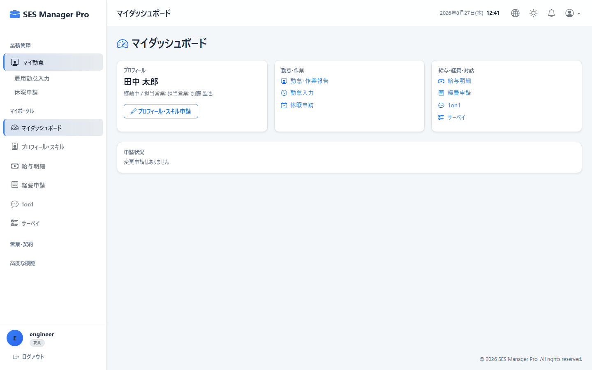
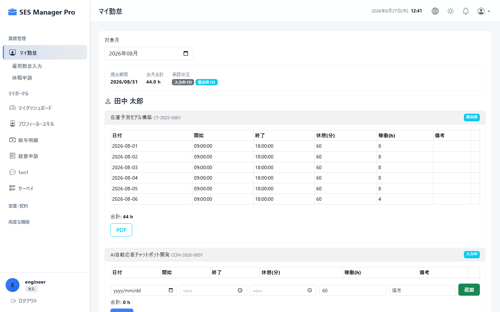
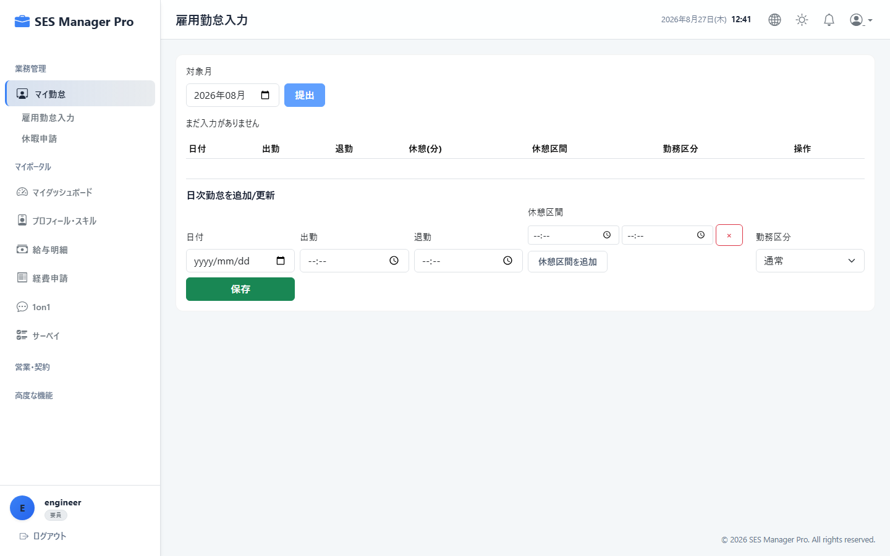
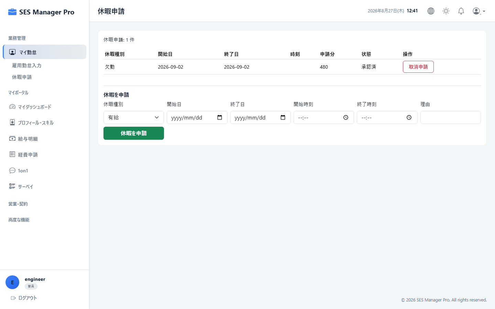
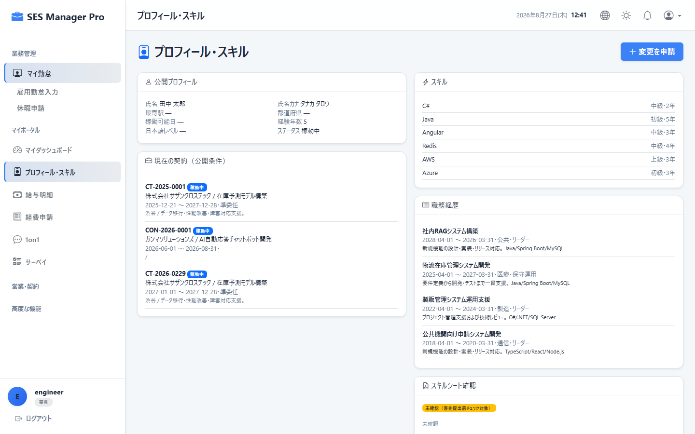
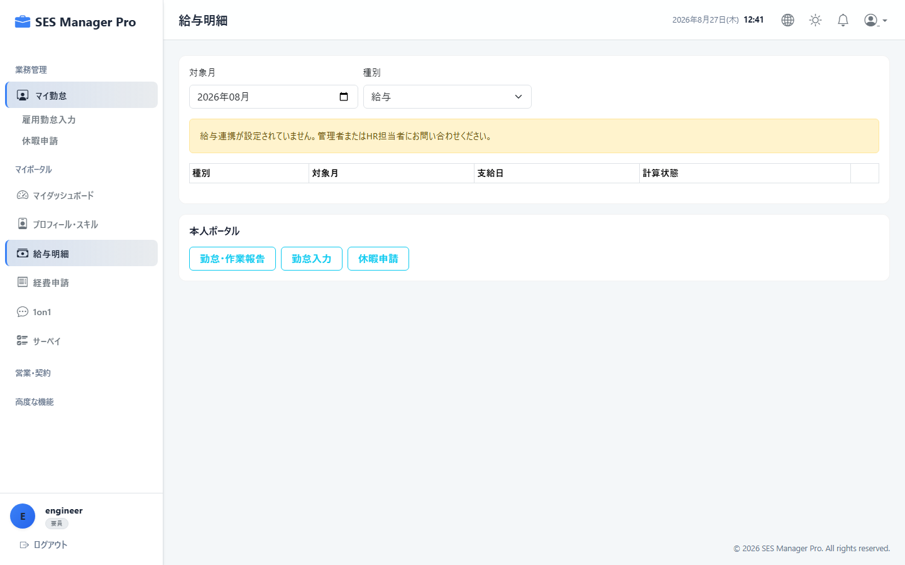
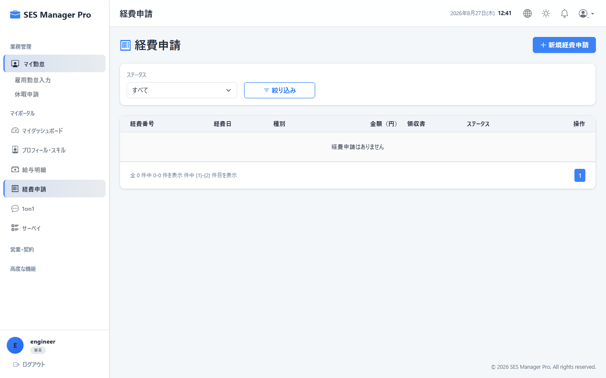

# 第2章 要員ポータル（マイポータル）操作マニュアル

本書では、エンジニア・要員が日常的に利用する「マイポータル（`/my/**`）」の各機能（勤怠入力、休暇申請、経費申請、スキル更新、給与明細照会、1on1、サーベイ）の操作手順を説明します。

---

## 2-1. マイダッシュボード照会

### 概要・目的
参画中の案件情報、当月の勤務進捗、および社内からのお知らせを一元的に確認します。

* **対象ロール**：要員
* **アクセスURL**：`/my/dashboard`
* **キャプチャID**：`CAP-MY-001`




```
+-------------------------------------------------------------------------------+
|  マイダッシュボード                                                           |
+------------------------------------+------------------------------------------+
| 【① 現在参画中の案件】             | 【② 当月稼働メーター】                   |
| 案件名: ECサイトリニューアル開発   | 基準精算幅: 140h 〜 180h                 |
| 顧客名: 株式会社ABC商事            | 当月実績工数: [ 152.5 h ] (基準内: 適正) |
| 期間: 2026/04/01 〜 2026/09/30     | [======|========|=====                ]  |
| 担当営業: 鈴木 一郎 (内線: 102)     |  0h   140h     180h                      |
+------------------------------------+------------------------------------------+
| 【③ 社内通知・お知らせ】           | 【④ 直近のアクション】                  |
| ・[重要] 8月度勤怠の提出期限は31日 | ・未提出の経費申請: 1件                  |
| ・秋季健康診断の予約受付中         | ・次回の1on1面談: 9月4日(金) 16:00       |
+------------------------------------+------------------------------------------+
```

### 確認事項
1. **参画中案件カード（①）**：現在の契約期間や担当営業の連絡先を確認できます。
2. **稼働メーター（②）**：基準時間（例: 140-180h）に対する現在の累計時間を把握し、過重労働や工数不足を未然に防ぎます。

---

## 2-2. マイ勤怠入力（客先工数入力・提出）

### 概要・目的
クライアント先での日々の作業実績工数を入力し、月末に客先勤務表（エビデンス）を添付して提出します。

* **対象ロール**：要員
* **アクセスURL**：`/my/timesheet`
* **キャプチャID**：`CAP-MY-002`




```
+-------------------------------------------------------------------------------+
| マイ勤怠入力 (客先実績)    対象年月: [ ① 2026年08月 ▼ ]   ステータス: [ 入力中 ] |
|                                   [ ④ 💾 一時保存 ]   [ ⑤ 🚀 当月勤怠を提出 ] |
+-------------------------------------------------------------------------------+
| 日付 | 曜日 | 区分 | 始業時刻 | 終業時刻 | 休憩 | 実働 | 作業内容・備考       |
|------+------+------+----------+----------+------+------+----------------------|
| 08/01| 木   | 出勤 | 09:00    | 18:00    | 60分 | 8.0h | API結合テスト実施    |
| 08/02| 金   | 出勤 | 09:00    | 19:30    | 60分 | 9.5h | バグ修正対応 (残業)  |
| 08/03| 土   | 休日 | -        | -        | -    | 0.0h | -                    |
+-------------------------------------------------------------------------------+
| 【③ 客先勤務表エビデンス添付 (必須)】                                         |
| [ 📎 ファイルを選択: 202608_timesheet_abc.pdf ] (ドラッグ＆ドロップ可)        |
+-------------------------------------------------------------------------------+
```

### 操作手順
1. **対象年月（①）** を選択します。
2. 日付ごとに **始業時刻・終業時刻・休憩時間（②）** を入力します。
3. 日常の入力途中で **[一時保存]（④）** をクリックするとデータが保持されます。
4. 月末に全営業日の入力が完了したら、客先の勤務表ファイル（PDFまたはExcel）を **エビデンス添付エリア（③）** にアップロードします。
5. **[当月勤怠を提出]（⑤）** をクリックして承認申請を行います。

### 入力項目一覧
| 項目名 | 必須 | 入力形式 | 説明・入力例 |
|:---|:---:|:---|:---|
| 始業時刻 / 終業時刻 | ● | `HH:mm` | 当日の客先作業開始・終了時刻（例: `09:00`, `18:00`） |
| 休憩時間 | ● | 数値 (分) | 取得した休憩時間（例: `60`） |
| 勤務区分 | ● | 選択式 | 通常出勤、在宅勤務、客先直行、有給休暇、欠勤 |
| 作業内容・備考 | 任意 | テキスト | 主な担当作業概要や残業理由 |
| 客先エビデンス | ● | PDF / Excel | 客先で押印・承認された勤務実績表 |

> [!IMPORTANT]
> 提出後はデータがロックされ編集不可となります。修正が必要な場合はマネージャーに差戻しを依頼してください。

---

## 2-3. 雇用勤怠入力（自社出退勤打刻）

### 概要・目的
自社の雇用管理・労基法遵守（36協定）のために、出退勤の打刻を行います。

* **対象ロール**：要員
* **アクセスURL**：`/my/attendance`
* **キャプチャID**：`CAP-MY-003`




```
+-------------------------------------------------------------------------------+
|  雇用勤怠打刻 (自社労務)                                                      |
|                                                                               |
|   現在時刻: 2026年08月27日(木) 08:58:32                                       |
|   +---------------------------+     +---------------------------+             |
|   |   [ ① ☀️ 出勤打刻 ]      |     |   [ ② 🌙 退勤打刻 ]      |             |
|   +---------------------------+     +---------------------------+             |
|                                                                               |
|   今月の36協定残業時間: [ 18.5 時間 ] (法定上限 45h まで残り 26.5h)           |
+-------------------------------------------------------------------------------+
```

### 操作手順
1. 業務開始時に **[出勤打刻]（①）** をクリックします。
2. 業務終了時に **[退勤打刻]（②）** をクリックします。
3. 打刻忘れや時刻修正がある場合は、下部の「打刻修正申請フォーム」より理由を添えて申請します。

---

## 2-4. 休暇申請（有休・特別休暇）

### 概要・目的
年次有給休暇や特別休暇の取得申請を行います。

* **対象ロール**：要員
* **アクセスURL**：`/my/leave`
* **キャプチャID**：`CAP-MY-004`




```
+-------------------------------------------------------------------------------+
|  休暇申請                                              [ ② ＋ 新規休暇申請 ] |
|  有休残日数: [ 12.5 日 ] / 当期付与: [ 15.0 日 ] / 消化率: [ 45.0% ]          |
+-------------------------------------------------------------------------------+
| 申請日     | 休暇種別     | 取得期間               | 日数 | 理由     | 状態   |
|------------+--------------+------------------------+------+----------+--------|
| 2026/08/10 | 年次有休     | 2026/08/15 〜 08/15   | 1.0  | 私用のため| 承認済 |
| 2026/08/25 | 午前半休     | 2026/09/01 (午前)      | 0.5  | 通院のため| 申請中 |
+-------------------------------------------------------------------------------+
```

### 操作手順
1. **[新規休暇申請] ボタン（②）** をクリックします。
2. モーダルで「休暇区分（全休/午前半休/午後半休/慶弔休暇等）」「取得日」「申請理由」を入力します。
3. **[申請を送信]** をクリックします（マネージャーに通知されます）。

---

## 2-5. プロフィール & スキルシート更新

### 概要・目的
自身の保有技術、経験年数、職務経歴を更新し、営業活動に用いるスキルシートの鮮度を保ちます。

* **対象ロール**：要員
* **アクセスURL**：`/my/profile`
* **キャプチャID**：`CAP-MY-005`




### 操作手順
1. **基本情報タブ**：最寄駅、現住所、緊急連絡先を更新します。
2. **スキルマトリクスタブ**：習得した言語（Java, Python, TypeScript等）やクラウド（AWS, Azure）の経験年数と自己評価（★1〜★5）を更新します。
3. **職務経歴タブ**：直近完了したプロジェクトの「期間」「プロジェクト名」「役割」「工程（要件〜テスト）」「使用技術」を追加します。
4. **[変更申請を送信]** をクリックします。

---

## 2-6. 給与明細照会

### 概要・目的
毎月の支給額、控除額、差引支給額を確認し、電子給与明細PDFをダウンロードします。

* **対象ロール**：要員
* **アクセスURL**：`/my/payroll`
* **キャプチャID**：`CAP-MY-006`




### 操作手順
1. 画面上部のタブから照会したい **支給年月** を選択します。
2. 「基本給」「時間外手当」「通勤手当」「健康保険」「厚生年金」「所得税」等の内訳を確認します。
3. **[PDFダウンロード]** をクリックして明細書ファイルを保存します。

---

## 2-7. 経費精算申請（交通費・経費）

### 概要・目的
客先訪問の交通費や業務で購入した書籍等の立替経費を申請します。

* **対象ロール**：要員
* **アクセスURL**：`/my/expenses`
* **キャプチャID**：`CAP-MY-007`




### 操作手順
1. **[新規経費申請]** をクリックします。
2. 「発生日」「勘定科目（旅費交通費/消耗品費等）」「支払先」「金額（税込）」を入力します。
3. 領収書の写真またはPDFファイルをアップロードします。
4. **[提出]** をクリックすると、マネージャーおよび経理へ承認申請が送信されます。
