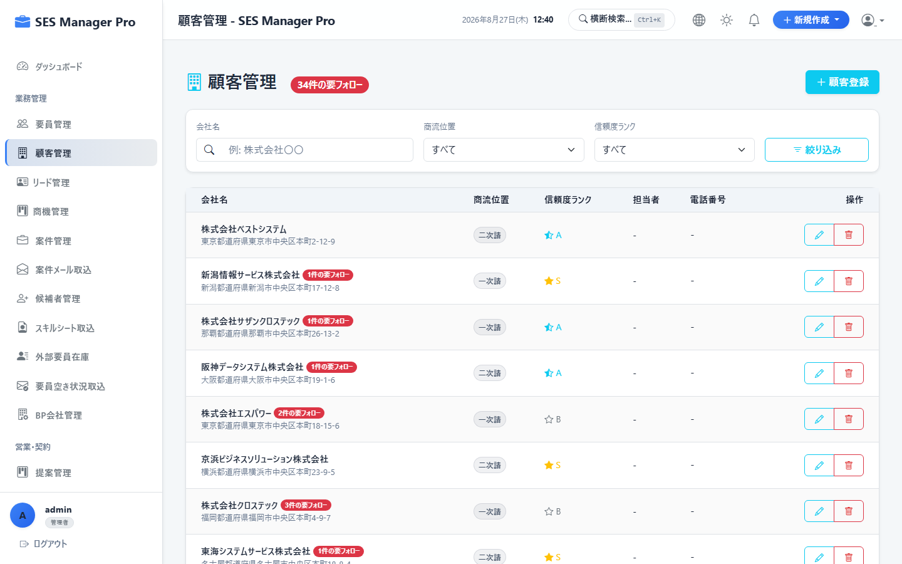
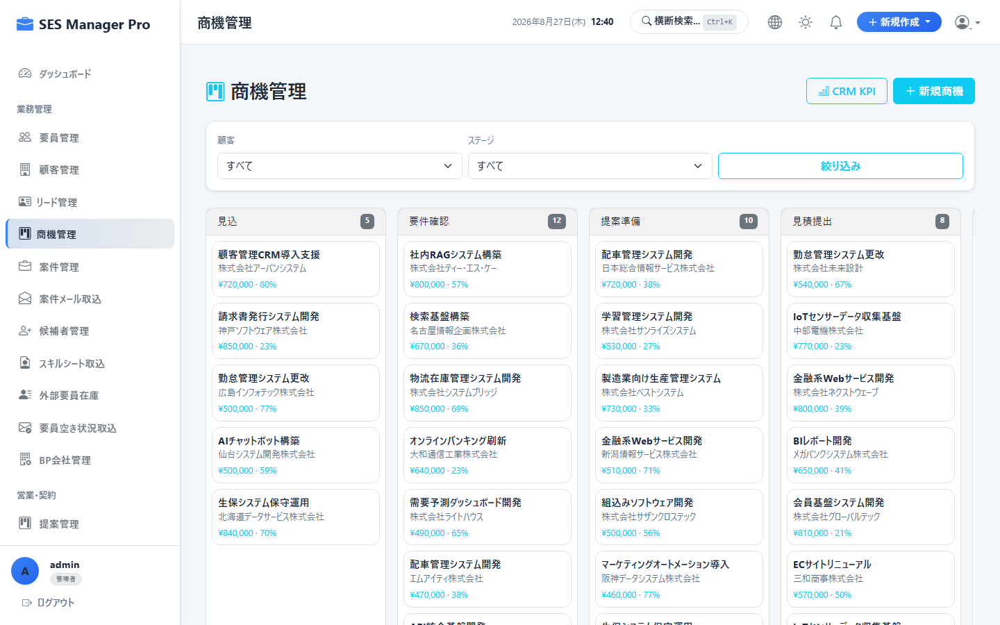
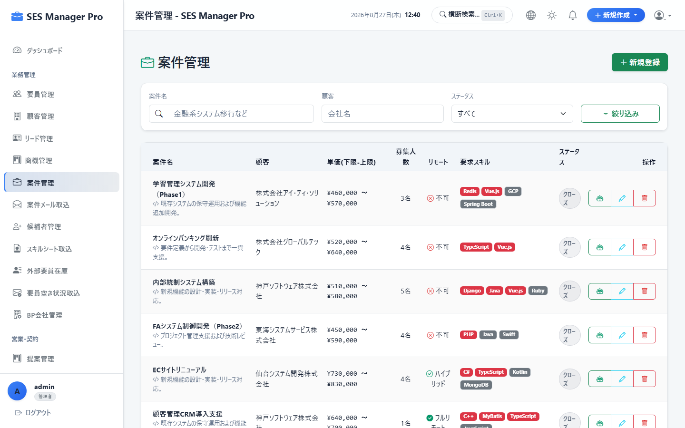
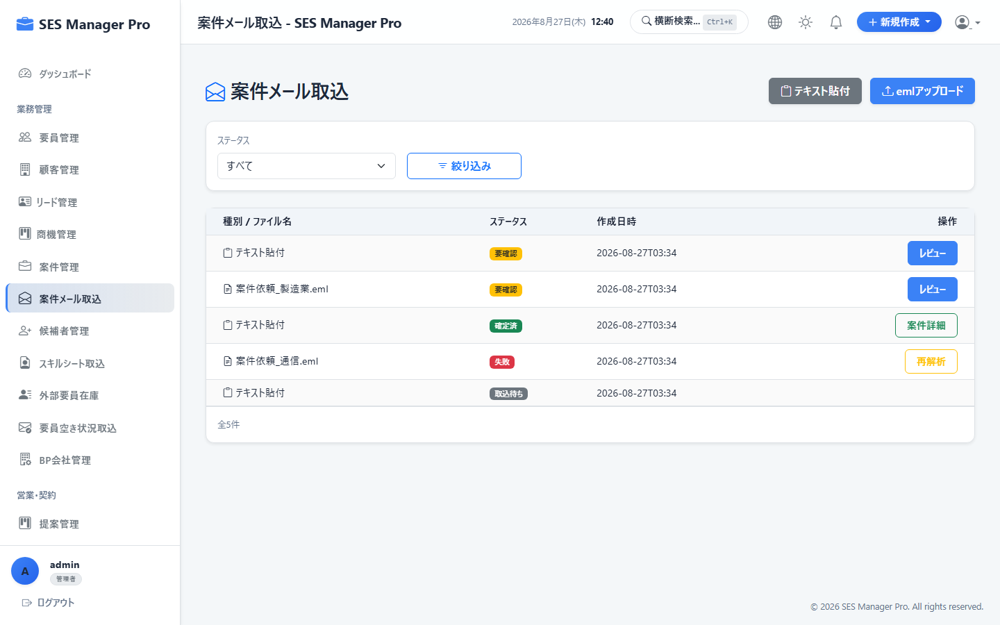
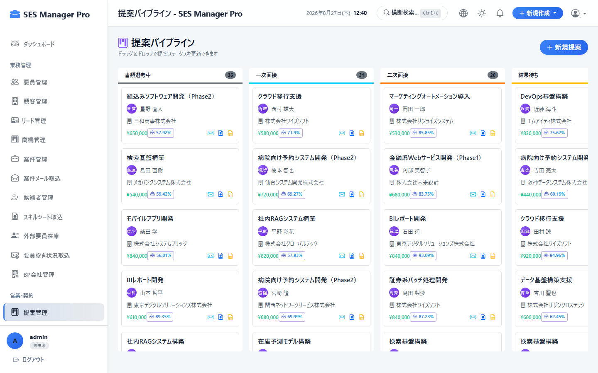
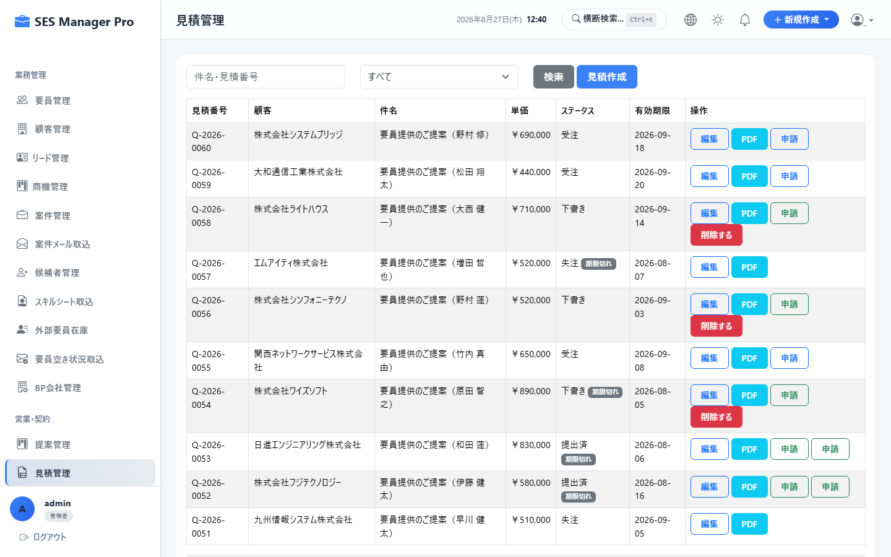
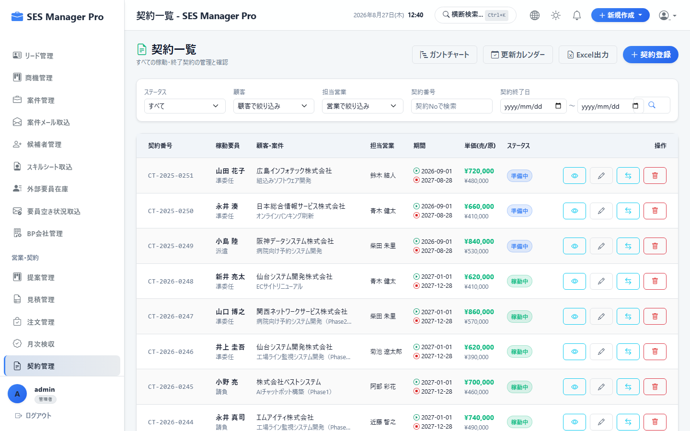
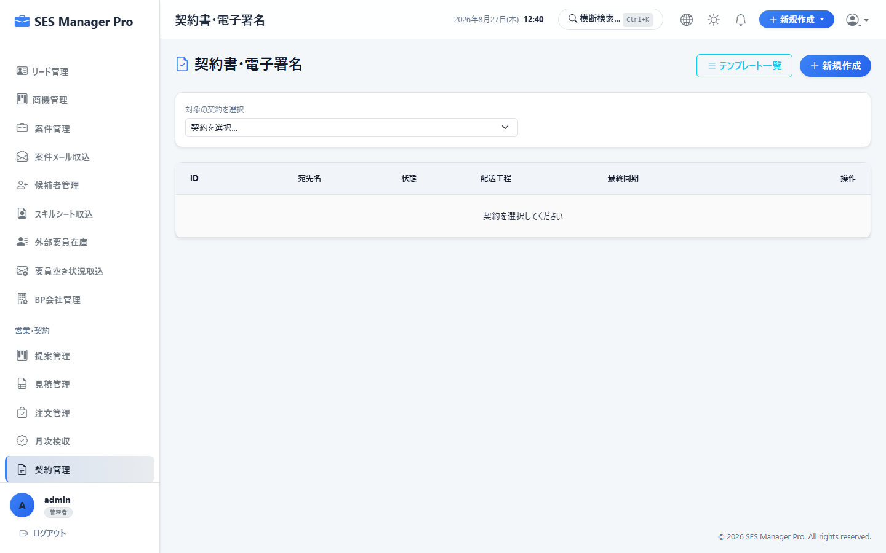
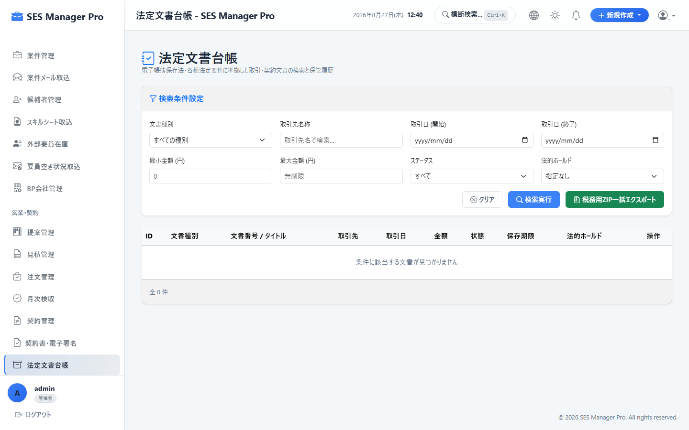
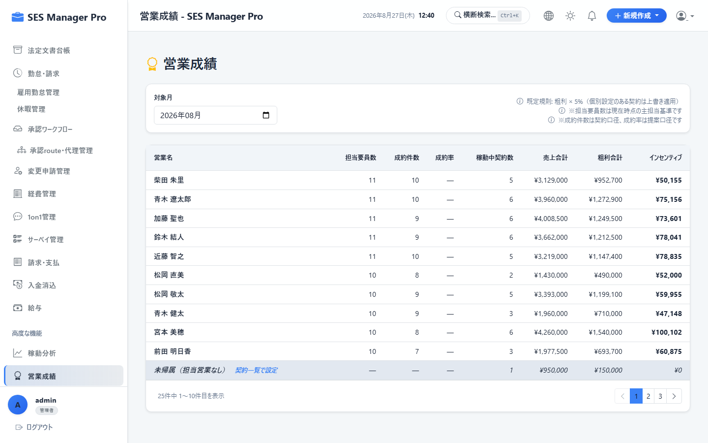

# 第3章 営業・案件・提案・契約管理操作マニュアル

本書では、営業担当者およびマネージャーが利用する、顧客CRM、商機、案件登録、案件メール自動取込、提案カンバン、見積書・注文書作成、SES契約登録、電子署名連携、法定文書管理、営業成績集計の操作手順を説明します。

---

## 3-1. 顧客マスタ管理・取引先登録

### 概要・目的
取引先企業（クライアント）の基本情報、インボイス登録番号、支払条件（締め日・支払サイト）を登録・管理します。

* **対象ロール**：管理者 / 営業
* **アクセスURL**：`/customer/list`
* **キャプチャID**：`CAP-SAL-001`




```
+-------------------------------------------------------------------------------+
|  顧客一覧                                                [ ② ＋ 新規顧客登録 ]|
|  検索: [ ① 株式会社ABC                 ]  担当営業: [ 鈴木 一郎 ▼ ]  [ 検索 ] |
+-------------------------------------------------------------------------------+
| 顧客コード | 顧客企業名         | 代表連絡先   | 支払サイト | 担当営業 | 操作 |
|------------+--------------------+--------------+------------+----------+------|
| CST-001    | 株式会社ABC商事    | 03-1234-5678 | 月末締翌末 | 鈴木 一郎| [詳細]|
| CST-002    | テクノロジー技研㈱ | 03-9876-5432 | 20日締翌20 | 佐藤 健太| [詳細]|
+-------------------------------------------------------------------------------+
```

### 操作手順
1. 画面右上の **[新規顧客登録]（②）** をクリックします。
2. 顧客情報入力モーダルで以下の項目を入力します。
   * **企業名**：正式な法人名を入力
   * **適格請求書発行事業者番号**：`T` + 13桁の番号を入力
   * **取引条件**：締め日（月末、20日等）および支払サイト（翌月末、翌々月5日等）を選択
   * **担当営業**：主担当となる営業ユーザーを選択
3. **[保存する]** をクリックします。

---

## 3-2. リード & 商機（Opportunity）パイプライン管理

### 概要・目的
見込み商談をステージ（ヒアリング → 提案 → 面談 → 内定 → 受注）別に可視化し、成約確度と売上予測を管理します。

* **対象ロール**：管理者 / 営業
* **アクセスURL**：`/crm/opportunities`
* **キャプチャID**：`CAP-SAL-002`




```
+-------------------------------------------------------------------------------+
|  商機カンバン (パイプライン)                          [ ② ＋ 新規商機登録 ]   |
|  当月想定パイプライン売上: [ ¥18,500,000 ]   想定粗利: [ ¥5,200,000 ]         |
+------------------+------------------+------------------+----------------------+
| [ ヒアリング ]   | [ 提案中 (50%) ] | [ 面談中 (80%) ] | [ 受注確定 (100%) ]  |
+------------------+------------------+------------------+----------------------+
| 【ABC商事: DX】  | 【XYZ: 基幹開発】| 【テック社: PMO】| 【ネット社: 保守】   |
| 単価: 85万       | 単価: 78万       | 単価: 95万       | 単価: 80万           |
| 確度: C (30%)    | 確度: B (60%)    | 確度: A (85%)    | 成約日: 08/25        |
+------------------+------------------+------------------+----------------------+
```

### 操作手順
1. **[新規商機登録]（②）** をクリックし、顧客名、商談名、予想単価、確度ランク（A/B/C/D）を登録します。
2. 商談が進展したら、カードをドラッグして次のステージ列へ移動させます。
3. 「受注確定」へ移動すると、ワンクリックで案件マスタおよび提案データへの変換が可能です。

---

## 3-3. 案件管理（新規案件登録）

### 概要・目的
クライアントから受領した募集案件の要件、単価、精算条件（140-180h等）を登録します。

* **対象ロール**：管理者 / 営業
* **アクセスURL**：`/project/list`
* **キャプチャID**：`CAP-SAL-003`




### 入力項目一覧
| 項目名 | 必須 | 説明・入力例 |
|:---|:---:|:---|
| 案件名 | ● | 案件の名称（例: `大手通信キャリア向け クラウド基盤構築`） |
| 顧客名 | ● | 取引先マスタから選択 |
| 募集職種・役割 | ● | インフラエンジニア / バックエンド開発 / PMO 等 |
| 必須スキル | ● | 必須要件（例: `AWS, Terraform, Linux`） |
| 単価範囲 | ● | 予算上限・下限（例: `800,000円 〜 900,000円`） |
| 精算条件 | ● | 精算幅（例: `140h - 180h`）、精算方式（上下割/中央割） |
| 勤務地・リモート | ● | 最寄駅（例: `秋葉原駅`）、リモート区分（フルリモート / 週2出社等） |

---

## 3-4. 案件メール自動取込 (Project Ingestion)

### 概要・目的
取引先から受信した案件案内メールの本文から、AIが案件情報を自動抽出し、登録工数を削減します。

* **対象ロール**：管理者 / 営業
* **アクセスURL**：`/project-ingestion`
* **キャプチャID**：`CAP-SAL-004`




```
+-------------------------------------------------------------------------------+
|  案件メール自動取込                                                           |
+------------------------------------+------------------------------------------+
| 【① メール本文貼り付けエリア】     | 【③ AI自動抽出プレビュー】               |
| 件名: [案件] Javaエンジニア募集... | 案件名: [ 金融向け基盤API開発      ]     |
| 単価: 75〜85万円(140-180h)         | 単価: [ 750,000 ] 〜 [ 850,000 ] 円      |
| スキル: Spring Boot, AWS 3年以上   | 精算幅: [ 140h 〜 180h ]                 |
|                                    | 必須スキル: [ Java, Spring Boot, AWS ]   |
|      [ ② 🤖 AI解析実行 ]           | 勤務形態: [ 一部リモート (週2出社) ]     |
|                                    |          [ ④ 💾 案件マスタへ登録 ]       |
+------------------------------------+------------------------------------------+
```

### 操作手順
1. メール本文を **ペーストエリア（①）** に貼り付けます。
2. **[AI解析実行] ボタン（②）** をクリックします。
3. 抽出された **プレビュー項目（③）** を確認し、必要に応じて修正します。
4. **[案件マスタへ登録]（④）** をクリックすると即時に案件一覧へ反映されます。

---

## 3-5. 提案管理（カンバンボード操作）

### 概要・目的
案件に対する要員の提案状況を、書類選考から成約までカンバン形式で視覚的に管理します。

* **対象ロール**：管理者 / 営業 / マネージャー
* **アクセスURL**：`/proposal/kanban`
* **キャプチャID**：`CAP-SAL-005`




```
+-------------------------------------------------------------------------------+
| 提案カンバンボード                                       [ ② ＋ 新規提案作成 ]|
+------------------+------------------+------------------+----------------------+
| [ 書類選考中 ]   | [ 面談調整中 ]   | [ 結果待ち ]     | [ 🎉 成約 (契約へ) ] |
+------------------+------------------+------------------+----------------------+
| 【要員: 山田太郎】| 【要員: 佐藤次郎】| 【要員: 鈴木一郎】| 【要員: 田中花子】   |
| 案件: 金融API    | 案件: ECサイト   | 案件: 医療システム| 案件: クラウド移行   |
| 単価: 800,000円  | 面談日: 08/29    | 単価: 850,000円  | 単価: 900,000円      |
| 営業: 鈴木       | 営業: 佐藤       | 営業: 鈴木       | [ 📝 契約ドラフト ]  |
+------------------+------------------+------------------+----------------------+
```

### 操作手順
1. **[新規提案作成]（②）** をクリックし、提案先案件、要員、提案単価を選択して登録します。
2. 選考の進行に合わせて、カードを目的のレーンへドラッグ＆ドロップします。
3. 面談日時が決定したら、カードをクリックして「第1次面談日時」「同席営業」を入力します。
4. 成約時は **[成約]** レーンに移動し、表示される **[契約ドラフト]** ボタンから契約作成へ移行します。

---

## 3-6. 見積書作成・PDF発行

### 概要・目的
顧客向けの公式見積書（インボイス制度対応）を作成し、社印付きPDFを出力・メール送信します。

* **対象ロール**：管理者 / 営業
* **アクセスURL**：`/quotation`
* **キャプチャID**：`CAP-SAL-006`




### 操作手順
1. **[新規見積作成]** をクリックし、顧客名・案件名・対象要員・月額単価を入力します。
2. 精算基準時間（140-180h）および超過・控除単価を確認します。
3. **[見積書PDF発行]** をクリックすると、自社印影および適格請求書登録番号が入った公式見積書が即座に生成されます。

---

## 3-7. SES契約登録 & 担当営業コミッション設定

### 概要・目的
締結されたSES契約（準委任/派遣）の期間、売上単価、仕入原価、担当営業、および営業歩合（コミッション）を設定します。

* **対象ロール**：管理者 / 営業
* **アクセスURL**：`/contract/list`
* **キャプチャID**：`CAP-SAL-007`




### 入力項目一覧
| 項目名 | 必須 | 説明・入力例 |
|:---|:---:|:---|
| 契約種別 | ● | 準委任契約 / 労働者派遣契約 / 請負契約 |
| 契約期間 | ● | 開始日（例: `2026/09/01`）〜 終了日（例: `2027/02/28`） |
| 売上月額単価 | ● | 顧客への請求単価（例: `800,000円`） |
| 仕入原価 | ● | BP仕入単価または自社要員標準給与額（例: `600,000円`） |
| 担当営業 | ● | 契約を管轄する営業担当者 |
| コミッション設定 | 任意 | 歩合計算基準（売上基準 / 粗利基準）、歩合率（例: `5.0%`） |

---

## 3-8. 電子署名連携 (CloudSign)

### 概要・目的
作成した契約書PDFを、CloudSign連携を通じて顧客およびBP企業へ送信し、オンライン上で電子締結します。

* **対象ロール**：管理者 / 営業
* **アクセスURL**：`/contract-document`
* **キャプチャID**：`CAP-SAL-008`




### 操作手順
1. 対象の契約を選択し、契約書テンプレートからPDFを生成します。
2. 相手方企業の署名権限者の氏名およびメールアドレスを入力します。
3. **[CloudSign電子署名依頼を送信]** をクリックします。
4. 相手方の署名完了後、締結済みPDFが自動で法定文書台帳へアーカイブされます。

---

## 3-9. 法定文書台帳管理（37条・38条）

### 概要・目的
労働者派遣法およびSES取引に必要な法定書面（個別契約書、就業条件明示書、派遣元台帳）の保管状況を一元管理します。

* **対象ロール**：管理者 / 営業 / HR
* **アクセスURL**：`/document/list`
* **キャプチャID**：`CAP-SAL-009`




---

## 3-10. 営業成績 & コミッション集計

### 概要・目的
営業担当者ごとの当月売上、粗利総額、成約件数、および個別契約に基づいた月次コミッション（歩合給）を集計します。

* **対象ロール**：管理者 / 営業 / マネージャー
* **アクセスURL**：`/sales-performance`
* **キャプチャID**：`CAP-SAL-010`




### 操作手順
1. 対象年月を選択します。
2. 各営業担当者の「稼働要員数」「売上高」「粗利額」「コミッション計算結果」の内訳を確認します。
3. **[給与計算用CSV出力]** をクリックして人事・経理へデータを引き渡します。
