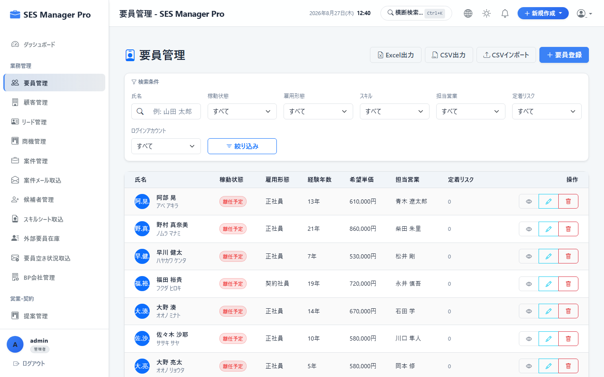
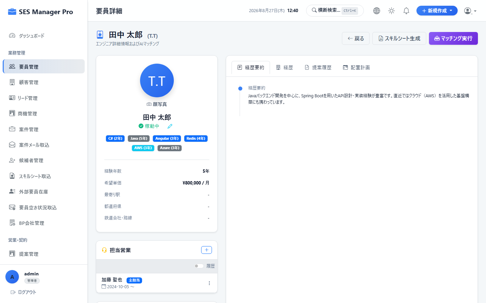
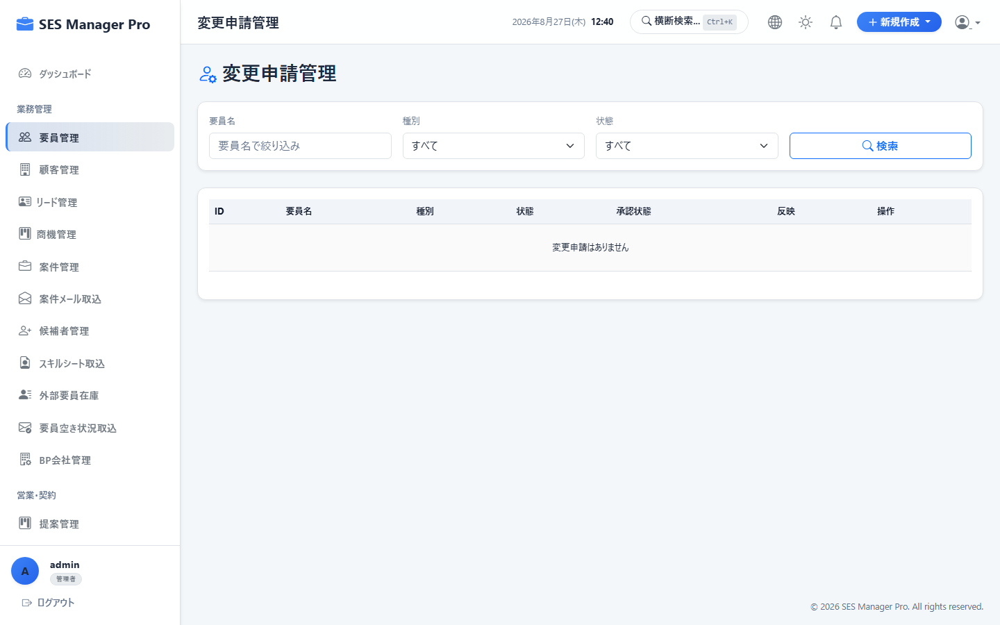
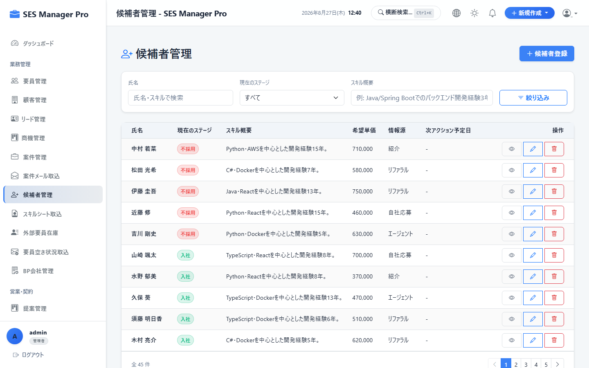
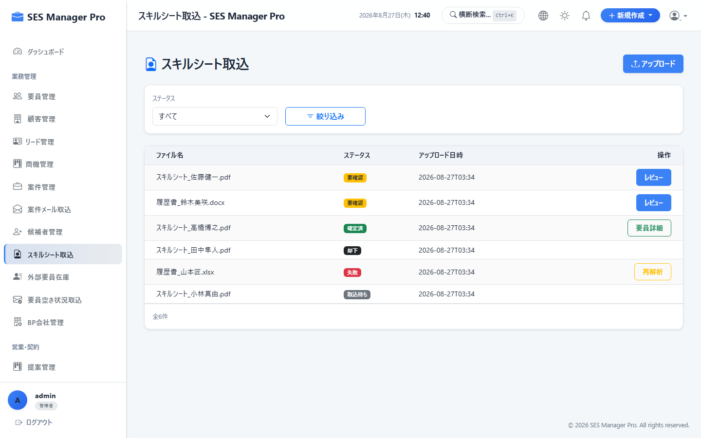
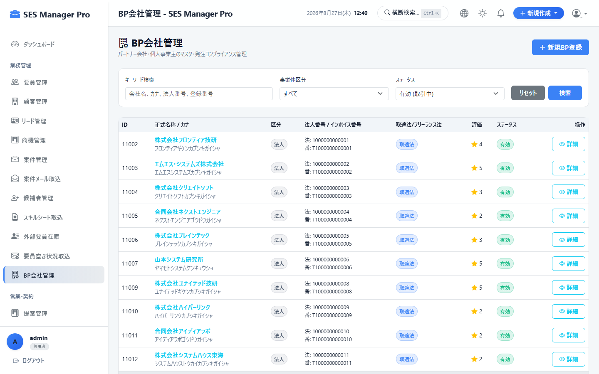
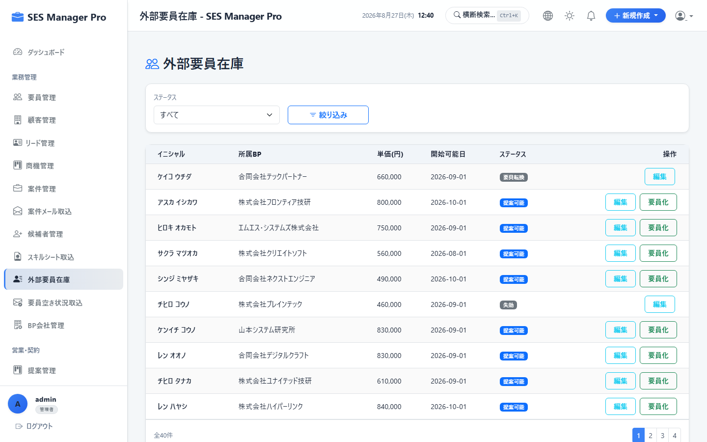

# 第4章 要員・パートナー調達管理操作マニュアル

本書では、HR（人事）および調達担当営業が利用する、要員台帳管理、スキルシート（経歴書）生成、情報変更申請承認、採用候補者パイプライン、スキルシートAI取込、BP企業マスタ、外部要員在庫（アベイラビリティ）の操作手順を説明します。

---

## 4-1. 要員台帳・基本情報 & コスト管理

### 概要・目的
自社エンジニア（正社員/契約社員）、フリーランス、およびBP所属エンジニアの基本情報、原価、担当営業を一元管理します。

* **対象ロール**：管理者 / HR / 営業
* **アクセスURL**：`/engineer/list`
* **キャプチャID**：`CAP-ENG-001`




```
+-------------------------------------------------------------------------------+
|  要員一覧                                                [ ② ＋ 新規要員登録 ]|
|  検索: [ ① 山田                        ]  所属区分: [ 自社正社員 ▼ ] [ 検索 ] |
+-------------------------------------------------------------------------------+
| 要員コード | 氏名 (カナ)     | 所属区分   | 稼働状況 | 原価月額  | 担当営業 | 操作 |
|------------+-----------------+------------+----------+-----------+----------+------|
| ENG-001    | 山田 太郎 (ヤマダ)| 自社正社員 | 稼働中   | 500,000円 | 鈴木 一郎| [詳細]|
| ENG-002    | 佐藤 美咲 (サトウ)| フリーランス| 待機中   | 650,000円 | 田中 健二| [詳細]|
+-------------------------------------------------------------------------------+
```

### 操作手順
1. 画面右上の **[新規要員登録]（②）** をクリックします。
2. 「氏名（漢字/カナ）」「生年月日」「所属区分（自社正社員/フリーランス/BP）」「最寄駅」を入力します。
3. 給与基準額または仕入原価、目標提案単価を設定します。
4. **担当営業** をアサインして **[保存]** をクリックします。

---

## 4-2. スキルシート（職務経歴書）生成・出力

### 概要・目的
エンジニアの職務経歴・保有技術を顧客提出用の統一レイアウトで出力（Excel / PDF）します。個人情報マスキング（匿名化版）にも対応しています。

* **対象ロール**：管理者 / HR / 営業
* **アクセスURL**：`/engineer/detail`
* **キャプチャID**：`CAP-ENG-002`




```
+-------------------------------------------------------------------------------+
|  要員詳細: 山田 太郎 (イニシャル: T.Y / 32歳 / 経験8年)                       |
|                                       [ ③ 📄 匿名版Excel ]  [ ④ 📄 PDF出力 ]  |
+------------------------------------+------------------------------------------+
| 【① スキルサマリー】               | 【② 職務経歴タイムライン】              |
| ・言語: Java (6年), Python (3年)   | 2024/04 〜 現在: 金融API基盤開発 (Java) |
| ・クラウド: AWS (4年), Docker      | 2022/10 〜 2024/03: ECサイト構築 (Go)    |
| ・得意領域: バックエンド / DB設計  | 2019/04 〜 2022/09: 業務系Webアプリ改修  |
+------------------------------------+------------------------------------------+
```

### 操作手順
1. 要員一覧より対象者を選択し、詳細画面を開きます。
2. 最新の職歴・スキル情報を確認します。
3. 顧客へ提出する場合は **[匿名版Excel]（③）** を選択します（氏名がイニシャル `T.Y` に変換され、最寄駅のみ表示されます）。
4. 自社保管用や社内確認用には **[PDF出力]（④）** をクリックします。

---

## 4-3. 要員情報変更申請 (Change Request) の承認

### 概要・目的
エンジニアがマイポータルから提出した住所変更、緊急連絡先変更、振込先口座変更の差分を確認し、マスタへ反映します。

* **対象ロール**：管理者 / HR
* **アクセスURL**：`/engineer-change-requests`
* **キャプチャID**：`CAP-ENG-003`




```
+-------------------------------------------------------------------------------+
|  要員情報変更申請 一覧                                                        |
+-------------------------------------------------------------------------------+
| 申請日     | 要員名   | 申請種別   | 変更前 (Before)    | 変更後 (After)     | 判定 |
|------------+----------+------------+--------------------+--------------------+------|
| 2026/08/26 | 山田 太郎| 住所変更   | 東京都千代田区...  | 神奈川県横浜市...  | [承認]|
| 2026/08/25 | 佐藤 美咲| 口座変更   | 三菱UFJ銀行 ***    | 三井住友銀行 ***   | [承認]|
+-------------------------------------------------------------------------------+
```

### 操作手順
1. 申請一覧から未処理のレコードを確認します。
2. 変更前（Before）と変更後（After）の差分を確認します。
3. 問題がなければ **[承認]** をクリックします（即座に要員マスタが更新されます）。

---

## 4-4. 採用候補者パイプライン管理

### 概要・目的
採用応募者の選考ステータス（書類選考 → 一次面接 → 最終面接 → 内定 → 入社確定）を管理し、採用決定時にワンクリックで要員台帳へ登録します。

* **対象ロール**：管理者 / HR
* **アクセスURL**：`/candidate/list`
* **キャプチャID**：`CAP-ENG-004`




---

## 4-5. スキルシートAI自動取込 (Resume Ingestion)

### 概要・目的
PDFやWord形式で受領した経歴書ファイルをアップロードすると、AIが氏名、年齢、最寄駅、保有スキル、職歴タイムラインを自動抽出し、手入力を不要にします。

* **対象ロール**：管理者 / HR / 営業
* **アクセスURL**：`/resume-ingestion`
* **キャプチャID**：`CAP-ENG-005`




### 操作手順
1. アップロードエリアに職務経歴書ファイル（PDF / Excel / Word）をドラッグ＆ドロップします。
2. AIパースが実行され、抽出結果が各入力フォームに自動展開されます。
3. 内容を目視確認し、**[要員マスタへ登録]** をクリックします。

---

## 4-6. BP（ビジネスパートナー）企業マスタ管理

### 概要・目的
協業しているBP企業の会社情報、窓口担当者、適格請求書番号（インボイス）、支払サイト、基本契約締結状況を管理します。

* **対象ロール**：管理者 / 営業 / HR
* **アクセスURL**：`/bp-company/list`
* **キャプチャID**：`CAP-ENG-006`




---

## 4-7. 外部要員在庫（アベイラビリティ）管理

### 概要・目的
各BP企業から送付される「空き要員情報（来月稼働可能、スキル、希望単価）」をデータベース化し、案件発生時に即座に横断検索・提案マッチングを行います。

* **対象ロール**：管理者 / 営業
* **アクセスURL**：`/bp-availability/list`
* **キャプチャID**：`CAP-ENG-007`



