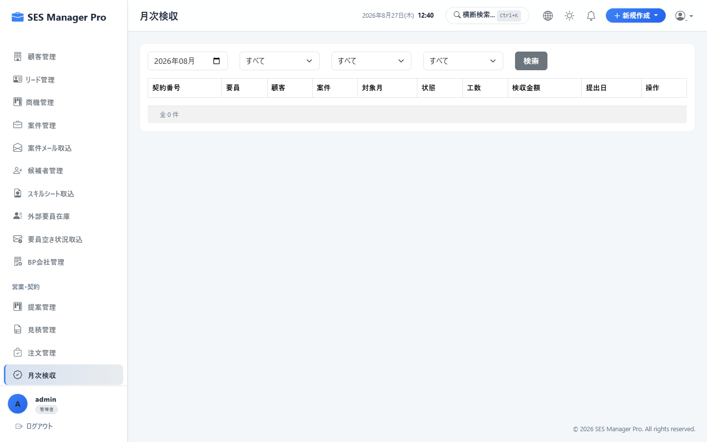
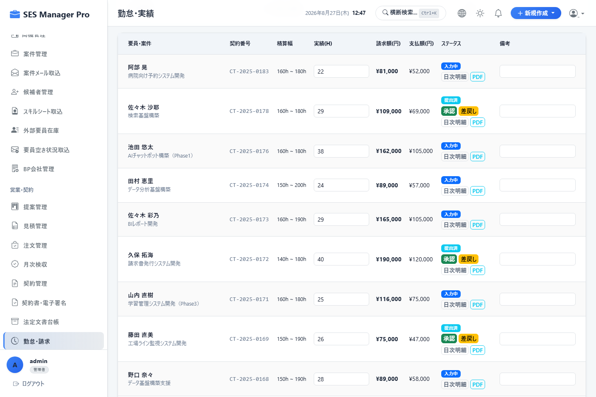
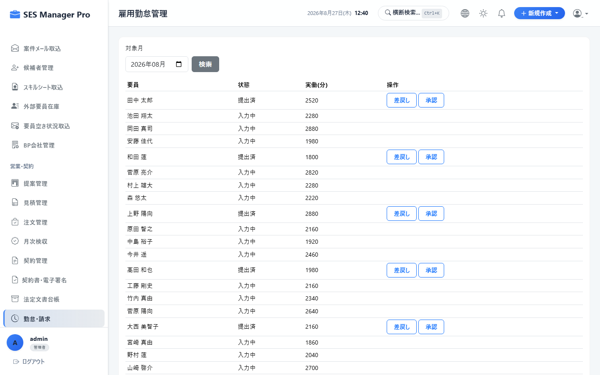
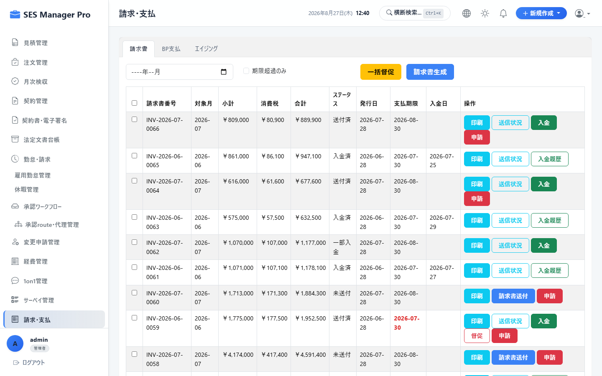
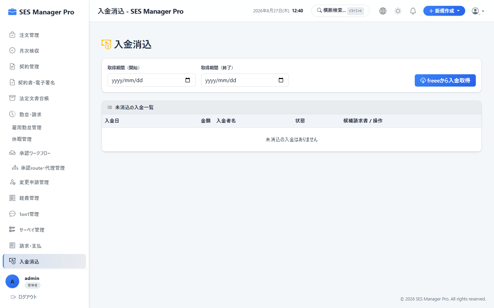
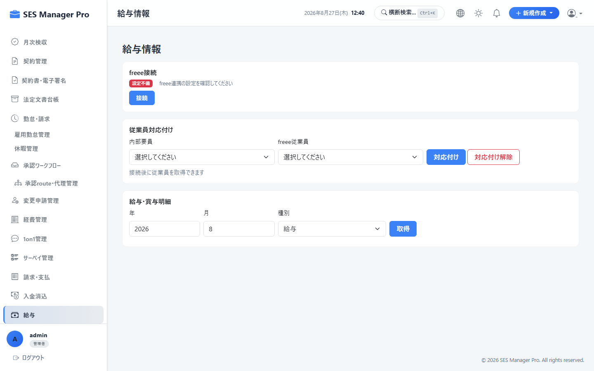
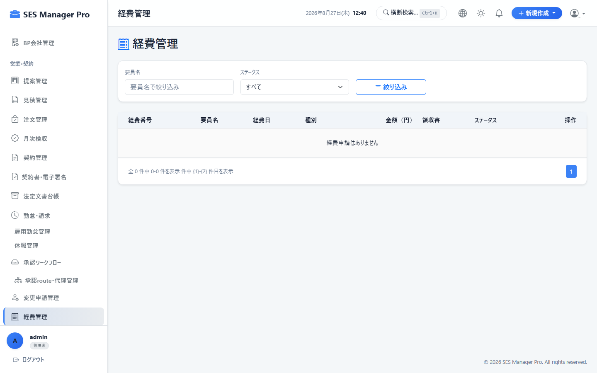

# 第5章 勤怠・請求・精算・会計連携操作マニュアル

本書では、経理担当者、HR、および営業が利用する、月次検収確定、勤怠集計（精算幅計算）、全社雇用勤怠管理、インボイス対応請求書自動発行、入金消込（Reconciliation）、BP支払明細作成、freee人事労務給与データ連携、全社経費精算の操作手順を説明します。

---

## 5-1. 月次検収確定（客先検収工数）

### 概要・目的
クライアントから受領した作業報告書・検収書に基づき、確定稼働工数をシステムへ登録し、請求計算の元データを確定します。

* **対象ロール**：管理者 / 営業 / HR
* **アクセスURL**：`/acceptance`
* **キャプチャID**：`CAP-ACC-001`




```
+-------------------------------------------------------------------------------+
|  月次検収確定                            対象年月: [ 2026年08月 ▼ ]  [ 一括確定 ] |
+-------------------------------------------------------------------------------+
| 顧客名       | 要員名   | 契約基準幅 | 客先確定工数 | 申告工数 | 差分判定 | 状態   |
|--------------+----------+------------+--------------+----------+----------+--------|
| 株式会社ABC  | 山田太郎 | 140h-180h  | [ 168.0 ] h  | 168.0 h  | 一致     | 確定済 |
| テクノロジー | 佐藤次郎 | 150h-190h  | [ 195.5 ] h  | 195.5 h  | 超過あり | 未確定 |
+-------------------------------------------------------------------------------+
```

### 操作手順
1. **対象年月** を選択します。
2. 顧客から受領した検収時間（例: `168.0h`）を **客先確定工数欄** に入力します。
3. 要員の提出工数との突合差分を確認します。
4. **[一括確定]** をクリックすると、請求計算モジュールへ確定工数が連携されます。

---

## 5-2. 勤怠集計 & 精算幅（過不足）自動計算

### 概要・目的
契約ごとの精算基準幅（例: 140-180h）に基づき、超過時間（残業）または控除時間の精算額を自動計算します。

* **対象ロール**：管理者 / HR / 経理
* **アクセスURL**：`/work-record`
* **キャプチャID**：`CAP-ACC-002`




```
+-------------------------------------------------------------------------------+
|  勤怠・請求精算集計                                   対象年月: [ 2026年08月 ▼ ]|
+-------------------------------------------------------------------------------+
| 要員名   | 基本月額  | 実働時間 | 基準幅    | 超過/控除 | 精算単価 | 精算金額  | 請求計    |
|----------+-----------+----------+-----------+-----------+----------+-----------+-----------|
| 山田太郎 | 800,000円 | 168.0h   | 140h-180h | 0.0h (適正)| -        | 0円       | 800,000円 |
| 佐藤次郎 | 750,000円 | 195.0h   | 140h-180h | +15.0h超過| 4,167円  | +62,505円 | 812,505円 |
| 鈴木一郎 | 700,000円 | 130.0h   | 140h-180h | -10.0h不足| 5,000円  | -50,000円 | 650,000円 |
+-------------------------------------------------------------------------------+
```

### 精算計算ロジック（システム自動適用）
1. **超過精算（上限超え）**：`超過時間 = 実働時間 - 上限時間 (180h)` → `超過額 = 超過時間 × (基本月額 ÷ 180h)`
2. **控除精算（下限割れ）**：`控除時間 = 下限時間 (140h) - 実働時間` → `控除額 = 控除時間 × (基本月額 ÷ 140h)`

---

## 5-3. 全社雇用勤怠管理 & 36協定モニタリング

### 概要・目的
全社員・要員の出退勤打刻実績を集計し、36協定残業上限（月45時間/年360時間）への抵触をアラート監視します。

* **対象ロール**：管理者 / HR
* **アクセスURL**：`/work-record/attendance`
* **キャプチャID**：`CAP-ACC-003`




---

## 5-4. インボイス対応請求書自動発行 & メール送付

### 概要・目的
当月の確定検収データから、インボイス制度対応の請求書PDFを一括生成し、顧客担当者へメール送付します。

* **対象ロール**：管理者 / 経理 / 営業
* **アクセスURL**：`/invoice`
* **キャプチャID**：`CAP-ACC-004`




```
+-------------------------------------------------------------------------------+
|  請求書一覧                                         [ ② ⚡ 請求書一括生成 ]   |
|  当月請求総額: [ ¥24,850,000 ] (消費税: ¥2,485,000)  未送付: [ 3 件 ]         |
+-------------------------------------------------------------------------------+
| 請求番号   | 顧客企業名         | 請求金額(税込) | 支払期日   | 送信状態 | 操作   |
|------------+--------------------+----------------+------------+----------+--------|
| INV-2608-01| 株式会社ABC商事    | 880,000円      | 2026/09/30 | 送付済   | [PDF]  |
| INV-2608-02| テクノロジー技研㈱ | 1,760,000円    | 2026/09/20 | 未送付   | [メール]|
+-------------------------------------------------------------------------------+
```

### 操作手順
1. **[請求書一括生成]（②）** をクリックします。
2. 顧客ごとの基本料金、過不足精算額、消費税10%、自社の適格請求書登録番号（T+13桁）が自動計算された請求書が生成されます。
3. **[一括メール送信]** をクリックすると、顧客担当者宛にダウンロードURL付き請求メールが送信されます。

---

## 5-5. 入金消込 (Reconciliation) & 督促管理

### 概要・目的
銀行の全銀協フォーマットまたはCSV入金データをインポートし、売掛金残高と自動突合して消込を実行します。

* **対象ロール**：管理者 / 経理
* **アクセスURL**：`/reconciliation`
* **キャプチャID**：`CAP-ACC-005`




### 操作手順
1. **[全銀データ取込]** よりネットバンキングの入金明細CSVをアップロードします。
2. システムが「振込名義」と「請求金額」を照合し、一致したレコードを自動サジェストします。
3. **[一括消込確定]** をクリックすると、売掛金ステータスが「回収済」へ更新されます。

---

## 5-6. BP支払明細作成 & 全銀振込データ出力

### 概要・目的
BP所属エンジニアの確定工数に基づき、仕入代金・精算代金を計算した「BP支払明細書」を発行し、総合振込データ（FBデータ）を出力します。

* **対象ロール**：管理者 / 経理
* **アクセスURL**：`/payroll`
* **キャプチャID**：`CAP-ACC-006`




---

## 5-7. freee人事労務 給与データ連携

### 概要・目的
自社エンジニアの確定勤怠時間（労働時間・残業時間・有休消化日数）をfreee人事労務へAPI送信し、給与確定後に明細データを取り込みます。

* **対象ロール**：管理者 / HR / 経理
* **アクセスURL**：`/payroll`
* **キャプチャID**：`CAP-ACC-007`


---

## 5-8. 全社経費精算管理 & 承認・仕訳

### 概要・目的
全要員から提出された交通費・交際費等の申請を領収書プレビューとともに審査し、会計仕訳CSVを出力します。

* **対象ロール**：管理者 / マネージャー / 経理
* **アクセスURL**：`/expenses`
* **キャプチャID**：`CAP-ACC-008`



