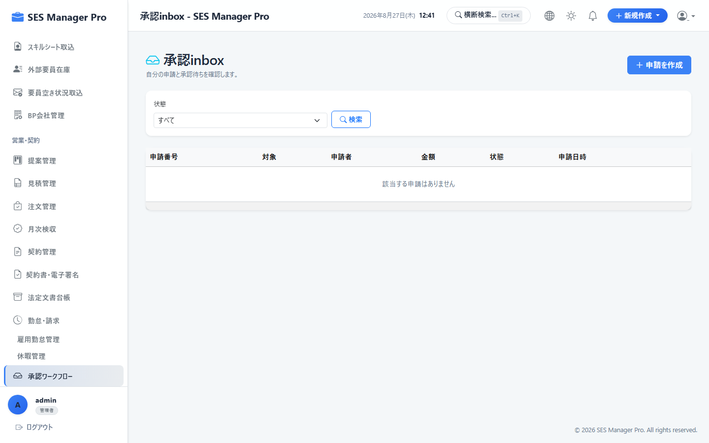
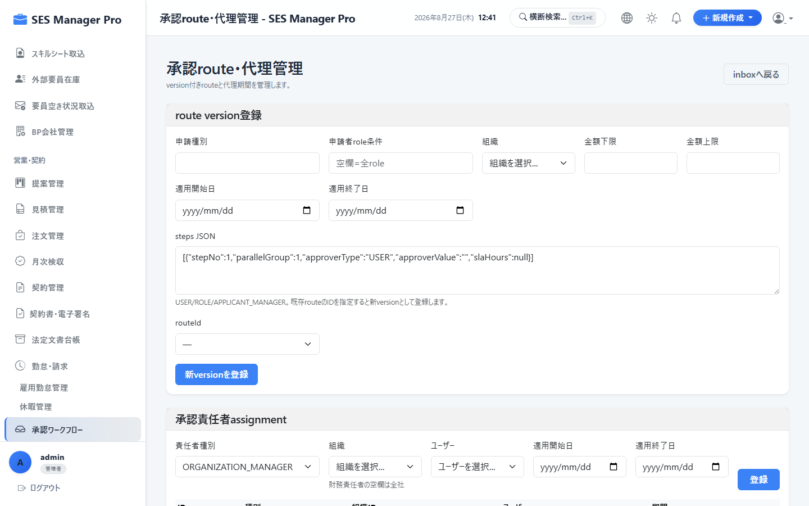
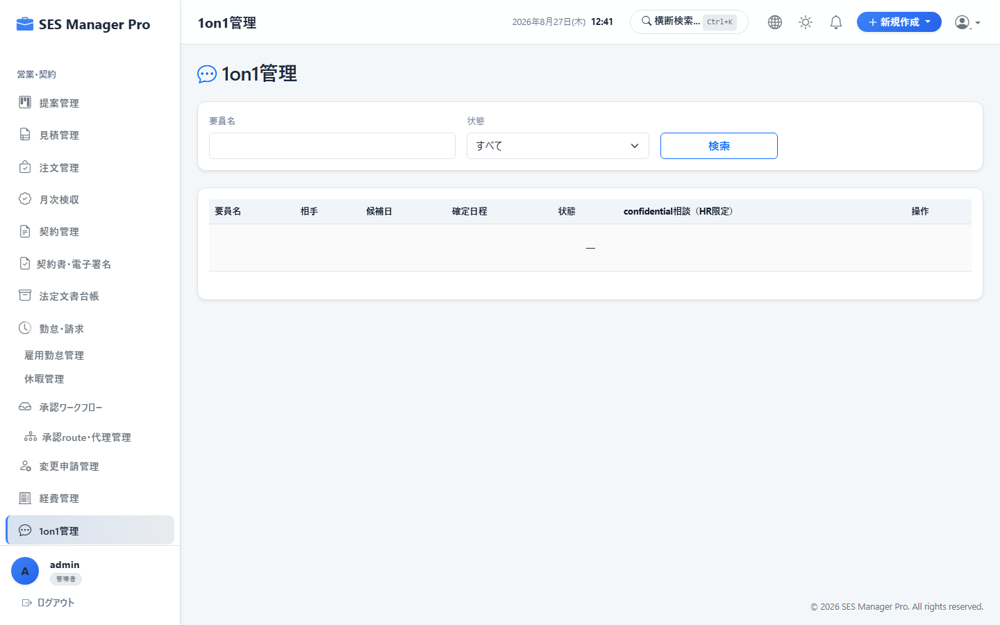
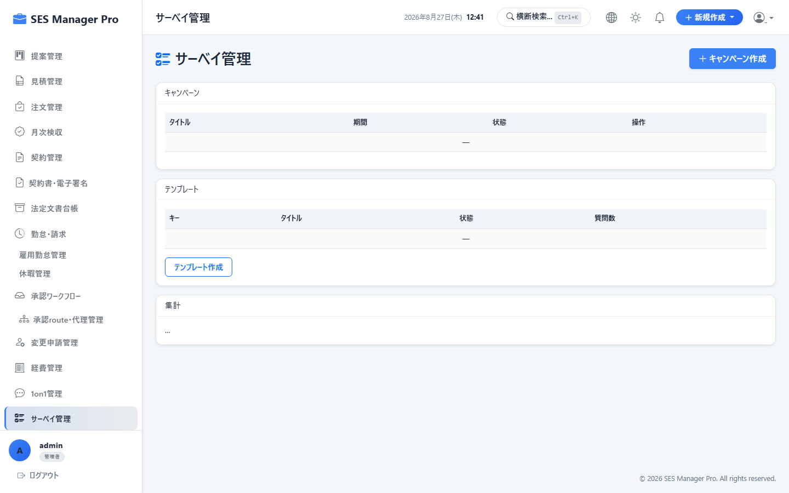
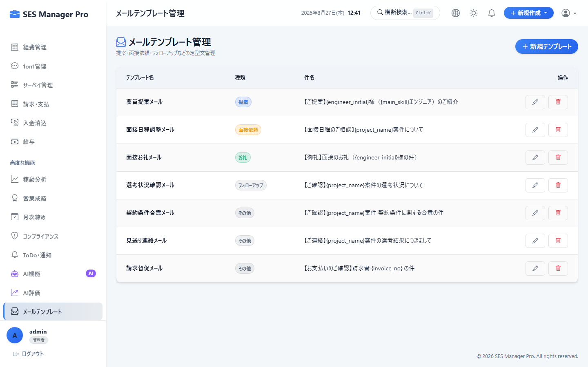

# 第6章 業務承認・ワークフロー・社内管理操作マニュアル

本書では、マネージャー、HR、および管理者が利用する、承認ワークフロー（未処理一覧・一括承認・差戻し）、承認ルート/代理設定、1on1面談管理、社内サーベイ作成、メール定型文管理の操作手順を説明します。

---

## 6-1. 承認受信トレイ (Approval Inbox) & 一括承認

### 概要・目的
自身に届いている未処理の申請（勤怠、休暇、経費、見積、契約更新等）を一元的に確認し、承認または差戻しを行います。

* **対象ロール**：管理者 / マネージャー / HR
* **アクセスURL**：`/approval/inbox`
* **キャプチャID**：`CAP-WKF-001`




```
+-------------------------------------------------------------------------------+
|  承認ワークフロー (未処理トレイ: 5件)                [ ② ✅ 選択した申請を一括承認 ]|
|  タブ: [ 勤怠 (2) ] [ 休暇 (1) ] [ 経費 (2) ] [ 契約変更 (0) ]                |
+-------------------------------------------------------------------------------+
| [ ] | 申請日     | 申請者   | 区分 / 件名          | 金額 / 期間        | 操作    |
|-----+------------+----------+----------------------+--------------------+---------|
| [X] | 2026/08/26 | 山田太郎 | 8月度客先勤怠提出    | 実働 168.0h (エビ有)| [確認]  |
| [X] | 2026/08/25 | 佐藤次郎 | 旅費交通費申請       | 12,450円 (領収書有)| [確認]  |
+-------------------------------------------------------------------------------+
```

### 操作手順
1. カテゴリ別タブ（勤怠 / 休暇 / 経費等）をクリックして未承認申請を確認します。
2. 申請行をクリックすると、詳細内容および添付されたエビデンス（PDF/画像）のプレビューが表示されます。
3. 一括処理したい場合はチェックボックスを選択し、**[一括承認]（②）** をクリックします。
4. 不備がある場合は **[差戻し]** をクリックし、理由コメントを入力して返却します。

---

## 6-2. 承認ルート設定 & 代理承認者管理

### 概要・目的
申請種別ごとの多段階承認フロー（1次承認：直属マネージャー → 2次承認：HR/役員）や、出張・休暇時の代理承認者を設定します。

* **対象ロール**：管理者
* **アクセスURL**：`/approval/routes`
* **キャプチャID**：`CAP-WKF-002`




---

## 6-3. 1on1面談管理（マネージャー向け）

### 概要・目的
配下エンジニアの定期1on1面談の予定管理、実施メモ、コンディション評価（モチベーション・健康状態）を記録・蓄積します。

* **対象ロール**：管理者 / マネージャー / HR
* **アクセスURL**：`/one-on-ones`
* **キャプチャID**：`CAP-WKF-003`




---

## 6-4. 社内サーベイ（アンケート）作成 & 集計

### 概要・目的
全社または特定部署向けのアンケートを作成・配信し、回答状況と統計グラフをリアルタイムで集計します。

* **対象ロール**：管理者 / HR
* **アクセスURL**：`/surveys`
* **キャプチャID**：`CAP-WKF-004`




---

## 6-5. メールテンプレート管理

### 概要・目的
案件提案、請求書送付、面談案内等で利用するメール本文の定型文テンプレート（動的変数埋め込み対応）を管理します。

* **対象ロール**：管理者 / 営業 / HR
* **アクセスURL**：`/email/template/list`
* **キャプチャID**：`CAP-WKF-005`



