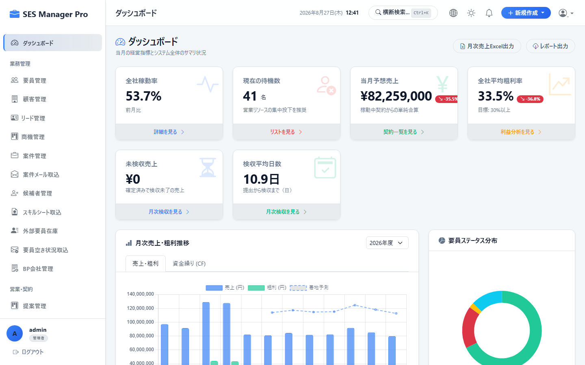
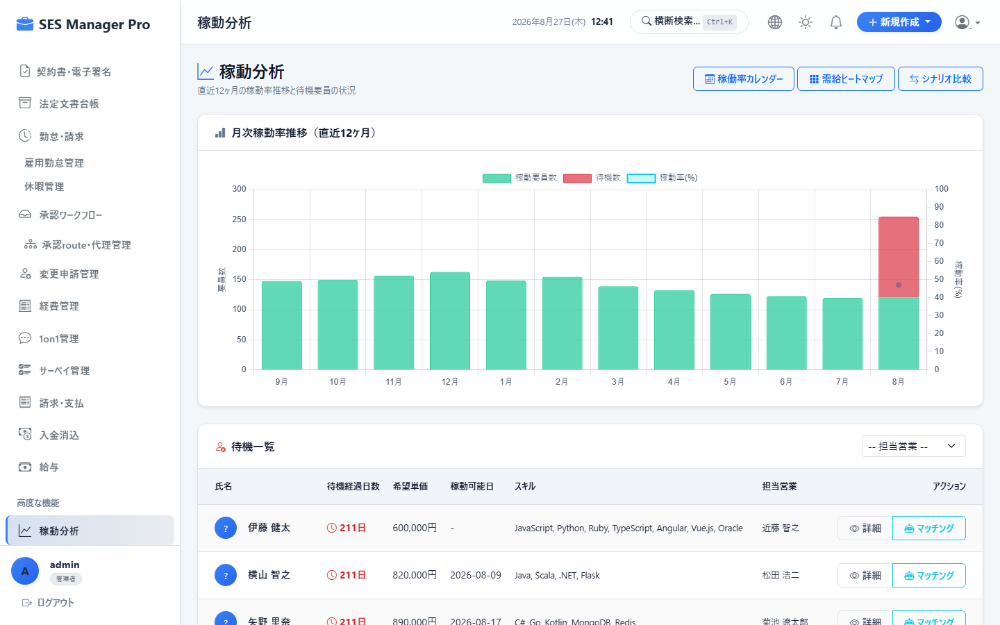
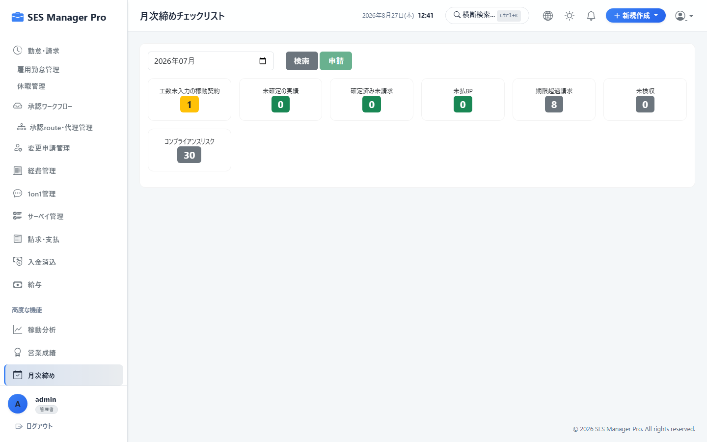
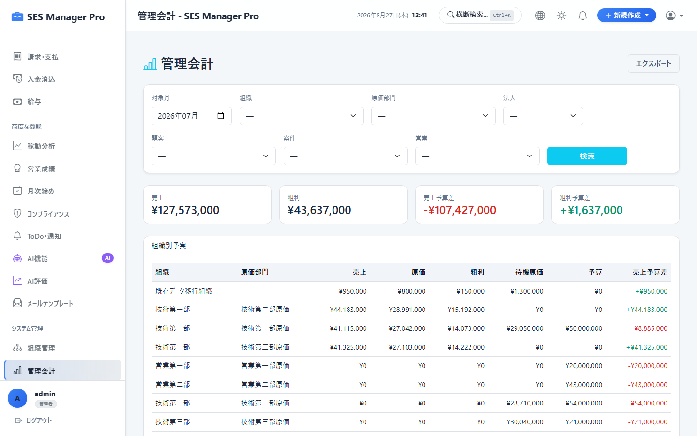
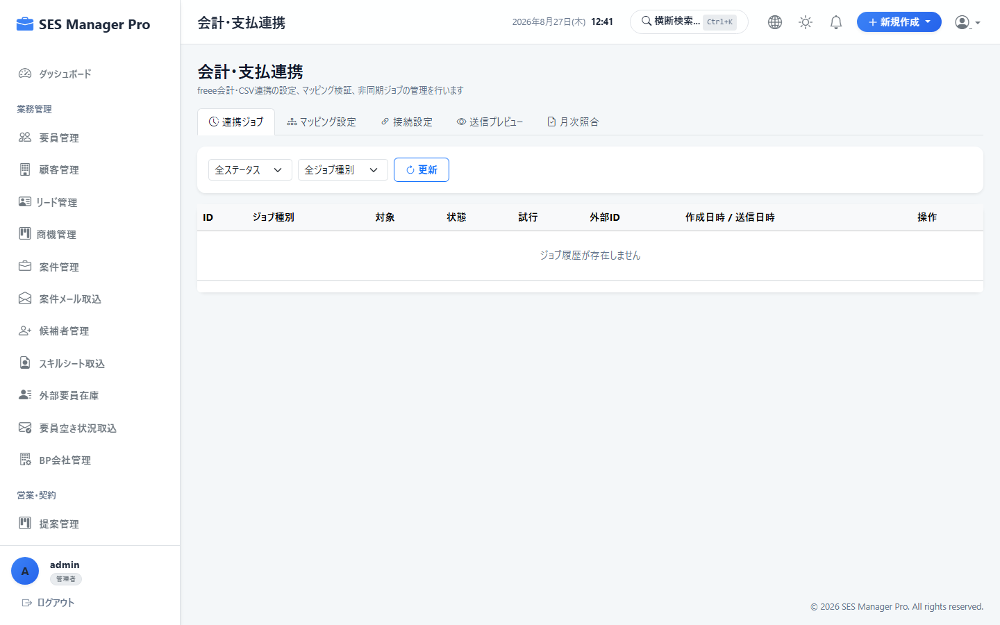
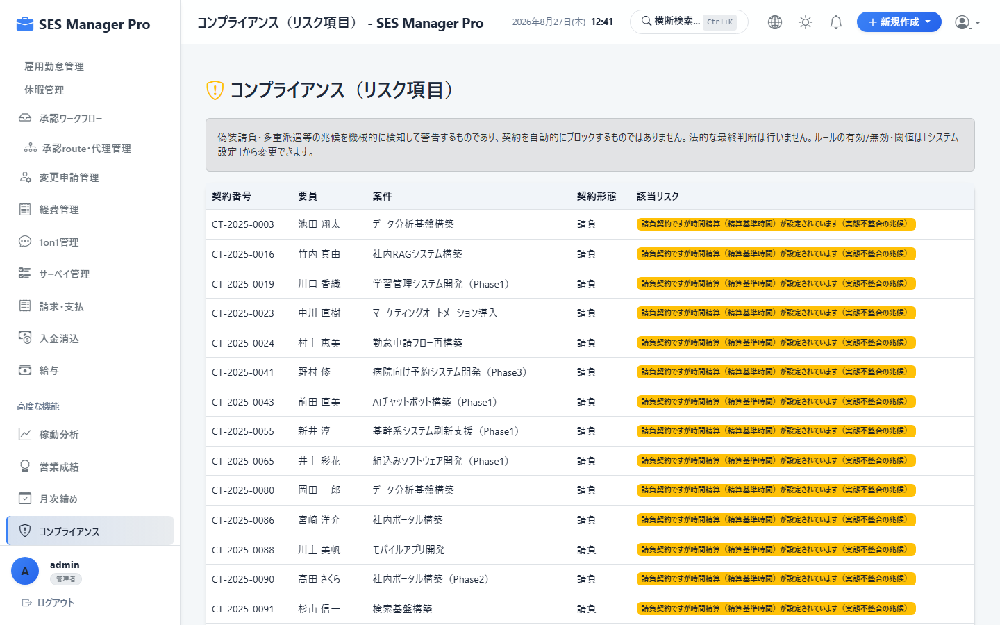
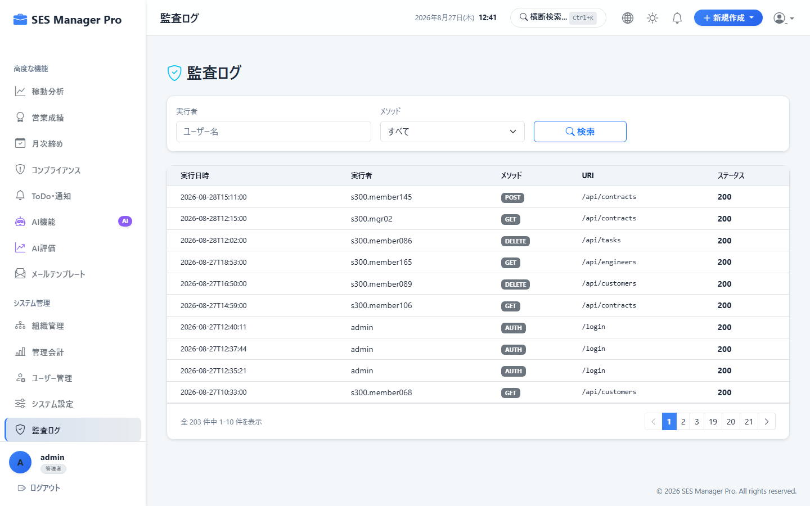

# 第7章 経営分析・月次締め・コンプライアンス操作マニュアル

本書では、経営層、管理職、および管理者が利用する、総合KPIダッシュボード、高度分析（ベンチ分析・単価分析）、月次締め処理（データロック）、管理会計（部門別P/L）、会計連携、労働者派遣法コンプライアンス（マージン率計算）、および監査ログ照会の操作手順を説明します。

---

## 7-1. 総合KPIダッシュボード

### 概要・目的
稼働率、待機要員（ベンチ）数、今月の売上見込、粗利総額、平均粗利率、およびアラート事項を一目で把握します。

* **対象ロール**：管理者 / 営業 / HR / マネージャー
* **アクセスURL**：`/dashboard`
* **キャプチャID**：`CAP-GOV-001`




```
+-------------------------------------------------------------------------------+
|  経営ダッシュボード (2026年08月度)                                             |
+-------------------+-------------------+-------------------+-------------------+
| 【① 全社稼働率】  | 【② 待機 (ベンチ)】| 【③ 当月売上高】  | 【④ 粗利総額】    |
|   94.2 %          |   5 名            |   ¥38,400,000     |   ¥11,250,000     |
|   (前月比: +1.5%) |   (待機コスト: 2.1M)| (達成率: 104.2%)  | (粗利率: 29.3%)   |
+-------------------+-------------------+-------------------+-------------------+
| 【⑤ 直近6ヶ月 売上・粗利推移グラフ】  | 【⑥ アラート・要アクション事項】     |
| [売上高 ■] [粗利額 ■]                 | ・契約満了30日前: 4件 (更新確認要)  |
| 35M |    ■     ■     ■     ■     ■    | ・未回収売掛金 (期日超): 1件        |
| 20M |    ■     ■     ■     ■     ■    | ・客先検収未受領: 3件               |
+---------------------------------------+---------------------------------------+
```

---

## 7-2. 高度分析 (Analytics) & ベンチ要員分析

### 概要・目的
待機要員のスキル別分析や、スキル別平均単価、顧客別利益率ランキングを多角的に分析します。

* **対象ロール**：管理者 / マネージャー
* **アクセスURL**：`/analytics`
* **キャプチャID**：`CAP-GOV-002`




---

## 7-3. 月次締め処理 (Monthly Closing) & データロック

### 概要・目的
月末に各業務（勤怠、請求、BP支払）の確定状態を検証し、システム全体に月次締めロックを適用してデータ改ざん・誤更新を防止します。

* **対象ロール**：管理者 / マネージャー
* **アクセスURL**：`/monthly-closing`
* **キャプチャID**：`CAP-GOV-003`




```
+-------------------------------------------------------------------------------+
|  月次締め管理 (対象年月: 2026年07月度)               [ ② 🔒 7月度月次締めを実行 ]|
+-------------------------------------------------------------------------------+
| 業務モジュール | 締めステータス | 未処理件数 | 最終確認担当者 | 確認日時      |
|----------------+----------------+------------+----------------+---------------|
| 1. 勤怠データ  | ✅ 確定完了    | 0 件       | 人事 鈴木      | 2026/08/05    |
| 2. 顧客請求    | ✅ 発行完了    | 0 件       | 経理 佐藤      | 2026/08/07    |
| 3. BP支払      | ✅ 確定完了    | 0 件       | 経理 佐藤      | 2026/08/08    |
+-------------------------------------------------------------------------------+
```

### 操作手順
1. 対象月の全モジュールが「確定完了（未処理0件）」であることを確認します。
2. **[月次締めを実行]（②）** をクリックします。
3. 実行後、対象年月の全データに対して更新・削除ロックが適用されます。
4. （例外修正時）管理者は理由を入力した上で **[管理者ロック解除]** を行うことができます。

---

## 7-4. 管理会計（部門別損益・プロジェクト別採算）

### 概要・目的
事業部や開発チームごとのP/L（損益計算書）および案件別の採算性をリアルタイム集計します。

* **対象ロール**：管理者 / マネージャー
* **アクセスURL**：`/management-accounting`
* **キャプチャID**：`CAP-GOV-004`




---

## 7-5. 会計仕訳・支払データ連携

### 概要・目的
締め完了後の売上・仕入・売掛金・買掛金データを、freeeやマネーフォワード、勘定奉行等に取り込める形式の仕訳CSVとして出力します。

* **対象ロール**：管理者 / 経理
* **アクセスURL**：`/accounting/integration`
* **キャプチャID**：`CAP-GOV-005`




---

## 7-6. コンプライアンス & 派遣法マージン率計算

### 概要・目的
労働者派遣法第23条第5項に基づくマージン率、派遣料金の平均額、派遣労働者賃金の平均額を自動計算し、情報提供公開用PDFを出力します。

* **対象ロール**：管理者 / マネージャー
* **アクセスURL**：`/compliance`
* **キャプチャID**：`CAP-GOV-006`




---

## 7-7. 監査ログ (Audit Log) 照会・追跡

### 概要・目的
ユーザーが行ったデータの登録・変更・削除、ログイン履歴、権限変更などの全操作ログをJSON Diff形式で確認・追跡します。

* **対象ロール**：管理者専用
* **アクセスURL**：`/audit-log`
* **キャプチャID**：`CAP-GOV-007`



