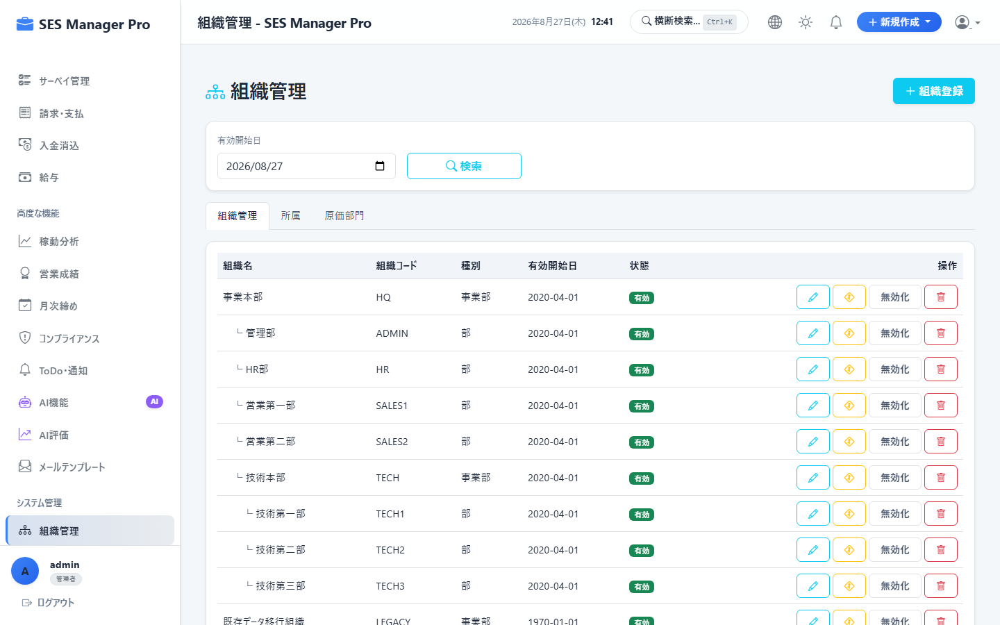
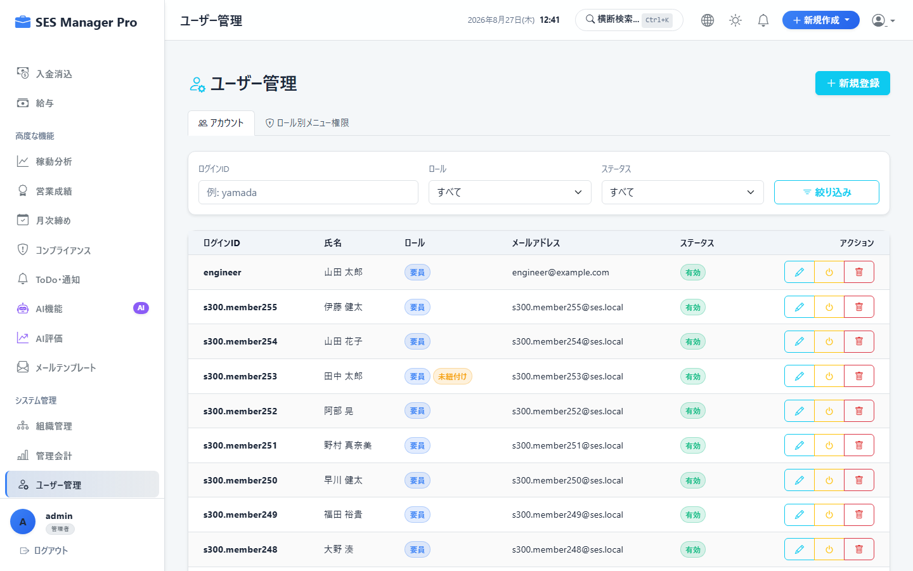
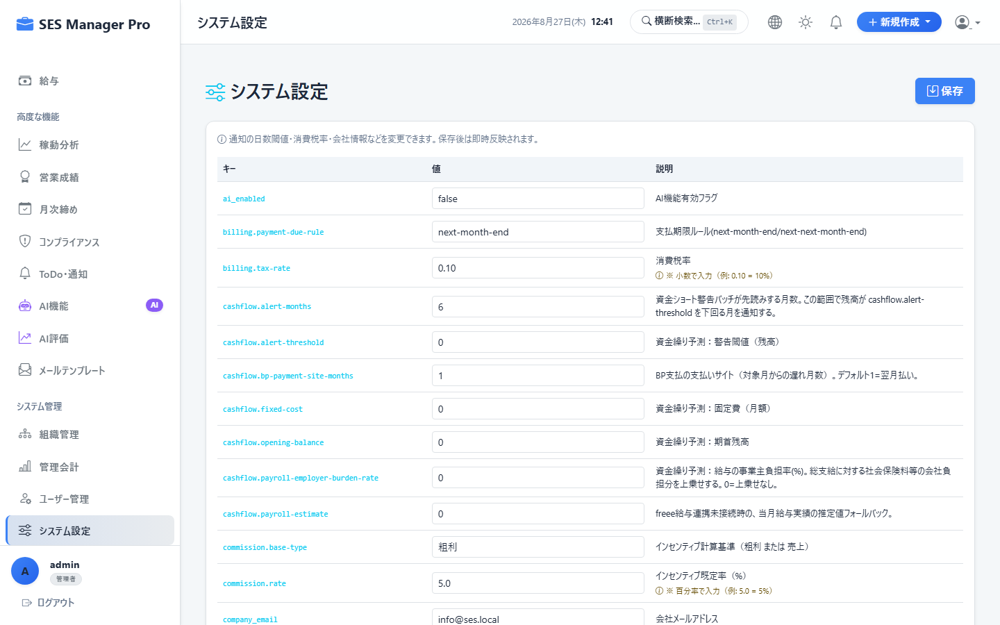

# 第8章 システム設定・マスタ管理操作マニュアル

本書では、システム管理者（`管理者` ロール）が利用する、組織・部署マスタ管理、ユーザーアカウントCRUD、ロール別メニュー権限マトリクス設定、およびシステム共通設定の操作手順を説明します。

---

## 8-1. 組織・部署マスタ管理

### 概要・目的
社内の組織階層（事業部、部、課、チーム）を登録し、責任者（マネージャー）および所属メンバーを割り当てます。

* **対象ロール**：管理者専用
* **アクセスURL**：`/organization`
* **キャプチャID**：`CAP-ADM-001`




```
+-------------------------------------------------------------------------------+
|  組織・部署マスタ管理                                    [ ② ＋ 新規部署追加 ]|
+------------------------------------+------------------------------------------+
| 【① 組織階層ツリー】               | 【③ 部署詳細: システム開発第1部】        |
| ▼ SES事業本部                      | 部署コード: DEV-01                       |
|   ├ ▶ 営業部                       | 親組織: SES事業本部                      |
|   └ ▼ システム開発本部             | 責任者(部長): 田中 誠一 (マネージャー)   |
|       ├ 🏢 システム開発第1部 [選択]| 所属メンバー: 28名                       |
|       └ 🏢 システム開発第2部       |                 [ 編集 ] [ メンバー管理 ]|
+------------------------------------+------------------------------------------+
```

---

## 8-2. ユーザーアカウント管理 (CRUD & ロック解除)

### 概要・目的
システムの利用ユーザーを発行・編集・無効化し、パスワード誤入力によるロック状態を解除します。

* **対象ロール**：管理者専用
* **アクセスURL**：`/user/list`
* **キャプチャID**：`CAP-ADM-002`


```
+-------------------------------------------------------------------------------+
|  ユーザー管理                                            [ ② ＋ 新規ユーザー登録 ]|
|  検索: [ ① yamada                      ]  ロール: [ 全て ▼ ]      [ 検索 ]    |
+-------------------------------------------------------------------------------+
| ユーザー名 | 氏名 (表示名) | ロール     | 状態   | 最終ログイン | 操作            |
|------------+---------------+------------+--------+--------------+-----------------|
| admin      | システム管理  | 管理者     | 有効   | 2026/08/27   | [編集]          |
| sales_suzuki| 鈴木 一郎    | 営業       | 有効   | 2026/08/26   | [編集] [PW初期化]|
| eng_yamada | 山田 太郎     | 要員       | 🔒ロック| 2026/08/25   | [ 🔓 ロック解除 ]|
+-------------------------------------------------------------------------------+
```

### 操作手順
1. **[新規ユーザー登録]（②）** をクリックし、「ユーザー名」「実名」「メールアドレス」「ロール（管理者/営業/HR/マネージャー/要員）」「初期パスワード」を設定します。
2. アカウントロックされたユーザーは、一覧の **[ロック解除]** ボタンをクリックすることで即時復帰させます。

---

## 8-3. ロール別メニュー権限設定 (Role-Menu)

### 概要・目的
ロール（役職）ごとに、アクセス可能な画面メニューおよびAPIプレフィックスを動的に設定します。

* **対象ロール**：管理者専用
* **アクセスURL**：`/user/list#permissions`
* **キャプチャID**：`CAP-ADM-003`




```
+-------------------------------------------------------------------------------+
|  ロール別メニューアクセス権限マトリクス設定              [ ④ 💾 権限設定を保存 ]|
|  対象ロール選択: [ ① 営業 ▼ ]                                                |
+-------------------------------------------------------------------------------+
| メニュー区分 | 画面機能名             | パス (URL)      | アクセス許可 (ON/OFF) |
|--------------+------------------------+-----------------+-----------------------|
| 業務管理     | 要員管理               | /engineer/**    | [X] 許可              |
| 業務管理     | 顧客管理 (CRM)         | /customer/**    | [X] 許可              |
| 営業・契約   | 提案管理 (カンバン)    | /proposal/**    | [X] 許可              |
| システム管理 | ユーザー管理           | /user/**        | [ ] 不許可 (非表示)   |
| システム管理 | システム設定           | /system-config  | [ ] 不許可 (非表示)   |
+-------------------------------------------------------------------------------+
```

---

## 8-4. システム共通設定 (System Config)

### 概要・目的
消費税率、端数計算ルール、営業コミッション基準値、およびSMTPメール送信サーバーの設定を一元管理します。

* **対象ロール**：管理者専用
* **アクセスURL**：`/system-config`
* **キャプチャID**：`CAP-ADM-004`



