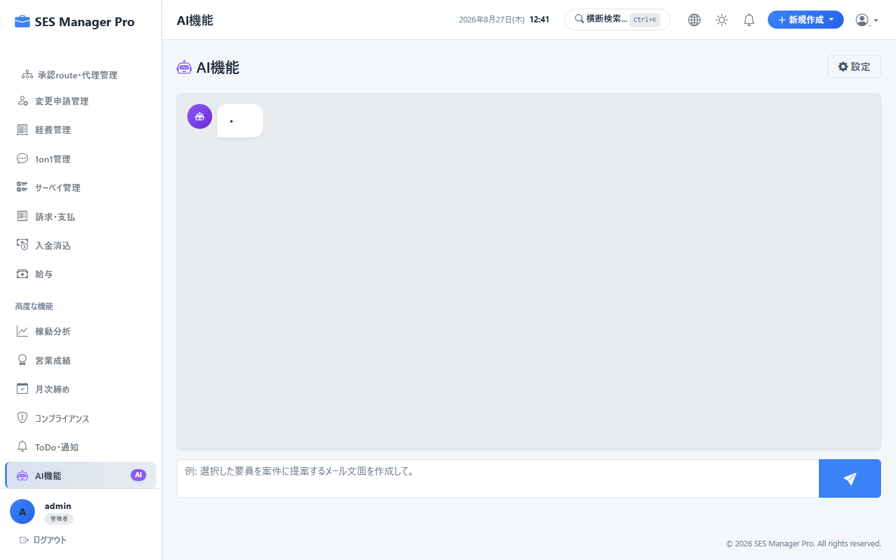
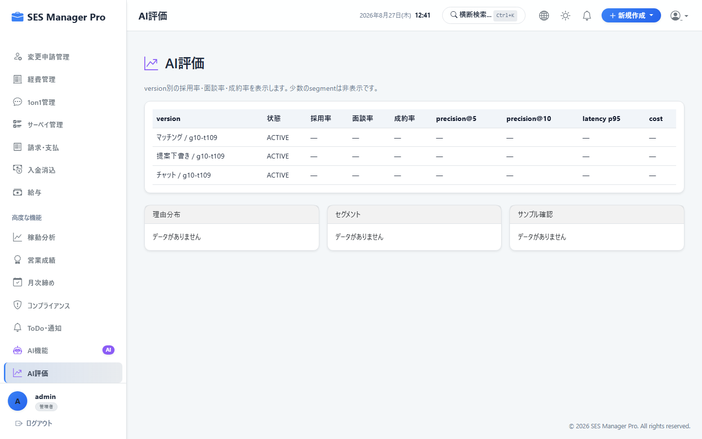

# 第9章 AI機能活用ガイド

本書では、営業担当者およびHR担当者が利用する、AI案件-要員マッチング機能、およびAIスキルシート要約・評価機能の操作手順を説明します。

---

## 9-1. AI案件-要員マッチング

### 概要・目的
案件の募集要件（必要スキル、勤務地、単価）と、待機要員（自社/フリーランス/BP）の職歴・スキル情報を自然言語処理で突合し、適合度の高い候補者をスコアリング推薦します。

* **対象ロール**：管理者 / 営業 / HR
* **アクセスURL**：`/ai/matching`
* **キャプチャID**：`CAP-AI-001`




```
+-------------------------------------------------------------------------------+
|  AI 案件-要員マッチング                                                       |
|  対象案件: [ 金融向けAPI開発 (Spring Boot / AWS) ▼ ]     [ 🤖 AIマッチング実行 ]|
+-------------------------------------------------------------------------------+
| 適合度順位 | 要員名 (所属) | 適合スコア | 主な推薦理由・スキル一致度           | 操作 |
|------------+---------------+------------+--------------------------------------+------|
| 🥇 第1位   | 山田 太郎(自社)| 94 %       | Java 6年, AWS 4年, 金融系API開発経験 | [提案]|
| 🥈 第2位   | 佐藤 次郎(BP) | 88 %       | Spring Boot 3年, Docker, 即日稼働可  | [提案]|
| 🥉 第3位   | 田中 健一(自社)| 81 %       | バックエンド経験豊富, 単価条件合致    | [提案]|
+-------------------------------------------------------------------------------+
```

### 操作手順
1. マッチングを行いたい **案件** または **要員** を選択します。
2. **[AIマッチング実行]** をクリックします。
3. 適合スコア（例: `94%`）と、AIによる選定理由（スキル一致点、過去類似案件実績）を確認します。
4. 候補者の行にある **[提案]** ボタンをクリックすると、ワンクリックで提案カンバンに登録されます。

---

## 9-2. AIスキルシート評価・強み要約

### 概要・目的
エンジニアの職務経歴書をAIが多角的に分析し、得意領域の要約、顧客提案用のアピールポイント、および市場相場に基づく推奨提案単価レンジを提示します。

* **対象ロール**：管理者 / 営業 / HR
* **アクセスURL**：`/ai/evaluation`
* **キャプチャID**：`CAP-AI-002`




```
+-------------------------------------------------------------------------------+
|  AI スキルシート評価 & アピールポイント生成                                   |
|  対象要員: [ 山田 太郎 (Java / クラウド) ▼ ]             [ 🤖 AI評価を実行 ]  |
+-------------------------------------------------------------------------------+
| 【AI生成プロファイルサマリー】                                                |
| ■ 主要得意領域: 金融・決済ドメインの大規模バックエンドAPI設計およびAWS基盤構築|
| ■ 技術的強み: マイクロサービスアーキテクチャの導入実績があり、性能改善に長けている |
| ■ 推奨提案単価レンジ: 780,000円 〜 850,000円 (市場相場対比: 適正)            |
|                                                                               |
| [ 📋 顧客提案用アピール文をクリップボードへコピー ]                           |
+-------------------------------------------------------------------------------+
```
