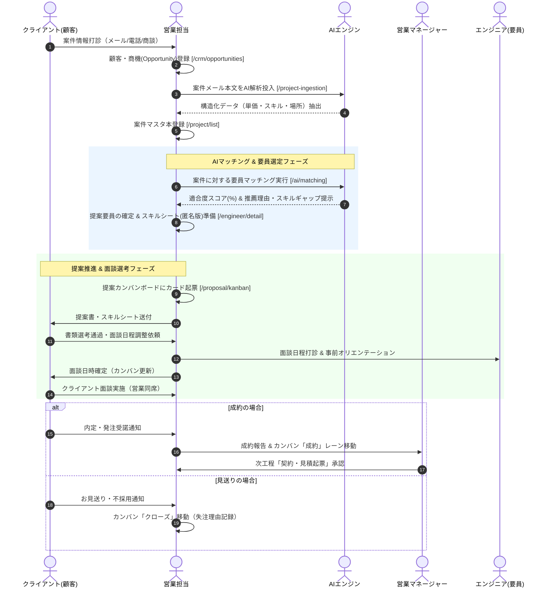

# 01. 営業・案件獲得・提案フロー詳細仕様書

## 1. プロセス概要
本フローは、顧客リードの獲得から商機登録、案件メールのAI解析・マスタ登録、AIによる案件-要員マッチング、提案カンバンボードでの進捗管理、クライアント面談調整、および成約判定に至る一連の営業活動プロセスを定義します。

---

## 2. スイムレーン別アクティビティフロー図

---

## 3. 詳細業務アクティビティ一覧

| Step | 業務フェーズ | 主担当 | 関係者 | アクション内容 | 利用システム画面 / API | 入力情報 (Input) | 成果物 (Output) | システム自動処理 / 分岐条件 |
|:---:|:---|:---:|:---:|:---|:---|:---|:---|:---|
| **1-1** | 顧客開拓 | 営業 | 顧客 | 新規または既存顧客の取引情報・連絡先・法人番号・支払条件を登録・更新する。 | 顧客管理 `/customer/list` | 企業名、法人番号、住所、支払サイト | 顧客マスタレコード | 法人番号重複チェック、インボイス登録番号自動検証 |
| **1-2** | 商機起票 | 営業 | 営業Mgr | 発生した商談について、商機名・確度（A/B/C/D）・想定月額単価・受注予定月を登録する。 | 商機管理 `/crm/opportunities` | 顧客ID、商機名、確度、想定売上単価 | パイプラインデータ | 売上予測・粗利予測ダッシュボードへ即時集計 |
| **1-3** | 案件取込 | 営業 | AI | 顧客・元請企業から受信した案件案内メール本文を貼り付け、AIによる自動抽出を実行する。 | 案件メール取込 `/project-ingestion` | 案件メール本文テキスト | 抽出JSON（単価・スキル等） | 自然言語処理による技術タグ・精算幅の自動バインド |
| **1-4** | 案件登録 | 営業 | 営業Mgr | AI抽出内容を確認・微修正し、精算条件（140h〜180h、上下割単価等）を設定して本登録する。 | 案件管理 `/project/list` | 案件名、募集人数、勤務地、精算幅 | 案件マスタレコード | 募集ステータス「募集中」設定、公開通知配信 |
| **1-5** | AI推薦 | 営業 | AI | 案件要件に対し、自社待機要員・BP空き要員を横断したAIマッチングを実行する。 | AI案件マッチング `/ai/matching` | 案件ID、最低適合度閾値 | マッチング適合度ランキング | ベクトル検索によるスキル類似度・過去実績スコア算出 |
| **1-6** | 要員確定 | 営業 | 要員 | 候補エンジニアの稼働可能時期・希望条件を確認し、提案用スキルシート（匿名化版）を出力する。 | 要員詳細 `/engineer/detail` | 要員ID、出力形式（Excel/PDF） | 顧客提出用スキルシート | 個人情報自動マスキング（イニシャル表示） |
| **1-7** | 提案起票 | 営業 | 顧客 | 提案カンバンボードに新規提案カードを作成し、提案単価・マージン率を設定して顧客へ提案送付する。 | 提案カンバン `/proposal/kanban` | 案件ID、要員ID、提案単価 | 提案レコード（提案中） | マージン率下限チェック（規定未満時は警告） |
| **1-8** | 面談調整 | 営業 | 要員, 顧客 | 書類通過後、顧客・要員双方の空きスケジュールを照合し、面談日時・形式（Web/対面）を登録する。 | 提案カンバン（面談設定） | 面談日時候補、同席営業 | 面談スケジュール登録 | リマインドメール・カレンダー連携通知 |
| **1-9** | 面談実施 | 営業 | 要員, 顧客 | クライアント面談に同席し、案件詳細ヒアリング、エンジニアの経歴補足、就業条件のすり合わせを行う。 | 1on1・面談記録 | 面談所感、要員フィードバック | 面談議事録・評価メモ | カンバンステータス「面談済」更新 |
| **1-10**| 成約判定 | 営業 | 営業Mgr | 顧客より内定受諾を得た場合、カンバンを「成約」へ移動し、次工程の契約ドラフト作成へ連携する。 | 提案カンバン `/proposal/kanban` | 受注確定単価、稼働開始日 | 成約データ | 「契約作成」ボタン自動活性化、契約管理へ引継 |

---

## 4. 例外処理・エスカレーション基準

1. **マージン率低下アラート**:
   * 目標粗利率（例: 20%）を下回る提案単価を設定する場合、システム上で警告が表示され、営業マネージャーの事前承認が必須となります。
2. **面談見送り・失注時**:
   * 見送り理由（スキルアンマッチ、単価不一致、他社競合等）をカンバンカードに記録し、失注分析データとして蓄積します。要員は即座に待機プールへ戻り、再マッチングの対象となります。
