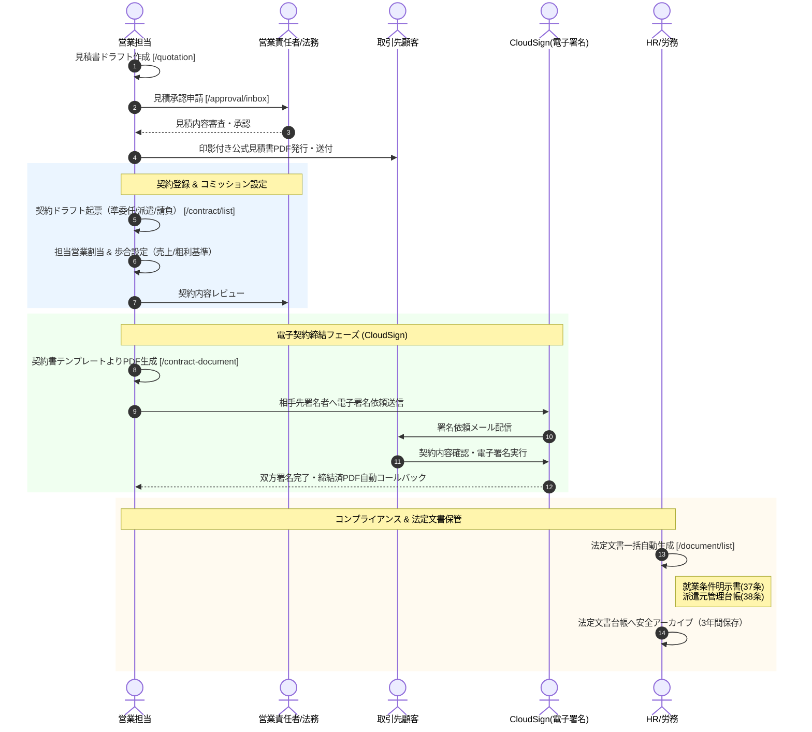

# 02. 見積・契約締結・電子署名フロー詳細仕様書

## 1. プロセス概要
本フローは、成約した提案内容に基づく公式見積書の作成・社内承認・顧客発行から、SES契約（準委任・派遣・請負）の正式登録、担当営業アサイン、コミッションレート設定、CloudSign連携による電子署名締結、および法定文書（労働者派遣法37条・38条等）の自動生成・台帳保管に至る法務・契約管理プロセスを定義します。

---

## 2. スイムレーン別アクティビティフロー図

---

## 3. 詳細業務アクティビティ一覧

| Step | 業務フェーズ | 主担当 | 関係者 | アクション内容 | 利用システム画面 / API | 入力情報 (Input) | 成果物 (Output) | システム自動処理 / 分岐条件 |
|:---:|:---|:---:|:---:|:---|:---|:---|:---|:---|
| **2-1** | 見積作成 | 営業 | 顧客 | 成約単価、精算基準時間幅（140〜180h等）、超過単価、控除単価、有効期限を入力し見積書を作成する。 | 見積管理 `/quotation` | 顧客ID、案件ID、要員ID、月額単価 | 見積書ドラフトレコード | 超過/控除単価の自動計算ロジック適用 |
| **2-2** | 見積承認 | 営業Mgr | 営業 | 提出された見積内容（マージン率、値引き幅、特記事項）を審査し、社内承認を実施する。 | 承認ワークフロー `/approval/inbox` | 審査判定（承認/差戻し）、承認コメント | 承認済見積データ | 承認完了ステータスへ移行、PDF出力機能解放 |
| **2-3** | 見積発行 | 営業 | 顧客 | 社内承認済みの見積書から会社印影が埋め込まれた公式PDFを発行し、顧客へメール送付する。 | 見積詳細 | 送信用メールテンプレート | 公式見積書PDF | 送信履歴・タイムスタンプ自動記録 |
| **2-4** | 契約登録 | 営業 | 営業Mgr | 契約形態（準委任/派遣/請負）、契約期間、単価、仕入原価、自動更新フラグを設定し契約マスタへ本登録する。 | 契約管理 `/contract/list` | 契約番号、開始日/終了日、売上単価、仕入原価 | 契約マスタレコード | 契約期間整合性チェック（過去月禁止・期間逆転防止） |
| **2-5** | 営業割当 | 営業 | 営業Mgr | 契約に対する担当営業ユーザーを紐付け、個別コミッション基準（売上/粗利ベース）とレートを設定する。 | 契約編集（担当営業） | 担当営業ID、歩合種別、歩合率(%) | 営業アサイン情報 | システム標準設定または個別上書きレートの適用 |
| **2-6** | 契約書生成 | 営業 | 法務 | 契約形態ごとの契約書テンプレートを選択し、企業名・要員名・条件を差し込んだ契約書PDFを自動生成する。 | 契約書・電子署名 `/contract-document` | 契約ID、テンプレートID | 契約書ドラフトPDF | 日本語フォント埋め込み・レイアウト自動調整 |
| **2-7** | 署名依頼 | 営業 | 顧客, CS | 相手先企業の署名権限者名・メールアドレスを入力し、CloudSign API経由で電子署名依頼を一括送信する。 | 電子署名送信モーダル | 先方署名者氏名、メールアドレス | CloudSignドキュメントID | CloudSign API連携・ステータス「先方確認中」更新 |
| **2-8** | 電子締結 | 顧客 | CS, 営業 | 顧客が内容を確認の上、クラウド上で電子署名を完了する。完了通知を受信しシステムへ同期する。 | CloudSign Webhook | 電子署名・タイムスタンプ | 締結済契約書PDF | システム内契約ステータス「締結済」自動更新 |
| **2-9** | 法定文書 | HR | 労務 | 労働者派遣法第37条（就業条件明示書）、第38条（派遣元管理台帳）等の法定帳票を一括生成する。 | 法定文書台帳 `/document/list` | 契約ID、年度、対象要員 | 法定文書一式（PDF） | 法定記載事項（抵触日・責任者・苦情処理先等）完全網羅 |
| **2-10**| 保管管理 | HR | 管理者 | 生成された法定文書および締結済契約書を法定保管期間（3年間）に準拠したセキュア台帳へ保管する。 | 法定文書台帳 | 保管カテゴリ、検索タグ | 保管完了アーカイブ | 改ざん防止・閲覧権限ロック適用 |

---

## 4. 例外処理・エスカレーション基準

1. **先方による契約書修正要望（条文修正）**:
   * 顧客から特約条項等の修正依頼があった場合、CloudSignの依頼を「取下げ」し、契約書ドラフトを修正して法務再レビュー後に再送付します。
2. **電子署名未完了リマインド**:
   * 署名依頼送信後、7営業日以上未締結の案件に対しては、システムが担当営業へ自動リマインド通知を発行します。
