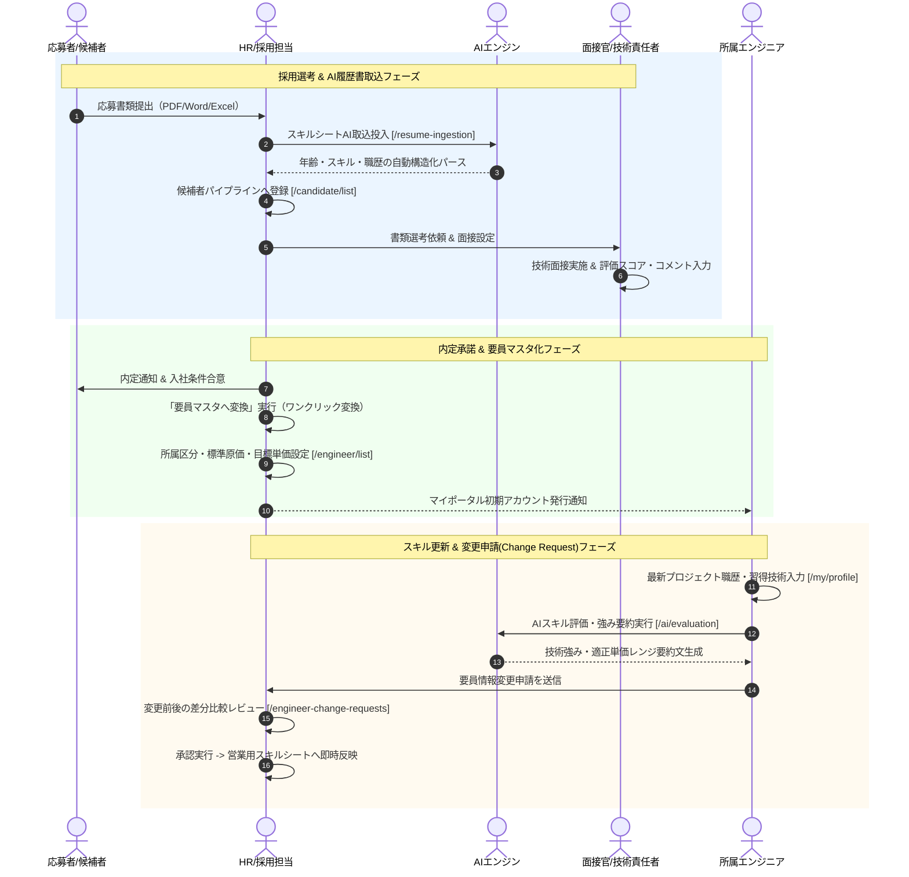

# 03. 要員採用・スキル管理フロー詳細仕様書

## 1. プロセス概要
本フローは、中途採用候補者のパイプライン管理、職務経歴書のAI解析取込、面接評価、内定承諾後の要員マスタ変換、原価・給与基準設定、エンジニア本人によるスキルシート更新申請（Change Request）、AIによるスキルシート要約・強み分析、およびHRによる審査・マスタ反映プロセスを定義します。

---

## 2. スイムレーン別アクティビティフロー図

---

## 3. 詳細業務アクティビティ一覧

| Step | 業務フェーズ | 主担当 | 関係者 | アクション内容 | 利用システム画面 / API | 入力情報 (Input) | 成果物 (Output) | システム自動処理 / 分岐条件 |
|:---:|:---|:---:|:---:|:---|:---|:---|:---|:---|
| **3-1** | 応募受付 | HR | 候補者 | 応募者の氏名、希望職種、希望年収/単価、応募経路を候補者台帳へ登録する。 | 候補者管理 `/candidate/list` | 応募者基本情報、希望条件 | 候補者レコード（書類選考中） | 重複応募チェック |
| **3-2** | 経歴書解析 | HR | AI | 受領した職務経歴書（PDF/Word/Excel）をアップロードし、AIによる高速OCR・自然言語パースを実行する。 | スキルシート取込 `/resume-ingestion` | 経歴書ファイル（.pdf, .xlsx） | 構造化スキル・職歴JSON | スキル名標準化（例: React.js -> React）、年数自動計算 |
| **3-3** | 面接選考 | 面接官 | HR | 書類通過者に対して技術面接・適性面談を実施し、評価点（1〜5段階）および詳細所感を記録する。 | 候補者詳細（面接評価） | 技術力、コミュニケーション力、人物面評価 | 面接評価シート | ステージ進行（一次面接 → 最終面接 → 内定） |
| **3-4** | 内定・要員化 | HR | 候補者 | 内定承諾が得られた候補者に対し、[要員マスタへ変換] をクリックしてエンジニア台帳へ自動移行する。 | 候補者管理 | 入社予定日、承諾条件 | 要員マスタレコード | 候補者データの自動アーカイブ、要員ID自動採番 |
| **3-5** | 原価・情報登録 | HR | 管理者 | 所属区分（正社員/契約社員/フリーランス/BP）、標準給与額、法定福利費、最寄駅、担当営業を登録する。 | 要員管理 `/engineer/list` | 氏名、生年月日、標準原価、最寄駅 | 正式要員レコード | 個人情報暗号化保管、営業提案可能プールへ追加 |
| **3-6** | マイポータル更新 | 要員 | HR | エンジニア本人がマイポータルより住所変更や最新参画プロジェクトの職務内容・使用技術を更新する。 | プロフィール更新 `/my/profile` | 最寄駅、保有スキルレベル、職務経歴詳細 | 変更申請ドラフト | 必須項目バリデーションチェック |
| **3-7** | AIスキル要約 | 要員 | AI, 営業 | AI評価エンジンを実行し、エンジニアの主要得意領域・技術的強み・適正単価レンジの要約PR文を自動生成する。 | AIスキル評価 `/ai/evaluation` | 要員ID、経歴テキスト | AI生成PR文・適正単価帯 | 日本円単位の適正単価推定・強みハイライト |
| **3-8** | 変更申請提出 | 要員 | HR | 編集内容およびAI要約文を確認し、HRへの本番マスタ反映申請（Change Request）を送信する。 | プロフィール更新 | 変更申請理由、変更データ一式 | 変更申請レコード（承認待ち） | HRへの新着通知発行 |
| **3-9** | HR差分審査 | HR | 要員 | 提出された変更内容について、変更前と変更後の差分（赤色/緑色ハイライト）を目視確認・審査する。 | 変更申請承認 `/engineer-change-requests` | 差分比較ビュー、本人確認証憑 | 審査結果 | 振込口座変更時の証憑突合チェック |
| **3-10**| マスタ反映 | HR | 営業 | 内容承認により要員マスタを最新化し、営業担当者が利用する提案用スキルシートへ即時同期する。 | 変更申請承認 | 承認確定アクション | 最新化要員マスタ | 営業側へのスキルシート更新完了通知配信 |

---

## 4. 例外処理・エスカレーション基準

1. **重要個人情報（口座・住所）の変更**:
   * 口座名義人や振込先銀行の変更は、不正出金防止のため通帳コピーまたはキャッシュカード画像の添付確認が必須となります。
2. **不採用時の個人情報保護**:
   * 選考見送りとなった候補者データは、社内プライバシー規程に基づき、一定期間（例: 180日）経過後に自動マスキングまたは物理削除されます。
