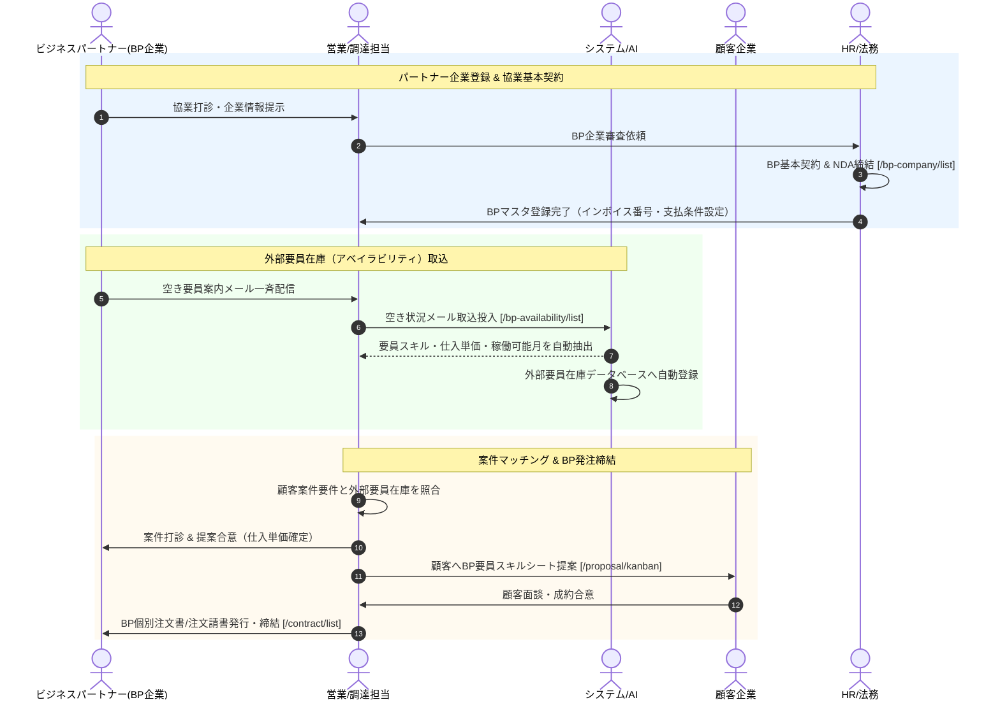

# 04. BP調達・パートナー協業フロー詳細仕様書

## 1. プロセス概要
本フローは、ビジネスパートナー（BP企業）のマスタ管理、基本契約/NDA締結状況の管理、BP各社から受信した空き要員案内メールの自動取込、外部要員在庫（アベイラビリティ）の横断検索、自社案件へのパートナー要員アサイン・提案連携、およびBP個別注文書締結プロセスを定義します。

---

## 2. スイムレーン別アクティビティフロー図

---

## 3. 詳細業務アクティビティ一覧

| Step | 業務フェーズ | 主担当 | 関係者 | アクション内容 | 利用システム画面 / API | 入力情報 (Input) | 成果物 (Output) | システム自動処理 / 分岐条件 |
|:---:|:---|:---:|:---:|:---|:---|:---|:---|:---|
| **4-1** | BP企業登録 | 営業 | BP, HR | BP企業名、法人番号、窓口担当者、協業区分、支払サイト（例: 月末締め翌々月5日払い）を登録する。 | BP会社管理 `/bp-company/list` | BP企業情報、法人番号、支払条件 | BPマスタレコード | インボイス適格請求書発行事業者番号の自動照合 |
| **4-2** | 契約状況管理 | HR | 法務, BP | BP基本契約締結日、秘密保持契約（NDA）締結日、覚書締結状況を記録・管理する。 | BP詳細（契約タブ） | 基本契約日、NDA締結日、更新日 | 契約締結ステータス | 基本契約未締結時の発注ガードアラート設定 |
| **4-3** | 空き情報取込 | 営業 | BP, AI | BP各社から送付される「空き要員リストメール」を受信し、メール自動取込機能で一括パースする。 | 外部要員在庫 `/bp-availability/list` | 空き要員案内メール本文 | 構造化要員データ | スキルタグ、稼働可能時期（即日/翌月）、仕入希望単価の抽出 |
| **4-4** | 在庫検索 | 営業 | 調達 | 募集中の案件スキル要件（Java, AWS, PMO等）に対し、外部要員在庫プールを横断検索する。 | 外部要員在庫検索 | 言語、FW、単価上限、最寄駅 | 適合外部要員リスト | 鮮度切れ（過去日）要員データの自動除外 |
| **4-5** | 案件紐付け | 営業 | BP | 適合する外部要員についてBP窓口へ参画意思を確認し、システム内の該当案件へワンクリックで紐付ける。 | 案件詳細 / 提案 | 案件ID、外部要員ID、仕入単価 | 提案準備レコード | 粗利マージン率シミュレーション自動計算 |
| **4-6** | 顧客提案 | 営業 | 顧客 | 顧客へBP要員のスキルシート（個人情報保護マスキング版）を提示し、面談日程を調整する。 | 提案カンバン `/proposal/kanban` | 提案単価、スキルシートPDF | 提案カード | 提案パイプラインへの算入 |
| **4-7** | 成約確定 | 営業 | 顧客, BP | 顧客面談を通過し成約した場合、顧客側売上契約とBP側仕入契約の双方を確定する。 | 提案カンバン（成約） | 受注単価、仕入確定単価 | 成約確定データ | 契約管理への自動引き継ぎ |
| **4-8** | BP発注書作成 | 営業 | 経理, BP | BP企業宛の個別契約書・発注書・注文請書を生成し、精算条件・支払期日を明記して発行する。 | 契約管理 `/contract/list` | BP契約情報、精算幅、仕入単価 | BP発注書PDF | 下請代金支払遅延等防止法（下請法）記載要件の検証 |
| **4-9** | アカウント発行 | HR | BP要員 | 稼働開始にあたり、BP要員用のマイポータルアカウントを発行し、勤怠入力権限を付与する。 | ユーザー管理 `/user/list` | 要員氏名、メールアドレス、ロール「要員」 | ポータルログインID | BP要員専用権限（他社案件・自社給与の非表示ガード） |
| **4-10**| 稼働状況監視 | 営業 | マネージャー | 稼働中のBP要員の契約満了日（30日前・14日前）をモニタリングし、契約更新または終了の事前調整を行う。 | ダッシュボード / 契約管理 | 契約満了日アラート | 契約更新通知 | 自動リマインド通知発行 |

---

## 4. 例外処理・エスカレーション基準

1. **下請法（支払期日・書面交付）遵守**:
   * BP企業が下請法対象となる場合、給付受領日から60日以内の支払期日設定、および発注書面の即時交付がシステムにより厳格にチェックされます。
2. **途中退場・契約変更リスク対応**:
   * BP要員の途中交代・体調不良等が発生した場合、速やかに代替要員検索を実行し、顧客およびBPとの契約変更覚書を作成します。
