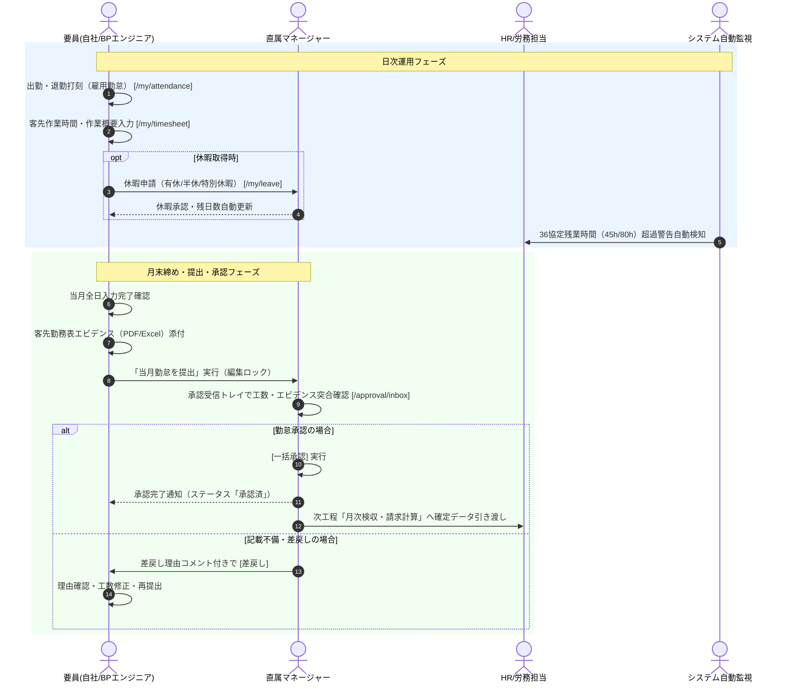

# 05. 日次・月次勤怠・承認ワークフロー詳細仕様書

## 1. プロセス概要
本フローは、エンジニアによる日次の自社雇用出退勤打刻、客先現場での実稼働工数（マイ勤怠）入力、休暇申請、月末の客先エビデンス（作業報告書PDF等）添付・勤怠提出、直属マネージャーによる承認受信トレイでの審査・承認・差戻し、およびHRによる全社36協定・過重労働モニタリングプロセスを定義します。

---

## 2. スイムレーン別アクティビティフロー図

---

## 3. 詳細業務アクティビティ一覧

| Step | 業務フェーズ | 主担当 | 関係者 | アクション内容 | 利用システム画面 / API | 入力情報 (Input) | 成果物 (Output) | システム自動処理 / 分岐条件 |
|:---:|:---|:---:|:---:|:---|:---|:---|:---|:---|
| **5-1** | 雇用打刻 | 要員 | HR | 始業時に [出勤打刻]、終業時に [退勤打刻] を実行する（自社の労働時間管理）。 | 雇用勤怠入力 `/my/attendance` | 打刻アクション（出勤/退勤/休憩） | 打刻タイムスタンプ | リアルタイム打刻記録、打刻漏れアラート |
| **5-2** | 客先工数入力 | 要員 | 営業 | 客先現場での実稼働開始・終了時刻、休憩時間、作業概要を日別に入力する。 | マイ勤怠入力 `/my/timesheet` | 始業/終業時刻、休憩(分)、作業内容 | 日別勤怠ドラフト | 実働時間の自動算出（終業 - 始業 - 休憩） |
| **5-3** | 休暇申請 | 要員 | マネージャー | 年次有給休暇、午前/午後半休、慶弔等の特別休暇を取得する際に事前申請を行う。 | 休暇申請 `/my/leave` | 休暇区分、取得日、取得理由 | 休暇申請レコード | 有給残日数の事前引き当て、重複申請チェック |
| **5-4** | 休暇承認 | マネージャー | 要員 | 申請された休暇内容を確認し、業務調整状況を勘案して承認または差戻しを行う。 | 承認ワークフロー `/approval/inbox` | 承認/差戻し判定、コメント | 承認済休暇データ | 有給休暇管理台帳への即時消化反映 |
| **5-5** | 月末エビデンス | 要員 | 営業 | クライアント企業から受領した公式勤務表・タイムシート（PDFやExcel等）を添付する。 | マイ勤怠入力 | 客先勤務表ファイル（PDF/Excel） | 添付エビデンスファイル | ファイル形式・ウイルススキャン検証 |
| **5-6** | 勤怠提出 | 要員 | マネージャー | 当月の全日工数およびエビデンスを確認し、[当月勤怠を提出] を実行する。 | マイ勤怠入力 | 提出確定アクション | 提出済勤怠データ | 要員側の編集ロック適用、マネージャーへ通知 |
| **5-7** | 勤怠審査 | マネージャー | 要員 | 提出された実働時間合計と添付エビデンスの数値を突合し、入力誤りがないか審査する。 | 承認受信トレイ `/approval/inbox` | 申請明細、添付プレビュー | 審査結果 | 客先勤怠と雇用勤怠の乖離チェックアラート |
| **5-8** | 一括承認 | マネージャー | 経理, HR | 不備のない勤怠申請を一括選択し、[一括承認] を実行して月次工数を確定する。 | 承認受信トレイ | 承認実行アクション | 確定月次勤怠レコード | 勤怠ステータス「承認済」更新、請求モジュール連携 |
| **5-9** | 差戻し処理 | マネージャー | 要員 | 工数入力ミスやエビデンス不備がある場合、修正指示コメントを添えて差戻しを行う。 | 承認受信トレイ | 差戻し理由テキスト | 差戻し通知 | 要員側編集ロック解除、再提出待ちステータス |
| **5-10**| 36協定監視 | HR | マネージャー | 全社の時間外労働実績（月間45時間超、年6回上限、80時間過重労働）をリアルタイム監視する。 | 雇用勤怠管理 `/work-record/attendance` | 月度、部署フィルター | 36協定アラートリスト | 警告レベル別（黄：45h超、赤：80h超）自動メール配信 |

---

## 4. 例外処理・エスカレーション基準

1. **提出遅延要員への自動督促**:
   * 毎月第1営業日の12:00時点で未提出の要員に対し、システムが自動で「勤怠提出督促メール」を一斉送信します。
2. **客先工数と自社打刻の大幅乖離**:
   * 客先実稼働時間と自社雇用打刻時間の月間差異が一定時間（例: ±10時間）を超える場合、サービス残業または不正打刻防止のためHRによる個別ヒアリングが実施されます。
