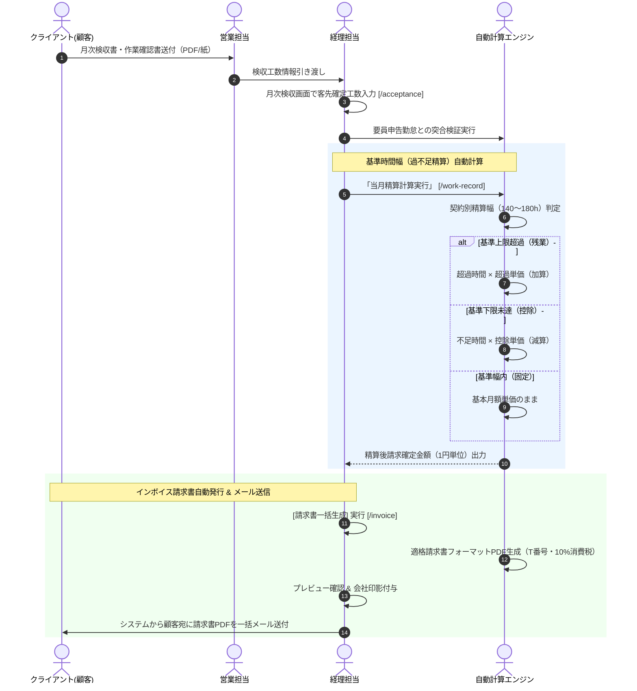

# 06. 月次検収・精算・請求フロー詳細仕様書

## 1. プロセス概要
本フローは、クライアント企業からの客先検収書受領、確定工数の検収入力、契約マスタの精算条件（基準時間幅 140h〜180h、上下割・中央割単価）に基づく超過/控除精算金額の自動計算、インボイス制度（適格請求書等保存方式）に完全準拠した請求書PDFの一括自動生成、および顧客宛の一括メール送信プロセスを定義します。

---

## 2. スイムレーン別アクティビティフロー図

---

## 3. 詳細業務アクティビティ一覧

| Step | 業務フェーズ | 主担当 | 関係者 | アクション内容 | 利用システム画面 / API | 入力情報 (Input) | 成果物 (Output) | システム自動処理 / 分岐条件 |
|:---:|:---|:---:|:---:|:---|:---|:---|:---|:---|
| **6-1** | 検収書受領 | 営業 | 顧客 | 顧客から送付された月次検収書・確定作業報告書を受領し、記載工数を確認する。 | 案件・契約照会 | 顧客検収書ファイル | 受領確認情報 | 受領ステータス記録 |
| **6-2** | 検収確定入力 | 経理 | 営業 | システムの月次検収画面にて、契約ごとの客先確定実働工数（例: 172.5h）を入力する。 | 月次検収確定 `/acceptance` | 対象年月、契約ID、確定時間(h) | 検収確定レコード | 要員提出工数との差分自動照合（差異時警告） |
| **6-3** | 精算幅計算 | 経理 | システム | 契約マスタに登録された精算基準幅（下限〜上限）と超過/控除単価に基づき、自動計算を実行する。 | 勤怠集計・精算 `/work-record` | 確定実働工数、契約単価 | 精算計算結果テーブル | 上下割・中間割・固定単価の自動分岐判定 |
| **6-4** | 勤怠・精算締め | 経理 | マネージャー | 全稼働要員の精算金額、端数処理結果を確認し、異常値がないことを確認して勤怠締めを実行する。 | 勤怠集計・精算 | 勤怠締め実行アクション | 請求確定元帳データ | 勤怠データの一括ロック（以降の工数変更不可） |
| **6-5** | 請求書一括生成 | 経理 | 管理者 | [請求書一括生成] をクリックし、当月の全顧客宛ての請求書データを一括作成する。 | 請求書管理 `/invoice` | 請求年月、発行日、支払期日 | 請求書ドラフト一覧 | 顧客別支払サイト（翌月末、翌々月5日等）の自動期日セット |
| **6-6** | インボイス検証 | 経理 | 営業 | 請求書に自社インボイス登録番号（T+13桁）、10%消費税額、過不足精算明細が正しく記載されているか確認する。 | 請求書プレビュー | 請求書プレビュー画面 | 検証済請求書 | 税額端数計算（1円未満切り捨て）の自動整合性検証 |
| **6-7** | 請求書PDF発行 | 経理 | 顧客 | 公式な社印影が自動付与されたPDF形式の請求書を発行・ダウンロードする。 | 請求書管理 | 一括PDF出力アクション | 公式請求書PDFファイル | 日本語フォント完全埋め込みPDF出力 |
| **6-8** | 一括メール送付 | 経理 | 顧客, 営業 | システムのメール送信機能を用い、顧客の請求書送付先担当者宛てに請求書PDFを添付して一括配信する。 | 請求書一括メール送信 | 送信用テンプレート、宛先確認 | 送信完了ログ | SMTP自動配信、送信日時・宛先の送信ログ永久記録 |
| **6-9** | 売掛金元帳計上 | 経理 | 経営層 | 発行された請求金額が売掛金残高（Accounts Receivable）としてシステム内に自動計上される。 | 売掛金管理 / 消込 | 請求確定金額 | 売掛金元帳データ | ダッシュボード売上KPI・回収予定表への即時反映 |
| **6-10**| 顧客受領確認 | 営業 | 顧客 | 請求書の到達ステータスを確認し、顧客側の経理処理状況を必要に応じて確認する。 | 請求書一覧 | 配信ステータス（送付済） | 到達確認ステータス | 開封トラッキングまたは受領通知管理 |

---

## 4. 例外処理・エスカレーション基準

1. **検収差異（客先工数 vs 要員提出工数）の発生**:
   * 客先の検収時間と要員が提出した勤怠時間に差異がある場合、画面上に黄色ハイライトが表示され、営業担当者が顧客へ内訳確認を行います。
2. **月途中入場・退場の日割り計算**:
   * 月の途中で参画または終了した契約については、契約設定に基づき所定労働日数または実日数による日割り計算ロジックが自動適用されます。
