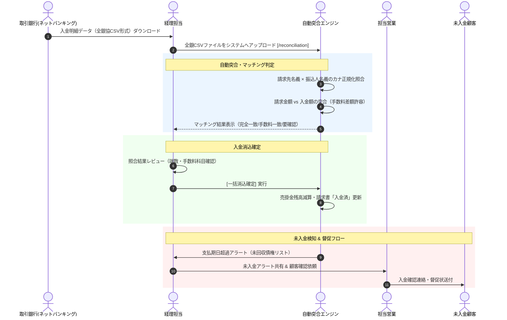

# 07. 入金消込・売掛金・督促管理フロー詳細仕様書

## 1. プロセス概要
本フローは、銀行口座への顧客からの売掛金入金に対し、全銀協フォーマットまたはCSV入金明細の取り込み、名義・金額の自動突合（Reconciliation）、振込手数料差額の自動仕訳判定、一括入金消込、売掛金残高の更新、および支払期日を超過した未回収債権に対する督促管理プロセスを定義します。

---

## 2. スイムレーン別アクティビティフロー図

---

## 3. 詳細業務アクティビティ一覧

| Step | 業務フェーズ | 主担当 | 関係者 | アクション内容 | 利用システム画面 / API | 入力情報 (Input) | 成果物 (Output) | システム自動処理 / 分岐条件 |
|:---:|:---|:---:|:---:|:---|:---|:---|:---|:---|
| **7-1** | 入金データ取得 | 経理 | 銀行 | 各支払期日（月末、翌月5日、10日等）にネットバンキングより全銀協CSV入金データを取得する。 | 外部バンキング | 口座明細データ | 全銀フォーマットCSV | 取引データ抽出 |
| **7-2** | 明細インポート | 経理 | システム | 入金消込画面にて、取得した全銀協CSV（または汎用入金CSV）をアップロードする。 | 入金消込 `/reconciliation` | 全銀CSVファイル | インポート入金明細一覧 | 入金日・振込依頼人名・入金金額の自動解析 |
| **7-3** | 自動突合実行 | 経理 | システム | システムが未回収の請求書レコードと入金明細を照合し、自動マッチング判定を実行する。 | 入金消込（自動突合） | 未消込請求残高データ | 突合候補リスト | カナ名義正規化（ｶ)除外等）、金額一致判定 |
| **7-4** | 確度判定分類 | システム | 経理 | 突合結果を「完全一致（緑）」「振込手数料差額一致（青）」「要確認/不一致（黄）」に分類表示する。 | 入金消込画面 | 照合ルール定義 | 判定ステータスバッジ | 振込手数料（例: 440円/660円等の許容範囲内判定） |
| **7-5** | 差額・手数料処理 | 経理 | システム | 振込手数料引きでの入金に対し、差額を「支払手数料」として自動仕訳計上する設定を確認する。 | 消込詳細モーダル | 手数料負担区分（先方/当方） | 手数料仕訳データ | 1円〜数百円の差額自動バランシング |
| **7-6** | 一括消込確定 | 経理 | 管理者 | 内容確認後、[一括消込確定] をクリックして売掛金の回収処理を確定する。 | 入金消込画面 | 消込確定アクション | 消込完了台帳 | 請求書ステータス「入金完了」更新、売掛金消込 |
| **7-7** | 手動消込（例外） | 経理 | 営業 | 名義違い（グループ会社名義振込等）の入金に対し、請求書を手動選択して消込を実行する。 | 手動消込ポップアップ | 顧客ID、対象請求書ID | 手動消込レコード | 名義紐付け学習（次回以降の自動マッチング候補化） |
| **7-8** | 未回収アラート | システム | 経理 | 支払期日を過ぎても未消込の請求書を自動検出し、期日超過アラート（赤色バッジ）を発火する。 | ダッシュボード / 売掛金管理 | 支払期日超過フラグ | 期日超過未入金リスト | 超過日数（1〜30日、30日超）別のリスク分類 |
| **7-9** | 営業連携・督促 | 経理 | 営業, 顧客 | 期日超過の顧客を担当する営業へ通知し、システムから公式督促状（リマインドレター）を作成・送付する。 | 督促管理 / メール送信 | 督促状テンプレート、送付先 | 督促メール / 送付履歴 | 営業ダッシュボードへの未回収アラート掲示 |
| **7-10**| 入金予定更新 | 営業 | 経理 | 顧客から入金延期連絡があった場合、確約された次回入金予定日をシステムに登録・更新する。 | 請求書詳細（回収予定） | 新規入金予定日、理由メモ | 回収予定更新データ | 資金繰り予測（キャッシュフロー予測）へ反映 |

---

## 4. 例外処理・エスカレーション基準

1. **過入金・二重振込の発生**:
   * 請求金額を超える入金があった場合、差額を「前受金」または「預り金」としてプールし、顧客連絡の上で翌月相殺または返金処理を実施します。
2. **長期滞留債権（60日以上未回収）のエスカレーション**:
   * 期日超過が60日を超える場合、経営陣・法務へエスカレーションされ、内容証明郵便の送付または法的回収手続きへ移行します。
