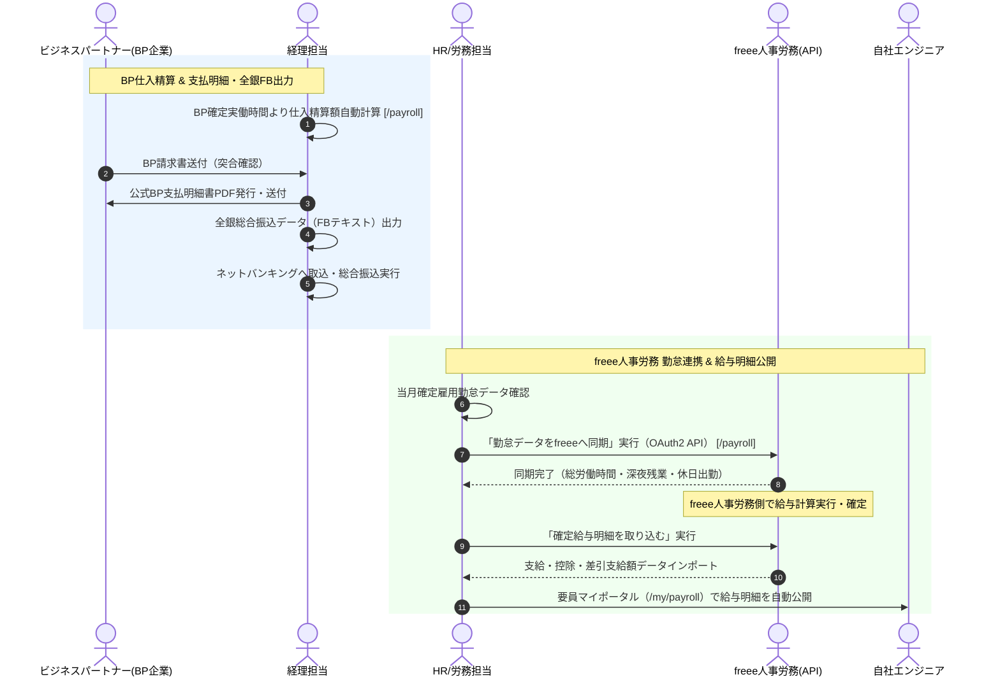

# 08. BP支払・freee給与連携フロー詳細仕様書

## 1. プロセス概要
本フローは、月次確定勤怠に基づくビジネスパートナー（BP企業）への仕入精算金額の自動計算、BP支払明細書の作成、インターネットバンキング用全銀総合振込データ（FBデータ）の出力、自社エンジニアの確定勤怠データのfreee人事労務へのOAuth2 API同期、クラウド給与計算後の確定給与明細の取り込み、および要員マイポータルへの給与明細自動公開プロセスを定義します。

---

## 2. スイムレーン別アクティビティフロー図

---

## 3. 詳細業務アクティビティ一覧

| Step | 業務フェーズ | 主担当 | 関係者 | アクション内容 | 利用システム画面 / API | 入力情報 (Input) | 成果物 (Output) | システム自動処理 / 分岐条件 |
|:---:|:---|:---:|:---:|:---|:---|:---|:---|:---|
| **8-1** | BP精算計算 | 経理 | システム | BP要員の確定実働時間に基づき、仕入基本単価および超過/控除精算金額を自動算出する。 | 給与・支払（BP支払） `/payroll` | 確定工数、BP契約原価、精算幅 | BP支払予定データ | BP側精算条件（上下割/中間割/固定）の自動計算 |
| **8-2** | BP請求書照合 | 経理 | BP企業 | BP企業から受領した請求書とシステム計算額を突合し、消費税額（インボイス経過措置含む）を検証する。 | BP支払一覧 | BP請求書PDF、金額 | 照合済BP支払レコード | 免税事業者BPの仕入税額控除経過措置（80%等）対応 |
| **8-3** | BP支払明細発行 | 経理 | BP企業 | BP企業向けの公式支払明細書（内訳明細・精算単価・消費税額記載）PDFを生成し発行する。 | BP支払明細書出力 | 支払年月、BP企業選択 | BP支払明細書PDF | 社印影付与、メール自動添付送付 |
| **8-4** | 全銀振込データ | 経理 | 銀行 | 確定した全BP企業宛の支払データから、銀行総合振込用全銀協フォーマット（FBデータ）を出力する。 | 全銀FBデータ出力 | 振込指定日、委託者コード | 全銀フォーマットテキストファイル | 金融機関コード・支店コード・口座番号の整合性検証 |
| **8-5** | ネットバンキング | 経理 | 銀行 | 出力した全銀FBデータを銀行インターネットバンキングへ一括アップロードし、振込予約を実行する。 | 外部バンキング | 全銀FBデータ | 総合振込実行ログ | 振込期日（例: 翌々月5日）厳守 |
| **8-6** | freee勤怠同期 | HR | freee(API) | [勤怠データをfreeeへ同期] を実行し、当月の総労働時間、普通残業、深夜労働、休日労働時間をfreeeへ連携する。 | freee連携タブ `/payroll` | 対象月、事業所ID | freee勤怠同期データ | OAuth2 API連携、アクセストークン自動更新 |
| **8-7** | freee給与計算 | HR | 外部 | freee人事労務上で社会保険料、所得税、住民税、各種手当の自動計算を実行し、給与を確定する。 | freee人事労務（外部） | 勤怠データ、社員給与設定 | 確定給与計算結果 | freee側の給与確定処理 |
| **8-8** | 給与明細取込 | HR | freee(API) | freeeで確定した給与データから [給与確定明細を取り込む] を実行し、システム内へインポートする。 | freee連携タブ | インポート対象年月 | 給与明細インポートレコード | 支給項目・控除項目・差引支給額の自動マッピング |
| **8-9** | 明細整合性検証 | HR | 経理 | インポートされた支給総額と会計ソフトの給与支払総額が完全に一致していることを確認する。 | 給与明細集計一覧 | 給与一覧データ | 承認済給与データ | 合計額バリデーション |
| **8-10**| ポータル自動公開 | HR | 要員 | 給与支給日に合わせて要員のマイポータル（`/my/payroll`）へ給与明細を自動公開し、PDF閲覧を可能にする。 | マイ給与明細 `/my/payroll` | 公開日設定 | マイポータル明細表示 | 要員本人以外の閲覧不可（完全アクセス分離） |

---

## 4. 例外処理・エスカレーション基準

1. **freee API認証エラー・トークン失効**:
   * freeeとのOAuth2セッションが切断された場合、画面に「再認可が必要です」と表示され、HR管理者がワンクリックで再ログイン連携を実行します。
2. **BP振込先口座エラー**:
   * 全銀データの口座名義や口座番号に不備がある場合、ネットバンキング取込前にシステムが事前バリデーションを行いエラー箇所を通知します。
