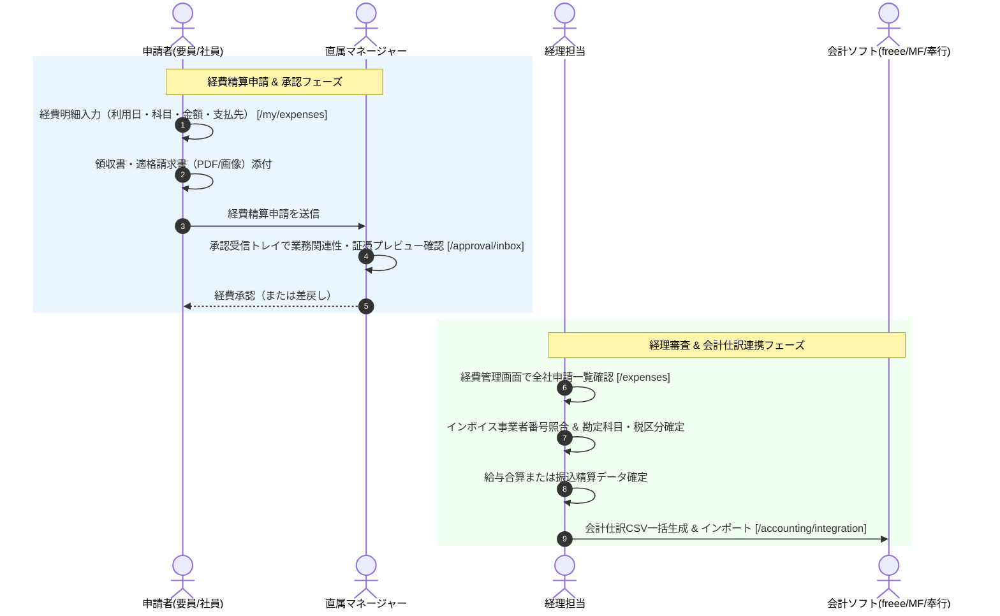

# 09. 経費精算・仕訳連携フロー詳細仕様書

## 1. プロセス概要
本フローは、エンジニア・社員による日々の立替経費（交通費・近郊旅費・消耗品費・会議費等）のマイポータルからの申請、領収書証憑のアップロード、直属マネージャーによる審査・承認、経理によるインボイス事業者登録番号の照合・勘定科目チェック、給与合算または個別振込での精算確定、および主要会計ソフト（freee / マネーフォワード / 勘定奉行 / 汎用ERP）向け仕訳CSVデータの自動生成・連携プロセスを定義します。

---

## 2. スイムレーン別アクティビティフロー図

---

## 3. 詳細業務アクティビティ一覧

| Step | 業務フェーズ | 主担当 | 関係者 | アクション内容 | 利用システム画面 / API | 入力情報 (Input) | 成果物 (Output) | システム自動処理 / 分岐条件 |
|:---:|:---|:---:|:---:|:---|:---|:---|:---|:---|
| **9-1** | 経費入力 | 申請者 | 経理 | 利用日、勘定科目（旅費交通費/消耗品費/会議費等）、支払先、税込金額、利用目的を入力する。 | 経費申請 `/my/expenses` | 利用日、科目、金額、支払先、目的 | 経費申請明細ドラフト | 科目別デフォルト消費税率（10%/軽減8%）自動セット |
| **9-2** | 証憑添付 | 申請者 | 経理 | 領収書・レシート・電子請求書の画像またはPDFをアップロードし、インボイス登録番号を入力する。 | 経費申請（証憑添付） | 領収書ファイル（JPEG/PNG/PDF） | 添付証憑ファイル | 画像プレビュー生成、ファイル暗号化保存 |
| **9-3** | 申請提出 | 申請者 | マネージャー | 申請内容を確認し、直属マネージャーへ承認申請を送信する。 | 経費申請画面 | 提出実行アクション | 経費申請レコード（承認待ち） | 直属承認者への自動ルーティング通知 |
| **9-4** | 一次承認 | マネージャー | 申請者 | 承認受信トレイにて業務上の必要性および領収書画像を確認し、承認または差戻しを行う。 | 承認受信トレイ `/approval/inbox` | 承認/差戻し判定、コメント | 一次承認済経費データ | 規定金額（例: 10万円以上）超過時の役員承認自動追加 |
| **9-5** | 経理審査 | 経理 | 申請者 | 経理管理画面にて、適格請求書要件の充足、勘定科目の妥当性、税区分（課税仕入10%等）を精査する。 | 経費精算管理 `/expenses` | 全社経費一覧、領収書拡大ビュー | 経理確認済経費レコード | インボイス事業者番号の有効性自動チェック |
| **9-6** | 精算方法確定 | 経理 | HR | 精算方式（当月給与支給に合算、または経費個別振込）を選択し、精算対象月を確定する。 | 経費精算確定モーダル | 精算種別（給与合算/個別振込） | 精算確定データ | 給与モジュールまたは全銀振込モジュールへの引継 |
| **9-7** | 仕訳プリセット選択 | 経理 | システム | 連携先会計システム（freee / マネーフォワード / 勘定奉行 / 汎用ERP）のフォーマットを選択する。 | 会計・支払連携 `/accounting/integration` | 会計ソフトプリセット選択 | 連携設定定義 | 会計ソフト別CSVヘッダー・カラム構造マッピング |
| **9-8** | 仕訳データ生成 | 経理 | システム | [仕訳データ生成] をクリックし、借方科目・貸方科目・税区分・金額・摘要が展開された仕訳を作成する。 | 会計仕訳連携 | 対象月度、勘定科目コード設定 | 会計仕訳明細テーブル | 借方（旅費交通費等）/ 貸方（未払金/普通預金）バランス検証 |
| **9-9** | 仕訳CSV出力 | 経理 | ERP | エラーがないことを確認し、会計ソフト取り込み用の仕訳CSVファイルをダウンロードする。 | 会計仕訳出力 | CSVエクスポートアクション | 公式会計仕訳CSVファイル | UTF-8 / Shift-JIS エンコーディング切替出力 |
| **9-10**| 会計ソフト取込 | 経理 | ERP | ダウンロードした仕訳CSVを自社会計ソフトにインポートし、全社総勘定元帳へ記帳を完了する。 | 会計ソフト（外部） | 仕訳CSVファイル | 総勘定元帳記帳ログ | 会計システム内での仕訳確定 |

---

## 4. 例外処理・エスカレーション基準

1. **領収書不備・私的利用の疑い**:
   * 領収書が不鮮明な場合や宛名が会社名でない場合、経理より理由を明記して即時差戻しを実施します。
2. **インボイス未登録業者への支払い**:
   * 適格請求書発行事業者以外の領収書については、経過措置税区分（80%控除等）が自動適用され、仕訳CSVに反映されます。
