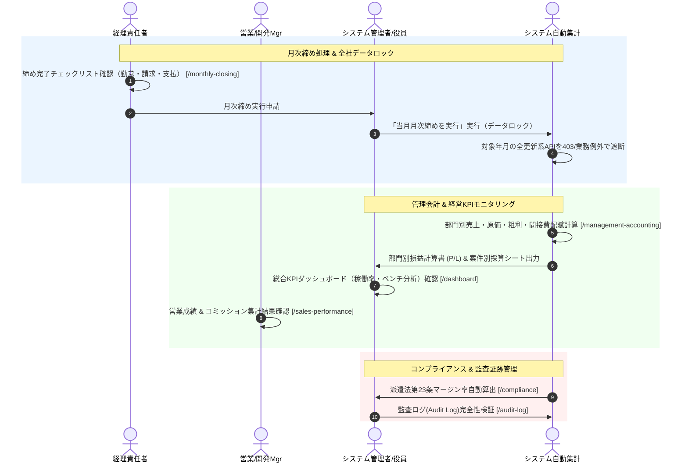

# 10. 月次決算締め・管理会計・ガバナンスフロー詳細仕様書

## 1. プロセス概要
本フローは、月次の「勤怠確定」「請求確定」「BP支払確定」の全タスク完了確認、月次締め（Monthly Closing）実行による当月トランザクションの一括データロック、部門別損益計算書（P/L）およびプロジェクト別採算集計、総合KPIダッシュボードによる経営モニタリング、営業成績・コミッション確定集計、労働者派遣法マージン率計算、および全更新操作の改ざん防止監査ログ（Audit Log）追跡プロセスを定義します。

---

## 2. スイムレーン別アクティビティフロー図

---

## 3. 詳細業務アクティビティ一覧

| Step | 業務フェーズ | 主担当 | 関係者 | アクション内容 | 利用システム画面 / API | 入力情報 (Input) | 成果物 (Output) | システム自動処理 / 分岐条件 |
|:---:|:---|:---:|:---:|:---|:---|:---|:---|:---|
| **10-1**| 締め前点検 | 経理責任者 | マネージャー | 当月の勤怠承認残数、請求書未発行件数、BP支払未確定件数がすべてゼロであることを確認する。 | 月次締め管理 `/monthly-closing` | 対象年月、各モジュール未処理件数 | チェック完了ステータス | 未完了タスク存在時の締め実行自動抑止 |
| **10-2**| 月次締め実行 | 管理者 | 役員, 経理 | [当月月次締めを実行] をクリックし、当月の全トランザクション（勤怠・契約・請求・支払）に更新ロックを適用する。 | 月次締め画面 | 締め確定アクション | 月次締め完了レコード | `assertOpenForUpdate` ガードによる更新API完全遮断 |
| **10-3**| 管理会計集計 | 経理 | 経営層 | 事業部・部署ごとの売上高、売上原価（給与・BP費）、売上総利益、間接費配賦額を集計する。 | 管理会計 `/management-accounting` | 会計年度、配賦基準（人員比/売上比） | 部門別損益計算書 (P/L) | 共通間接費の自動按分計算 |
| **10-4**| 案件採算分析 | マネージャー | 営業 | プロジェクト別の限界利益、粗利率、予実乖離（予算vs実績）を詳細分析し、低収益案件を特定する。 | 案件採算一覧 | 案件ID、契約単価、投入原価 | 案件別採算分析表 | 目標粗利率（例: 20%）未達案件の赤色アラート表示 |
| **10-5**| 経営KPI確認 | 経営層 | 管理者 | 総合ダッシュボードにて全社稼働率、待機要員（ベンチ）数、今月売上・粗利推移グラフ、6ヶ月トレンドを俯瞰する。 | 総合ダッシュボード `/dashboard` | 期間セレクター | 経営KPIダッシュボード | リアルタイムKPIカード・推移チャート描画 |
| **10-6**| ベンチ分析 | 営業Mgr | 営業 | 高度分析（Analytics）にて、現在待機となっている要員の待機日数、累積待機コスト、保有スキルを分析する。 | 高度分析 `/analytics` | 待機日数フィルター、スキル軸 | ベンチ分析レポート | 待機30日超要員に対する早期提案アラート発火 |
| **10-7**| 営業成績確定 | 営業責任者 | 営業 | 営業担当ごとの担当要員数、新規成約数、成約率、売上高、粗利総額、および月次コミッション額を確定する。 | 営業成績 `/sales-performance` | 集計年月、営業担当者フィルター | 営業成績・歩合給確定表 | 契約ごとのレート（売上/粗利基準）自動計算 |
| **10-8**| マージン率計算 | HR | 管理者 | 労働者派遣法第23条第5項に基づく派遣料金平均、賃金平均、マージン率を自動算出し、情報提供書を出力する。 | コンプライアンス `/compliance` | 事業年度、教育訓練費用 | マージン率公開文書（PDF） | 法定計算式による自動算出・Web公開用PDF生成 |
| **10-9**| 監査ログ検証 | 管理者 | 監査役 | 当月に実行された全更新系API操作（INSERT/UPDATE/DELETE）の実行者・IP・変更前後のJSON差分を監査照合する。 | 監査ログ `/audit-log` | 実行期間、操作モジュール、キーワード | 監査証跡レポート（CSV） | 改ざん不能ログ（DBトリガー/フィルター記録）の検証 |
| **10-10**| ロック解除(例外) | 管理者 | 経営層 | （過去月修正の例外時）理由を明記して管理者限定の [ロック一時解除] を実行し、修正後に即時再締めを行う。 | 月次締め（ロック解除ダイアログ） | ロック解除理由テキスト | 解除監査ログレコード | 監査ログへの解除者・日時・理由の永久記録 |

---

## 4. 例外処理・エスカレーション基準

1. **月次締め後の緊急修正（ブレークグラス運用）**:
   * 締め処理完了後の過去月データ修正は重大な決算変動リスクを伴うため、管理者ロールかつ役員承認を得た理由の入力が必須となり、監査ログに厳格に記録されます。
2. **コンプライアンスリスク（偽装請負・二重派遣）検知**:
   * 準委任契約における指揮命令関係の疑いや多重下請構造のリスクが検知された場合、法務・コンプライアンス部門へ即時アラートが送信されます。
