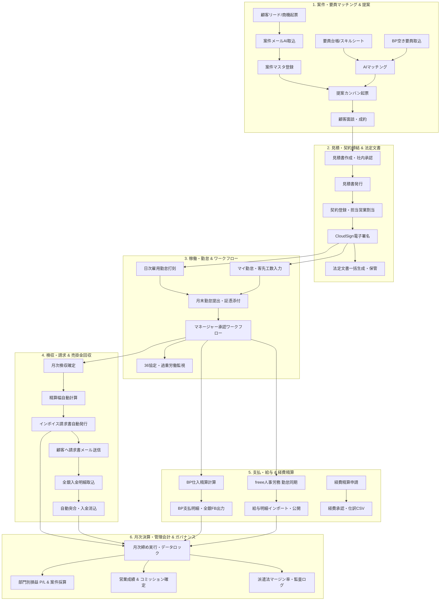

# SES Manager Pro 業務詳細フロー体系書（Business Process Architecture）

本ドキュメントは、システムエンジニアリングサービス（SES）統合管理プラットフォーム「**SES Manager Pro**」におけるエンドツーエンドの業務プロセス、部門間連携、ステータス遷移、および各フェーズのインプット／アウトプットを定義した公式業務フロー体系書です。

---

## 1. 業務プロセス全体連関図 (End-to-End Business Flow)

SES事業の根幹となる「営業・調達 → 契約 → 稼働・勤怠 → 検収・請求・回収 → 支払・給与 → 月次決算・ガバナンス」の業務フロー連関は以下の通りです。

---

## 2. 業務詳細フロー一覧

| No | フロー名称 | 主幹ロール | 関係部門・ロール | 主なインプット / アウトプット | 関連画面パス |
|:---|:---|:---|:---|:---|:---|
| **01** | [営業・案件獲得・提案フロー](./01_営業・案件獲得・提案フロー.md) | 営業 | 顧客, HR, マネージャー, 要員 | 案件案内メール / 提案カンバン, 面談記録 | `/crm/opportunities` `/project-ingestion` `/proposal/kanban` |
| **02** | [見積・契約締結・電子署名フロー](./02_見積・契約締結・電子署名フロー.md) | 営業, 経営管理 | 顧客, 法務, 営業責任者 | 成約提案 / 見積書PDF, 電子締結契約書, 法定文書 | `/quotation` `/contract/list` `/contract-document` |
| **03** | [要員採用・スキル管理フロー](./03_要員採用・スキル管理フロー.md) | HR / 採用 | 候補者, 面接官, 所属要員 | 職務経歴書 / 要員台帳, 評価サマリー, スキルシート | `/candidate/list` `/resume-ingestion` `/engineer/list` |
| **04** | [BP調達・パートナー協業フロー](./04_BP調達・パートナー協業フロー.md) | 営業, 調達 | BP企業, BP要員, HR | 空き要員メール / BP台帳, 注文書, 外部要員在庫 | `/bp-company/list` `/bp-availability/list` `/contract/list` |
| **05** | [日次・月次勤怠・承認ワークフロー](./05_日次・月次勤怠・承認ワークフロー.md) | 要員 | マネージャー, HR | 実働時間, 休暇申請 / 確定勤怠, 36協定アラート | `/my/timesheet` `/approval/inbox` `/work-record/attendance` |
| **06** | [月次検収・精算・請求フロー](./06_月次検収・精算・請求フロー.md) | 経理, 営業 | 顧客, マネージャー | 客先検収書 / 精算確定データ, インボイス請求書PDF | `/acceptance` `/work-record` `/invoice` |
| **07** | [入金消込・売掛金・督促管理フロー](./07_入金消込・売掛金・督促管理フロー.md) | 経理 | 銀行, 営業, 経営層 | 全銀入金CSV / 消込完了台帳, 未入金督促状 | `/reconciliation` |
| **08** | [BP支払・freee給与連携フロー](./08_BP支払・freee給与連携フロー.md) | 経理, HR | BP企業, freee人事労務, 要員 | 確定工数 / BP支払明細, 全銀総合振込データ, 給与明細 | `/payroll` |
| **09** | [経費精算・仕訳連携フロー](./09_経費精算・仕訳連携フロー.md) | 申請者, 経理 | マネージャー, 会計ソフト | 領収書証憑 / 精算確定データ, 会計仕訳CSV | `/my/expenses` `/expenses` `/accounting/integration` |
| **10** | [月次決算締め・管理会計・ガバナンスフロー](./10_月次決算締め・管理会計・ガバナンスフロー.md) | 管理者, 経営層 | 経理責任者, 営業責任者 | 全業務確定データ / ロック済台帳, 部門別P/L, 監査ログ | `/monthly-closing` `/management-accounting` `/audit-log` |

---

## 3. ロール定義と責任権限マトリクス (RACI)

* **R (Responsible: 実行責任)**: 実際に業務タスクを実行・入力するロール
* **A (Accountable: 説明責任・最終承認)**: 成果物の承認・最終責任を持つロール
* **C (Consulted: 協議・相談先)**: プロセス進行にあたり助言・確認を行うロール
* **I (Informed: 報告・情報共有先)**: 処理結果や進捗が通知・共有されるロール

| 業務フェーズ | 顧客/BP | 要員 | 営業担当 | 営業Mgr | HR/労務 | 経理担当 | 管理者/役員 |
|:---|:---:|:---:|:---:|:---:|:---:|:---:|:---:|
| 案件獲得・AIマッチング | C | I | **R** | A | C | I | I |
| 提案カンバン・顧客面談 | C | C | **R** | A | I | - | I |
| 見積作成・社内承認 | I | - | **R** | **A** | - | C | A |
| 契約締結・電子署名 | **R** | I | **R** | A | C | I | **A** |
| 採用選考・要員マスタ登録 | C | - | C | - | **R** | - | **A** |
| 勤怠打刻・客先工数提出 | - | **R** | I | **A** | C | - | I |
| 月次検収・精算幅計算 | C | - | **R** | A | - | **R** | I |
| 請求書発行・送付 | I | - | C | I | - | **R** | **A** |
| 入金消込・督促 | **R** | - | C | I | - | **R** | A |
| BP支払・freee給与同期 | I | I | - | - | **R** | **R** | **A** |
| 経費精算・会計仕訳 | - | **R** | R | **A** | I | **R** | A |
| 月次締め・管理会計・監査 | - | - | I | I | C | **R** | **A** |

---

## 4. 共通業務SLA（サービスレベル合意基準）

1. **提案・マッチング**: 案件発生から **24時間以内** に適合要員をマッチングし、顧客へファーストコンタクトを実施。
2. **見積・契約承認**: 見積・契約申請から **1営業日以内** に責任者承認を完了。
3. **勤怠提出・承認**:
   * 要員提出期限：当月末日 〜 翌月 **第1営業日 18:00**
   * マネージャー承認期限：翌月 **第2営業日 18:00**
4. **検収・請求書発行**:
   * 検収確定：翌月 **第3営業日** まで
   * 請求書送付：翌月 **第4営業日** まで（顧客支払期日に応じて厳守）
5. **月次決算締め**:
   * 当月データロック完了：翌月 **第5営業日**
   * 部門別P/L・経営レポート提出：翌月 **第7営業日**
